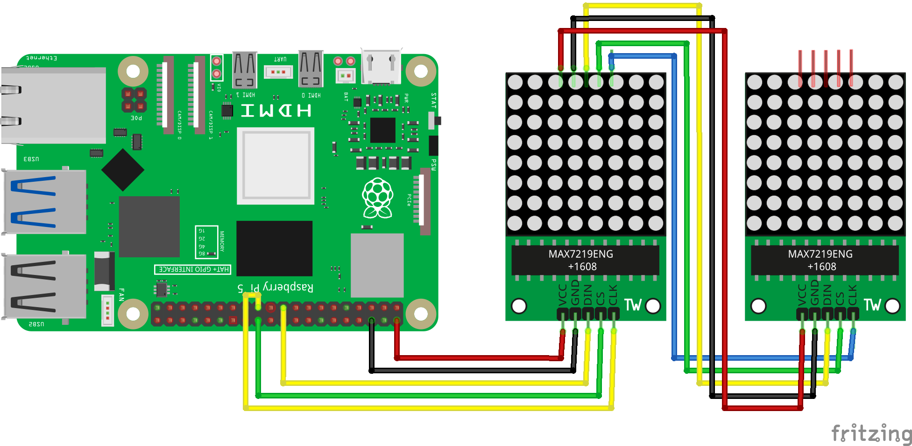

============================================================
Урок 15: Матричная клавиатура ⌨️
============================================================

Теоретическая часть
-------------------
Матричная клавиатура – это набор кнопок, организованных в виде матрицы строк и столбцов. Такая организация позволяет существенно сократить количество необходимых пинов для подключения большого числа кнопок. Например, для клавиатуры 4x4 (16 кнопок) требуется всего 8 GPIO пинов.

В этом уроке мы используем CircuitPython для работы с матричной клавиатурой 4x4, которая имеет 16 кнопок и часто используется в проектах, где требуется ввод цифр или команд.

Необходимые компоненты
----------------------
- Raspberry Pi
- Матричная клавиатура 4x4 (16 кнопок)
- Соединительные провода
- Резисторы 10 кОм для подтяжки (опционально)

Схема подключения
-----------------

   **Рис. 1:** Схема подключения матричной клавиатуры

Установка необходимых библиотек
-------------------------------
Перед запуском кода установите библиотеку для работы с матричной клавиатурой:

.. code-block:: bash

   pip install adafruit-circuitpython-matrixkeypad

Запуск кода
-----------
1. Создайте файл `keypad_circuit.py` в папке `lessons/lesson15/`:

   .. code-block:: bash

      nano lessons/lesson15/keypad_circuit.py

2. Вставьте в файл следующий код и сохраните.
3. Запустите программу:

   .. code-block:: bash

      python3 lessons/lesson15/keypad_circuit.py

Код программы
-------------
Файл: `lessons/lesson15/keypad_circuit.py`

.. code-block:: python

   import time
   import board
   import digitalio
   import adafruit_matrixkeypad

   # Определяем пины для строк (R1-R4) и столбцов (C1-C4)
   row_pins = [
       digitalio.DigitalInOut(board.D5),
       digitalio.DigitalInOut(board.D6),
       digitalio.DigitalInOut(board.D13),
       digitalio.DigitalInOut(board.D19)
   ]

   col_pins = [
       digitalio.DigitalInOut(board.D12),
       digitalio.DigitalInOut(board.D16),
       digitalio.DigitalInOut(board.D20),
       digitalio.DigitalInOut(board.D21)
   ]

   # Настраиваем пины строк как выходы с подтягиванием к высокому уровню
   for pin in row_pins:
       pin.direction = digitalio.Direction.OUTPUT
       pin.value = True

   # Настраиваем пины столбцов как входы с подтягиванием к высокому уровню
   for pin in col_pins:
       pin.direction = digitalio.Direction.INPUT
       pin.pull = digitalio.Pull.UP

   # Определяем карту символов клавиатуры
   keys = [
       ["1", "2", "3", "A"],
       ["4", "5", "6", "B"],
       ["7", "8", "9", "C"],
       ["*", "0", "#", "D"]
   ]

   # Инициализируем матричную клавиатуру
   keypad = adafruit_matrixkeypad.Matrix_Keypad(
       row_pins, col_pins, keys
   )

   # Сохраняем последнее состояние клавиатуры для определения нажатий
   last_pressed = []
   current_input = ""  # Строка для сохранения введенных символов

   # Функция для обработки нажатий клавиш
   def process_key_press(key):
       global current_input
       
       if key == "*":  # Если нажата звездочка, очищаем ввод
           current_input = ""
           print("Ввод очищен")
       elif key == "#":  # Если нажата решетка, обрабатываем ввод
           print(f"Вы ввели: {current_input}")
           # Здесь можно добавить логику обработки ввода
           current_input = ""
       else:  # Обычная клавиша - добавляем к текущему вводу
           current_input += key
           print(f"Нажата клавиша: {key}, Текущий ввод: {current_input}")

   # Основной цикл
   try:
       print("Матричная клавиатура 4x4 готова к работе!")
       print("'*' - очистить ввод, '#' - подтвердить ввод")
       
       while True:
           # Проверяем нажатые клавиши
           pressed = keypad.pressed_keys
           
           # Выводим отладочную информацию
           if pressed:
               print(f"Обнаружены нажатия: {pressed}")
           
           # Обрабатываем только новые нажатия (фронт сигнала)
           for key in pressed:
               if key not in last_pressed:
                   process_key_press(key)
           
           # Обновляем состояние последних нажатых клавиш
           last_pressed = pressed.copy()
           
           # Небольшая задержка для стабилизации
           time.sleep(0.1)
           
   except KeyboardInterrupt:
       print("\nПрограмма завершена.")

Разбор кода
-----------
- **Настройка пинов**:
  
  - `row_pins` и `col_pins` – списки объектов `DigitalInOut` для строк и столбцов клавиатуры.
  - Пины строк настраиваются как выходы (`Direction.OUTPUT`) с начальным высоким уровнем.
  - Пины столбцов настраиваются как входы (`Direction.INPUT`) с подтяжкой к высокому уровню.

- **Инициализация клавиатуры**:
  
  - `keys` – двумерный массив символов, соответствующих кнопкам.
  - `adafruit_matrixkeypad.Matrix_Keypad` создает объект для работы с клавиатурой.

- **Обработка нажатий**:
  
  - `pressed = keypad.pressed_keys` – получаем список всех нажатых клавиш.
  - Сравниваем текущие нажатия с предыдущими, чтобы обрабатывать только новые.
  - Функция `process_key_press()` обрабатывает нажатия:
    - `*` – очистка текущего ввода
    - `#` – подтверждение ввода и его обработка
    - Другие клавиши – добавление к строке ввода

Ожидаемый результат
-------------------
1. При нажатии на клавиши 0-9, A-D символы добавляются к текущему вводу.
2. Нажатие `*` очищает текущий ввод.
3. Нажатие `#` отправляет введенную строку на обработку.
4. В консоль выводится информация о текущем вводе и выполняемых действиях.

.. note::

   В зависимости от конкретной модели клавиатуры и способа подключения, могут потребоваться корректировки в нумерации пинов и раскладке клавиш. Проверьте спецификацию вашей клавиатуры.

Завершение работы
-----------------
Для остановки программы нажмите **Ctrl + C** в терминале.

Поздравляем! 🎉 Вы успешно научились работать с матричной клавиатурой с помощью CircuitPython! Теперь вы можете использовать клавиатуру для ввода данных, создания кодовых замков, управления меню и других интерактивных проектов.
