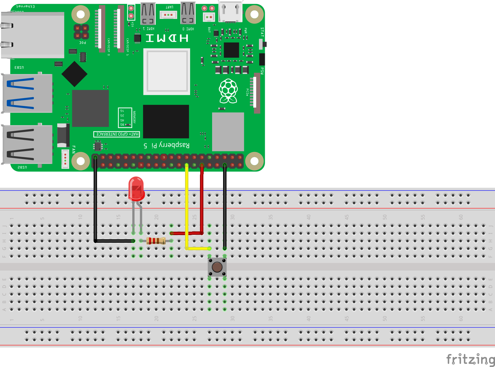

================================
Урок 2: Подключение кнопки ✨
================================

Теоретическая часть
-------------------
Кнопка является простым механическим переключателем, который при нажатии замыкает цепь и позволяет передавать сигнал в Raspberry Pi. В этом уроке мы будем использовать кнопку для управления светодиодом.

Важным аспектом работы с кнопками является понятие **подтяжки (pull-up/pull-down)**. Когда кнопка не нажата, пин находится в "плавающем" состоянии, что может приводить к ложным срабатываниям. Чтобы избежать этого, используют резисторы подтяжки:

- **Pull-up** - подтягивает пин к высокому уровню (3.3В), когда кнопка не нажата
- **Pull-down** - подтягивает пин к низкому уровню (0В), когда кнопка не нажата

В нашем уроке мы будем использовать **внутреннюю подтяжку** Raspberry Pi, что избавляет от необходимости использовать внешние резисторы и упрощает схему.

Необходимые компоненты
----------------------
- Raspberry Pi
- Светодиод (LED)
- Резистор 330 Ом (для светодиода)
- Кнопка
- Макетная плата (breadboard)
- Соединительные провода

Схема подключения
-----------------

   **Рис. 1:** Схема подключения кнопки и светодиода

Обратите внимание, что в схеме мы не используем внешний подтягивающий резистор для кнопки, так как задействуем внутреннюю подтяжку Raspberry Pi.

Запуск кода
-----------
1. Создайте файл `button_led.py` в папке `lessons/lesson2/`:

   .. code-block:: bash

      nano lessons/lesson2/button_led.py

2. Скопируйте в него следующий код и сохраните.
3. Запустите программу:
   
   .. code-block:: bash

      python3 lessons/lesson2/button_led.py

Код программы
-------------
Файл: `lessons/lesson2/button_led.py`

.. code-block:: python

   import board
   import digitalio
   import time

   # Настройка светодиода
   led = digitalio.DigitalInOut(board.D18)  # BCM 18
   led.direction = digitalio.Direction.OUTPUT

   # Настройка кнопки
   button = digitalio.DigitalInOut(board.D23)  # BCM 23
   button.direction = digitalio.Direction.INPUT
   button.pull = digitalio.Pull.DOWN

   print("Нажми кнопку, чтобы включить светодиод!")

   # Основной цикл
   while True:
       try:
           if button.value:  # Если кнопка нажата
               led.value = True
               print("Кнопка нажата! Включаем LED.")
           else:
               led.value = False
               print("Кнопка отпущена! Выключаем LED.")
           
           time.sleep(0.1)  # Небольшая задержка для стабильности
       except KeyboardInterrupt:
           # Безопасное завершение при нажатии Ctrl+C
           led.value = False
           break

Разбор кода
-----------
- `import board` и `import digitalio` – импортируем модули для работы с GPIO пинами.
- `import time` – модуль для создания задержек.

**Настройка светодиода:**

- `led = digitalio.DigitalInOut(board.D18)` – создаем объект для управления GPIO18.
- `led.direction = digitalio.Direction.OUTPUT` – настраиваем пин как выход.

**Настройка кнопки:**

- `button = digitalio.DigitalInOut(board.D23)` – создаем объект для GPIO23, к которому подключена кнопка.
- `button.direction = digitalio.Direction.INPUT` – настраиваем пин как вход.
- `button.pull = digitalio.Pull.DOWN` – включаем внутреннюю подтяжку к земле (pull-down), чтобы когда кнопка не нажата, значение пина было стабильно 0.

**Основная логика:**

- `if button.value:` – проверяем состояние кнопки. Когда кнопка нажата, `button.value` равно `True`.
- `led.value = True` – включаем светодиод, если кнопка нажата.
- `led.value = False` – выключаем светодиод, если кнопка не нажата.
- `time.sleep(0.1)` – небольшая задержка для снижения нагрузки на процессор и стабильности считывания сигнала.
- `except KeyboardInterrupt:` – обработка нажатия Ctrl+C для аккуратного завершения программы.

Ожидаемый результат
-------------------
При запуске программы и нажатии на кнопку должен загораться светодиод. При отпускании кнопки светодиод гаснет. В терминале будут отображаться соответствующие сообщения о состоянии кнопки.

Завершение работы
-----------------
Для остановки программы нажмите **Ctrl + C** в терминале. Благодаря блоку `except KeyboardInterrupt`, программа корректно завершит работу и выключит светодиод.

Поздравляем! Вы научились считывать состояние кнопки и управлять светодиодом в зависимости от её состояния, используя внутреннюю подтяжку Raspberry Pi.