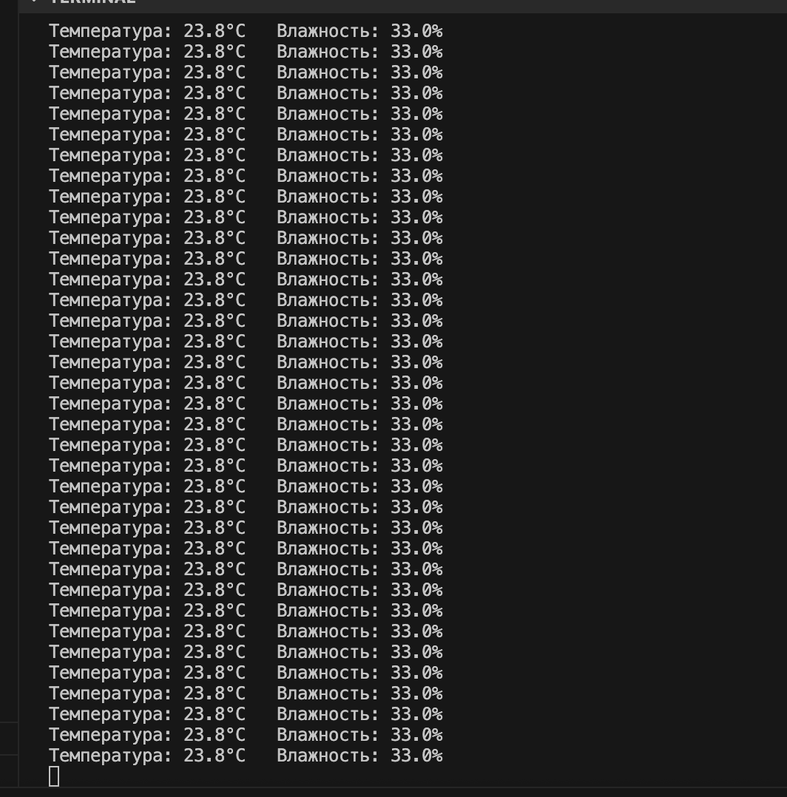

============================================================
Урок 6: Работа с датчиком температуры и влажности DHT11
============================================================

Теоретическая часть
-------------------
Датчик DHT11 позволяет измерять температуру и относительную влажность окружающей среды. Это недорогой и популярный датчик для начинающих проектов умного дома, метеостанций и мониторинга микроклимата. DHT11 имеет следующие характеристики:

- Измерение влажности: 20-90% RH (точность ±5%)
- Измерение температуры: 0-50°C (точность ±2°C)
- Частота опроса: не чаще, чем раз в 1-2 секунды

DHT11 использует собственный протокол передачи данных по одному проводу, что требует особой библиотеки для корректного считывания показаний. В нашем случае мы будем использовать библиотеку `adafruit_dht`, которая хорошо работает с CircuitPython.

Необходимые компоненты
----------------------
- Raspberry Pi
- Датчик DHT11 (или DHT22 для более точных измерений)
- Резистор 10 кОм (подтягивающий, может не потребоваться, если модуль DHT11 уже включает его)
- Макетная плата (breadboard)
- Соединительные провода

Схема подключения
-----------------
.. figure:: images/lesson6.png
   :width: 80%
   :align: center

   **Рис. 1:** Схема подключения датчика DHT11

В нашей схеме:
- Пин VCC датчика подключен к 3.3В на Raspberry Pi
- Пин DATA датчика подключен к GPIO18
- Пин GND датчика подключен к земле (GND)

Установка необходимых библиотек
-------------------------------
Перед запуском кода необходимо установить библиотеку для работы с DHT11:

.. code-block:: bash

   pip3 install adafruit-circuitpython-dht

Запуск кода
-----------
1. Создайте файл `dht11.py` в папке `lessons/lesson6/`:

   .. code-block:: bash

      nano lessons/lesson6/dht11.py

2. Скопируйте в него следующий код и сохраните.
3. Запустите программу:
   
   .. code-block:: bash

      python3 lessons/lesson6/dht11.py

Код программы
-------------
Файл: `lessons/lesson6/dht11.py`

.. code-block:: python

   import time
   import board
   import adafruit_dht

   # Инициализация DHT11 датчика с указанием пина
   # Для Raspberry Pi, используем нумерацию пинов из библиотеки board
   dht_device = adafruit_dht.DHT11(board.D18)  # DHT11 подключен к GPIO18

   # Если вы используете DHT22, замените на:
   # dht_device = adafruit_dht.DHT22(board.D18)

   # Главный цикл
   while True:
       try:
           # Считываем температуру и влажность
           temperature = dht_device.temperature
           humidity = dht_device.humidity
           
           # Выводим показания
           print(f"Температура: {temperature:.1f}°C   Влажность: {humidity:.1f}%")
           
       except RuntimeError as e:
           # Ошибки чтения датчика случаются довольно часто, особенно на DHT11
           # Не паникуйте, просто попробуем снова
           print(f"Ошибка чтения: {e}")
       
       except Exception as e:
           # В случае критической ошибки, освобождаем ресурсы и выходим
           dht_device.exit()
           raise e
       
       # Ждем 2 секунды перед следующим чтением
       # DHT11 может обновлять данные только раз в 1-2 секунды
       time.sleep(2.0)

Разбор кода
-----------
- `import time` – для создания задержек между опросами датчика.
- `import board` – для удобного доступа к пинам Raspberry Pi.
- `import adafruit_dht` – библиотека для работы с датчиками серии DHT.

**Инициализация датчика:**

- `dht_device = adafruit_dht.DHT11(board.D18)` – создаем объект для работы с DHT11, подключенным к GPIO18.
- Если у вас DHT22 (более точная версия датчика), замените на `adafruit_dht.DHT22()`.

**Основной цикл:**

- В бесконечном цикле `while True` мы периодически считываем данные с датчика.
- `temperature = dht_device.temperature` – получаем значение температуры в градусах Цельсия.
- `humidity = dht_device.humidity` – получаем значение относительной влажности в процентах.
- Форматируем вывод с одним знаком после запятой: `{temperature:.1f}°C`.

**Обработка ошибок:**

- `except RuntimeError as e` – обрабатываем временные ошибки чтения, которые довольно часты для DHT11.
- Библиотека может выдавать ошибки при неудачном считывании сигнала от датчика.
- Мы просто выводим сообщение об ошибке и продолжаем цикл.
- `except Exception as e` – обрабатываем любые другие ошибки.
- Корректно закрываем ресурсы датчика с помощью `dht_device.exit()`.
- Передаем исключение дальше с помощью `raise e`.

**Задержка:**

- `time.sleep(2.0)` – ожидаем 2 секунды перед следующим опросом.
- Датчик DHT11 физически не способен обновлять данные чаще, чем раз в 1-2 секунды.

Ожидаемый результат
-------------------
При запуске программы в терминале будут отображаться текущие значения температуры и относительной влажности, обновляемые каждые 2 секунды. Иногда могут появляться сообщения об ошибках чтения – это нормально для DHT11.

   **Рис. 2:** Пример вывода данных с датчика DHT11

Завершение работы
-----------------
Для остановки программы нажмите **Ctrl + C** в терминале. Программа корректно обработает прерывание и освободит ресурсы датчика.

Поздравляем! Вы научились работать с датчиком температуры и влажности DHT11, считывать его показания и обрабатывать возможные ошибки чтения.