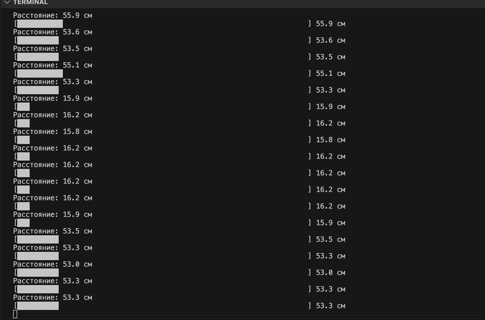

============================================================
Урок 7: Ультразвуковой датчик HC-SR04
============================================================

Теоретическая часть
-------------------
Ультразвуковой датчик **HC-SR04** – это модуль, который позволяет измерять расстояние до объектов с помощью ультразвуковых волн. Принцип работы основан на измерении времени, которое требуется ультразвуковому импульсу для достижения объекта и возвращения обратно (эхо-локация).

В данном уроке мы подключим HC-SR04 к Raspberry Pi, используя **CircuitPython**, и напишем код для измерения расстояния до объектов.

Необходимые компоненты
----------------------
- Raspberry Pi
- Ультразвуковой датчик HC-SR04
- Соединительные провода
- Макетная плата (breadboard)

Принцип работы HC-SR04
----------------------
Датчик HC-SR04 имеет 4 пина:

- **VCC** – питание 5В
- **Trig** – триггер для генерации ультразвукового импульса
- **Echo** – пин для получения отраженного сигнала
- **GND** – земля

Работа датчика:
1. Подаем короткий импульс (10 мкс) на пин **Trig**
2. Датчик генерирует 8 ультразвуковых импульсов частотой 40 кГц
3. Ультразвук отражается от препятствия и возвращается
4. Пин **Echo** переходит в состояние HIGH на время, пропорциональное расстоянию
5. Расстояние = (Время сигнала на Echo × Скорость звука) / 2

Схема подключения
-----------------
.. figure:: images/lesson7.png
   :width: 80%
   :align: center

   **Рис. 1:** Схема подключения HC-SR04 к Raspberry Pi

Подключаем датчик HC-SR04 к Raspberry Pi следующим образом:
- VCC к 5V
- GND к GND
- Trig к GPIO23 (BCM)
- Echo к GPIO24 (BCM)

.. note::
   HC-SR04 требует 5В для работы, но пин Echo выдает сигнал 5В, что может повредить Raspberry Pi (рассчитан на 3.3В). Для безопасности рекомендуется использовать делитель напряжения на пине Echo. В нашем случае мы будем использовать встроенную защиту CircuitPython.

Установка необходимых библиотек
-------------------------------
Перед началом работы установим библиотеку Adafruit для работы с HC-SR04:

.. code-block:: bash

   pip install adafruit-circuitpython-hcsr04

Код программы
-------------

.. code-block:: python

   #!/usr/bin/env python3
   # HC-SR04 ультразвуковой датчик на CircuitPython
   # Подключение:
   # - VCC к 5V
   # - GND к GND
   # - Trig к GPIO23 (BCM)
   # - Echo к GPIO24 (BCM)

   import time
   import board
   import digitalio
   import adafruit_hcsr04

   # Настраиваем пины для ультразвукового датчика
   # На Raspberry Pi используйте правильные пины для вашего подключения
   sonar = adafruit_hcsr04.HCSR04(trigger_pin=board.D23, echo_pin=board.D24)

   # Функция для вывода расстояния в консоль
   def display_distance(distance):
       print(f"Расстояние: {distance:.1f} см")
       
       # Для визуализации можно добавить графическое представление расстояния
       if distance < 350:  # Максимальная дальность HC-SR04 около 4 метров
           bar_count = int(distance // 5)  # 1 символ на каждые 5 см
           bar = '█' * bar_count
           print(f"[{bar.ljust(70)}] {distance:.1f} см")

   # Основная функция программы
   def main():
       print("Мониторинг расстояния с HC-SR04")
       print("Нажмите Ctrl+C для выхода")
       print("-" * 50)
       
       try:
           while True:
               try:
                   # Получаем расстояние в сантиметрах
                   distance = sonar.distance
                   display_distance(distance)
               except RuntimeError:
                   # Обработка ошибок чтения
                   print("Ошибка чтения данных, проверьте подключение")
               
               # Пауза между измерениями
               time.sleep(0.5)
       
       except KeyboardInterrupt:
           print("\nПрограмма остановлена пользователем")

   if __name__ == "__main__":
       main()

Разбор кода
-----------

- `import adafruit_hcsr04` – импортируем библиотеку для HC-SR04, которая значительно упрощает взаимодействие с датчиком
- `import board` – библиотека CircuitPython для доступа к пинам платы
- `sonar = adafruit_hcsr04.HCSR04(trigger_pin=board.D23, echo_pin=board.D24)` – создаем объект датчика, указав пины для Trig и Echo
- `distance = sonar.distance` – получаем расстояние в сантиметрах (библиотека сама выполняет все необходимые расчеты)
- `except RuntimeError` – обрабатываем ошибки чтения с датчика (например, если объект вне диапазона или проблемы с подключением)
- `display_distance()` – функция для вывода и визуализации расстояния в консоли
- Цикл `while True` позволяет непрерывно производить измерения с паузой 0.5 секунды

Запуск
------
Сохраните код в файл `hcsr04_circuitpython.py` и запустите его:

.. code-block:: bash

   python3 hcsr04_circuitpython.py

Ожидаемый результат
-------------------
При запуске программы вы увидите информацию о расстоянии до ближайшего объекта перед датчиком HC-SR04. Расстояние будет обновляться каждые 0,5 секунды. Кроме числового значения, будет отображаться графическая линейка, длина которой пропорциональна расстоянию.

   **Рис. 2:** Пример вывода программы

Завершение работы
-----------------
Нажмите **Ctrl + C** для остановки программы. Поздравляем! Теперь вы знаете, как работать с ультразвуковым датчиком HC-SR04 при помощи CircuitPython на Raspberry Pi.
