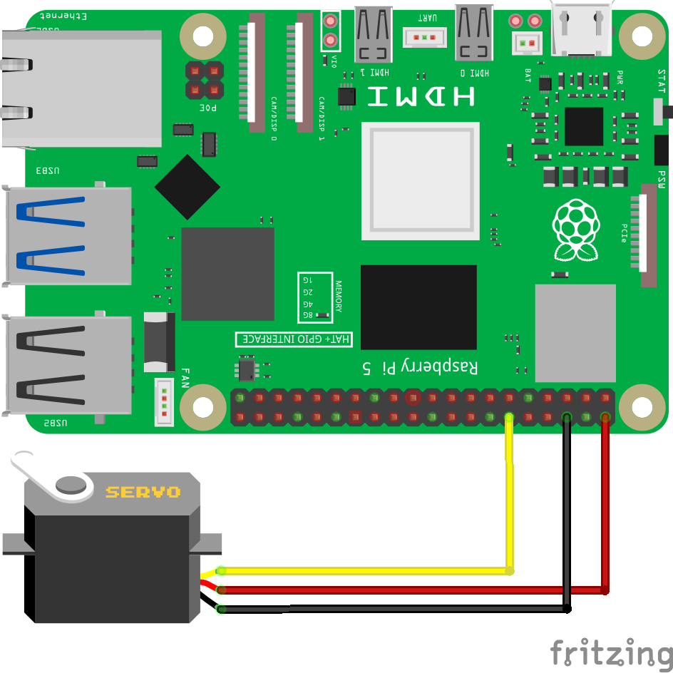

============================================================
Урок 8: Управление сервоприводом SG90 🔄
============================================================

Теоретическая часть
-------------------
Сервопривод SG90 – это компактный электромеханический привод, который позволяет вращать вал на определённый угол (обычно от 0 до 180 градусов). Управление углом происходит за счёт подачи ШИМ-сигнала (PWM) с различной скважностью (pulse width).

В отличие от библиотеки gpiozero, CircuitPython использует специальный модуль `adafruit_motor.servo` для управления сервоприводом, что обеспечивает более точное и удобное управление.

Необходимые компоненты
----------------------
- Raspberry Pi
- Сервопривод SG90 (или аналог)
- Макетная плата (breadboard) при необходимости
- Соединительные провода (3 провода: питание, земля, сигнал)

Схема подключения
-----------------

   **Рис. 1:** Схема подключения сервопривода

Запуск кода
------------
1. Откройте текстовый редактор или IDE (например, Thonny или VS Code) на Raspberry Pi.
2. Создайте новый файл **servo_circuit.py** в папке `lessons/lesson8/`.
3. Вставьте в файл следующий код:

Код программы
-------------
Файл: `lessons/lesson8/servo_circuit.py`

.. code-block:: python

    import time
    import board
    import pwmio
    from adafruit_motor import servo

    # Инициализация PWM на GPIO 18
    pwm = pwmio.PWMOut(board.D18, duty_cycle=2 ** 15, frequency=50)

    # Создание объекта сервопривода
    # Параметры min_pulse и max_pulse можно регулировать для точной настройки углов
    my_servo = servo.Servo(pwm, min_pulse=750, max_pulse=2250)

    try:
        while True:
            print("Поворот на 0°")
            my_servo.angle = 0
            time.sleep(1)
            
            print("Поворот на 90°")
            my_servo.angle = 90
            time.sleep(1)
            
            print("Поворот на 180°")
            my_servo.angle = 180
            time.sleep(1)
            
            # Плавное движение от 180° к 0°
            print("Плавное движение от 180° к 0°")
            for angle in range(180, -1, -5):  # Шаг 5 градусов
                my_servo.angle = angle
                time.sleep(0.05)
                
            # Плавное движение от 0° к 180°
            print("Плавное движение от 0° к 180°")
            for angle in range(0, 181, 5):  # Шаг 5 градусов
                my_servo.angle = angle
                time.sleep(0.05)
                
    except KeyboardInterrupt:
        print("\nПрограмма завершена.")
        # Устанавливаем сервопривод в нейтральное положение перед выходом
        my_servo.angle = 90

Разбор кода
------------
- `import board` – импортируем модуль board для доступа к пинам Raspberry Pi.
- `import pwmio` – импортируем модуль для создания PWM (Pulse Width Modulation) сигнала.
- `from adafruit_motor import servo` – импортируем модуль для работы с сервоприводами.
- `pwm = pwmio.PWMOut(board.D18, duty_cycle=2 ** 15, frequency=50)` – создаем PWM-объект на пине GPIO18 с частотой 50 Гц (стандарт для большинства сервоприводов).
- `my_servo = servo.Servo(pwm, min_pulse=750, max_pulse=2250)` – создаем объект сервопривода с указанием минимальной и максимальной длительности импульса.
- `my_servo.angle = 0/90/180` – устанавливаем угол поворота сервопривода.
- Циклы `for angle in range(...):` демонстрируют плавное движение сервопривода.

Ожидаемый результат
-------------------
1. Сервопривод последовательно поворачивается на 0°, 90° и 180° с паузами между положениями.
2. Затем демонстрируется плавное движение от 180° к 0° и обратно с шагом 5°.
3. В консоли отображаются текущие действия.

Завершение работы
-----------------
Для остановки программы нажмите **Ctrl + C** в терминале. Перед завершением сервопривод устанавливается в нейтральное положение (90°).

Поздравляем! 🎉 Вы успешно научились управлять сервоприводом SG90 с помощью CircuitPython на Raspberry Pi! Теперь вы можете использовать сервоприводы в различных проектах, требующих точного управления движением.