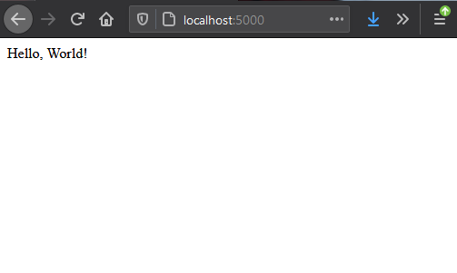
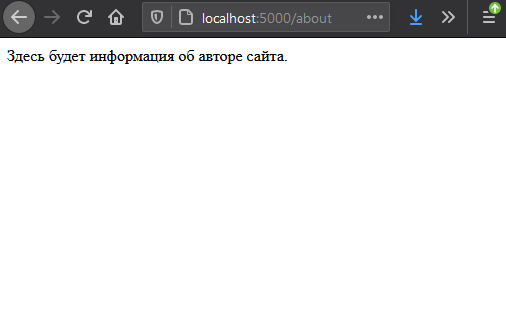
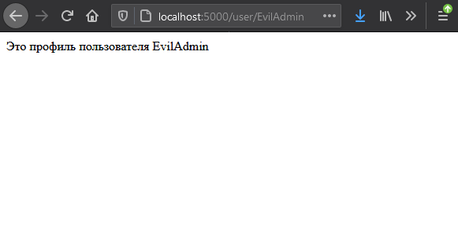
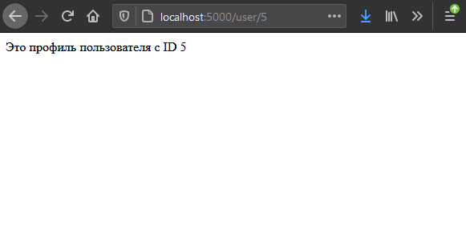

============
Основы Flask
============

**Flask** – компактный фреймворк для быстрой разработки веб-приложений. Он предоставляет минимальную необходимую функциональность и не навязывает никаких строгих правил в отношении структуры и архитектуры приложения (как это делает Django).

Flask универсален – на его основе можно создавать сложные приложения и API, и в то же время он идеально подходит для разработки небольших проектов.

Основные преимущества Flask:
----------------------------------------------------

* **Минималистичность**. Flask отличается небольшим размером – в нем есть все самое необходимое и нет ничего лишнего.
* **Гибкость**. Фреймворк не диктует определенных правил и позволяет разработчику сохранить полный контроль над структурой приложения.
* **Простота в использовании**. Он имеет несколько встроенных функций, которые позволяют сразу начать создавать полноценные веб-приложения, даже если у вас нет опыта в веб-разработке на Python. Например, у Flask есть встроенный сервер, поддержка сессий, обработчик форм, шаблонизатор.
* **Интеграция с дополнительными библиотеками**. Фреймворк очень просто интегрируется с многочисленными библиотеками, которые расширяют его функциональность. Это позволяет создать гибкий, масштабируемый проект для любой сферы.
* **Простота тестирования**. У Flask есть встроенный тестовый клиент, который максимально упрощает тестирование и отладку.

Установка
------------------------

Flask лучше всего устанавливать в виртуальное окружение – это позволяет избежать появления ошибок, связанных с конфликтами версий различных библиотек и модулей. 
Выполните в **терминал**::

    cd lessons/module2/lesson1

Перейдите в директорию::

    python3 -m venv venv

Создайте окружение::

    source venv\scripts\activate

Активируйте окружение::

    pip install flask

И установите Flask

.. note:: Активировать виртуальное окружение нужно перед каждым сеансом работы с Flask

Простейшее приложение на Flask
----------------------------------------------------
Напишем приложение, которое будет выводить традиционное приветствие Hello, World! в браузере. Сохраните этот код в файле app.py в директории lesson1:

.. code-block:: python
    
    from flask import Flask

    app = Flask(__name__)

    @app.route('/')
    def hello():
        return 'Hello, World!'

    if __name__ == '__main__':
        app.run()

Этот код создает объект приложения Flask с помощью класса Flask и присваивает его переменной **app**. Декоратор ``@app.route('/')`` устанавливает маршрут для главной страницы нашего приложения, а метод ``def hello()`` определяет, что будет отображаться на этой странице.

``if __name__ == '__main__':`` проверяет, запускается ли данный файл как самостоятельное приложение, или импортируется как модуль. В нашем случае он запускается как независимое приложение, поэтому вызывается метод **app.run()**, который запускает веб-сервер Flask.

Запустите приложение в командой строке::

    (venv) C:\Users\User\fproject>app.py

Откройте адрес http://localhost:5000/ в браузере:

Flask по умолчанию использует порт 5000. При желании его можно изменить на более привычный 8000::

    app.run(port=8000)

Кроме того, можно включить режим отладки – тогда все возникающие ошибки будут отображаться на странице браузера, а при внесении любых изменений в файлы проекта сервер будет автоматически перезагружаться::

    app.run(debug=True)

Для остановки сервера нажмите **Ctrl+C**.

Маршруты в Flask
------------------------------

Маршруты – это URL-адреса, по которым пользователи могут открывать определенные страницы (разделы) веб-приложения. Маршруты в Flask определяются с помощью декоратора ``@app.route()``. Для каждого маршрута можно написать отдельную функцию представления, которая будет выполнять какие-то действия при переходе по определенному адресу. Рассмотрим пример:

.. code-block:: python

    from flask import Flask

    app = Flask(__name__)

    @app.route('/')
    def home():
        return 'Это главная страница.'

    @app.route('/about')
    def about():
        return 'Здесь будет информация об авторе сайта.'

    @app.route('/blog')
    def blog():
        return 'Это блог с заметками о работе и увлечениях.'

    if __name__ == '__main__':
        app.run()

Сохраните код, запустите приложение, последовательно откройте адреса:

* http://localhost:5000/
* http://localhost:5000/about
* http://localhost:5000/blog

Переменные в маршрутах
----------------------

В URL можно передавать различные значения. Запустите этот код и перейдите по адресу, например, http://localhost:5000/user/alash:

.. code-block:: python

    from flask import Flask

    app = Flask(__name__)

    @app.route('/user/<username>')
    def user_profile(username):
        return f"Это профиль пользователя {username}"

    if __name__ == '__main__':
        app.run()

Имя пользователя, переданное в качестве переменной, будет показано на странице.

А так можно передать в маршруте целое число:

.. code-block:: python

    from flask import Flask

    app = Flask(__name__)

    @app.route('/user/<int:user_id>')
    def user_profile(user_id):
        return f"Это профиль пользователя с ID {user_id}"

    if __name__ == '__main__':
        app.run()

Перейдите по адресу, например, http://localhost:5000/user/5:

Flask – отличный фреймворк для начинающих Python-разработчиков, желающих освоить веб-разработку. Его простота, гибкость и минимализм делают его идеальным инструментом как для создания небольших веб-приложений, так и для более сложных проектов.

В этом уроке мы рассмотрели:
----------------------------

* Установку Flask и настройку виртуального окружения
* Создание простого приложения "Hello, World!"
* Работу с маршрутами в Flask
* Использование переменных в URL

Дальнейшие темы для изучения могут включать:
--------------------------------------------------------------------------------------

* Работу с шаблонами (Jinja2)
* Обработку форм и данных пользователя
* Подключение баз данных (например, SQLite или SQLAlchemy)
* Создание REST API
* Аутентификацию и авторизацию пользователей

.. tip:: Обязательно ознакомьтесь с официальной документацией Flask на https://flask.palletsprojects.com/ для более глубокого понимания возможностей фреймворка.

.. note:: Продолжайте практиковаться и создавать небольшие проекты – это лучший способ закрепить полученные знания и развить навыки работы с Flask.
