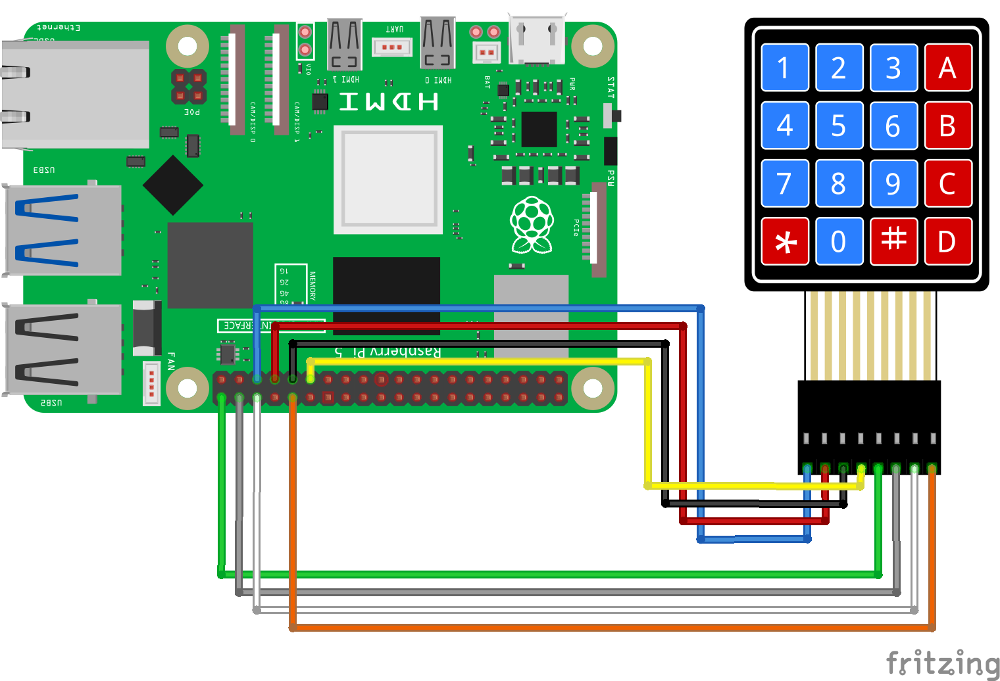
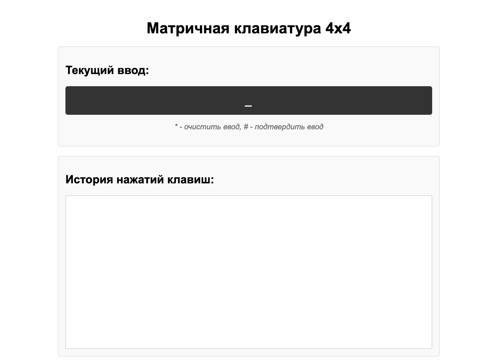

============================================================
Веб клавиатура 
============================================================

Теоретическая часть
--------------------------------------
В этом уроке мы объединим матричную клавиатуру с веб-технологиями, создав систему, которая позволит отслеживать нажатия клавиш через браузер. Такое решение может использоваться для создания кодовых замков, систем ввода PIN-кодов, простых интерфейсов управления и многих других проектов, где требуется физический ввод данных с удаленным мониторингом.

Матричная клавиатура 4x4 содержит 16 кнопок, но требует всего 8 GPIO пинов благодаря своей матричной организации. Мы будем использовать:
- Flask для создания веб-сервера
- CircuitPython для работы с клавиатурой
- JavaScript для динамического обновления веб-интерфейса
- Многопоточность для одновременного опроса клавиатуры и обслуживания веб-запросов

Необходимые компоненты
------------------------------------------------------------
- Raspberry Pi
- Матричная клавиатура 4x4
- Соединительные провода
- Устройство с браузером для доступа к веб-интерфейсу (смартфон, планшет, компьютер)

Схема подключения
-------------------------------------------------------

   **Рис. 1:** Схема подключения матричной клавиатуры 4x4

Подключите клавиатуру к Raspberry Pi следующим образом:
- Строки (R1-R4) к GPIO пинам: 5, 6, 13, 19
- Столбцы (C1-C4) к GPIO пинам: 12, 16, 20, 21

Установка необходимых библиотек
---------------------------------------------------------------------
Перед запуском кода установите необходимые библиотеки:

.. code-block:: bash

   pip install flask adafruit-circuitpython-matrixkeypad

Структура проекта
-------------------------------------------------------
Создайте следующую структуру папок и файлов:

.. code-block:: bash

   lessons/
   └── keypad_web/
       ├── app.py            # Основное Flask-приложение
       └── templates/
           └── index.html    # HTML-шаблон для веб-интерфейса

Код программы
---------------------------------------------------
**Файл app.py**

.. code-block:: python

   from flask import Flask, render_template, jsonify
   import time
   import board
   import digitalio
   import adafruit_matrixkeypad
   import threading

   app = Flask(__name__)

   # Определяем пины для строк (R1-R4) и столбцов (C1-C4)
   row_pins = [
       digitalio.DigitalInOut(board.D5),
       digitalio.DigitalInOut(board.D6),
       digitalio.DigitalInOut(board.D13),
       digitalio.DigitalInOut(board.D19)
   ]

   col_pins = [
       digitalio.DigitalInOut(board.D12),
       digitalio.DigitalInOut(board.D16),
       digitalio.DigitalInOut(board.D20),
       digitalio.DigitalInOut(board.D21)
   ]

   # Настраиваем пины строк как выходы с подтягиванием к высокому уровню
   for pin in row_pins:
       pin.direction = digitalio.Direction.OUTPUT
       pin.value = True

   # Настраиваем пины столбцов как входы с подтягиванием к высокому уровню
   for pin in col_pins:
       pin.direction = digitalio.Direction.INPUT
       pin.pull = digitalio.Pull.UP

   # Определяем карту символов клавиатуры
   keys = [
       ["1", "2", "3", "A"],
       ["4", "5", "6", "B"],
       ["7", "8", "9", "C"],
       ["*", "0", "#", "D"]
   ]

   # Инициализируем матричную клавиатуру
   keypad = adafruit_matrixkeypad.Matrix_Keypad(
       row_pins, col_pins, keys
   )

   # Глобальные переменные для хранения состояния
   current_input = ""  # Текущий ввод пользователя
   last_pressed = []   # Последние нажатые клавиши
   keypad_history = [] # История ввода для отображения в веб-интерфейсе

   # Блокировка для многопоточного доступа
   lock = threading.Lock()

   # Функция для обработки нажатий клавиш
   def process_key_press(key):
       global current_input, keypad_history
       
       with lock:
           if key == "*":  # Если нажата звездочка, очищаем ввод
               keypad_history.append(f"Ввод очищен: {current_input}")
               current_input = ""
           elif key == "#":  # Если нажата решетка, обрабатываем ввод
               keypad_history.append(f"Подтверждён ввод: {current_input}")
               current_input = ""
           else:  # Обычная клавиша - добавляем к текущему вводу
               current_input += key
               keypad_history.append(f"Нажата клавиша: {key}")
           
           # Ограничиваем историю до последних 20 записей
           if len(keypad_history) > 20:
               keypad_history = keypad_history[-20:]

   # Функция опроса клавиатуры в отдельном потоке
   def keypad_polling():
       global last_pressed
       
       while True:
           # Проверяем нажатые клавиши
           pressed = keypad.pressed_keys
           
           # Обрабатываем только новые нажатия
           for key in pressed:
               if key not in last_pressed:
                   process_key_press(key)
           
           # Обновляем состояние последних нажатых клавиш
           last_pressed = pressed.copy()
           
           # Небольшая задержка для стабилизации
           time.sleep(0.1)

   # Роут для главной страницы
   @app.route('/')
   def index():
       return render_template('index.html')

   # API для получения текущего состояния клавиатуры
   @app.route('/api/keypad-state')
   def keypad_state():
       with lock:
           return jsonify({
               'current_input': current_input,
               'history': keypad_history
           })

   # Запуск опроса клавиатуры в отдельном потоке
   def start_keypad_thread():
       keypad_thread = threading.Thread(target=keypad_polling, daemon=True)
       keypad_thread.start()

   if __name__ == '__main__':
       # Запускаем поток для опроса клавиатуры
       start_keypad_thread()
       
       # Запускаем веб-сервер Flask
       app.run(host='0.0.0.0', port=5000, debug=False, threaded=True)

**Файл templates/index.html**

.. code-block:: html

   <!DOCTYPE html>
   <html lang="ru">
   <head>
       <meta charset="UTF-8">
       <meta name="viewport" content="width=device-width, initial-scale=1.0">
       <title>Матричная клавиатура</title>
       
   </head>
   <body>
       <h1>Матричная клавиатура 4x4</h1>
       
       

           

               <h2>Текущий ввод:</h2>
               
_

               
* - очистить ввод, # - подтвердить ввод

           

           
           

               <h2>История нажатий клавиш:</h2>
               

           

       

       
   </body>
   </html>

Разбор кода
-------------------------------------------------

**Разбор app.py:**

1. **Настройка пинов и клавиатуры:**

.. code-block:: python

    row_pins = [digitalio.DigitalInOut(board.D5), ...]
    col_pins = [digitalio.DigitalInOut(board.D12), ...]
    
    # Настройка пинов строк как выходы

    for pin in row_pins:
        pin.direction = digitalio.Direction.OUTPUT
        pin.value = True
    
    # Настройка пинов столбцов как входы с подтяжкой
    for pin in col_pins:
        pin.direction = digitalio.Direction.INPUT
        pin.pull = digitalio.Pull.UP

   - Инициализируем GPIO пины для строк и столбцов матричной клавиатуры
   - Настраиваем строки как выходы, а столбцы как входы с подтяжкой к высокому уровню

2. **Определение карты символов:**

.. code-block:: python

    keys = [
        ["1", "2", "3", "A"],
        ["4", "5", "6", "B"],
        ["7", "8", "9", "C"],
        ["*", "0", "#", "D"]
    ]
  
   - Создаем матрицу символов, соответствующую физическому расположению клавиш

3. **Работа с нажатиями клавиш:**

    .. code-block:: python

        def process_key_press(key):
            global current_input, keypad_history
            
            with lock:
                if key == "*":  # Очистка ввода
                    keypad_history.append(f"Ввод очищен: {current_input}")
                    current_input = ""
                elif key == "#":  # Подтверждение ввода
                    keypad_history.append(f"Подтверждён ввод: {current_input}")
                    current_input = ""
                else:  # Добавление символа
                    current_input += key
                    keypad_history.append(f"Нажата клавиша: {key}")

   - Обрабатываем нажатия разных клавиш
   - Используем `*` для очистки ввода и `#` для подтверждения
   - Сохраняем историю действий

4. **Многопоточность:**

    .. code-block:: python

        def keypad_polling():
            global last_pressed
            
            while True:
                pressed = keypad.pressed_keys
                
                for key in pressed:
                    if key not in last_pressed:
                        process_key_press(key)
                
                last_pressed = pressed.copy()
                time.sleep(0.1)

   - Создаем отдельный поток для постоянного опроса клавиатуры
   - Обрабатываем только новые нажатия, сравнивая с предыдущим состоянием
   - Используем блокировку (`lock`) для безопасного доступа к общим данным

5. **Flask API:**

.. code-block:: python

    @app.route('/')
    def index():
        return render_template('index.html')

    @app.route('/api/keypad-state')
    def keypad_state():
        with lock:
            return jsonify({
                'current_input': current_input,
                'history': keypad_history
            })

   - Создаем endpoint для получения текущего состояния клавиатуры
   - Используем блокировку для безопасного доступа к данным

**Разбор index.html:**

1. **Структура страницы:**
   - Создаем два основных элемента: дисплей ввода и история нажатий
   - Добавляем инструкцию о функциях клавиш `*` и `#`

2. **Стили CSS:**
   - Оформляем дисплей ввода в виде темного монохромного экрана
   - Создаем прокручиваемую область истории с подсветкой строк

3. **JavaScript-логика:**

.. code-block:: javascript

    function updateKeypadData() {
        fetch('/api/keypad-state')
            .then(response => response.json())
            .then(data => {
                // Обновляем текущий ввод и историю
            });
    }
   
   // Обновляем данные раз в секунду
   setInterval(updateKeypadData, 1000);

   - Используем Fetch API для получения данных от сервера
   - Обновляем интерфейс на основе полученных данных
   - Настраиваем автоматическое обновление каждую секунду

Запуск программы
-----------------------------------------------------
1. Сохраните файлы в соответствующих директориях
2. Запустите Flask-приложение:

.. code-block:: bash

    python3 lessons/keypad_web/app.py

3. Откройте браузер и перейдите по адресу: http://<IP_Raspberry_Pi>:5000
   - где <IP_Raspberry_Pi> - IP-адрес вашего Raspberry Pi в локальной сети
   - например: http://192.168.1.100:5000

Ожидаемый результат
---------------------------------------------------------
После запуска приложения вы увидите веб-страницу с дисплеем ввода и историей нажатий. При нажатии клавиш на физической клавиатуре:

1. На дисплее отобразятся нажатые символы
2. В истории появятся записи о нажатиях
3. При нажатии * произойдет очистка ввода
4. При нажатии # произойдет подтверждение и обработка ввода

   **Рис. 2:** Пример веб-интерфейса для матричной клавиатуры

Практические применения
------------------------------------------------------------
Данная система может быть использована для различных целей:

1. **Кодовый замок**: Добавьте проверку введенного кода и управление электромеханическим замком
2. **Система авторизации**: Используйте клавиатуру для ввода PIN-кодов доступа к различным функциям
3. **Калькулятор**: Добавьте функции вычислений на основе введенных чисел
4. **Домашняя автоматизация**: Управляйте устройствами через предварительно настроенные коды
5. **Системы сигнализации**: Используйте клавиатуру для активации/деактивации сигнализации

Дополнительные задания
-----------------------------------------------------------
1. **Проверка кода доступа**: Добавьте функционал проверки введенного кода с предустановленным паролем
2. **Звуковая обратная связь**: Подключите пьезоэлемент для звукового подтверждения нажатий
3. **Интеграция с реле**: Добавьте возможность включать/выключать устройства по вводу определенных кодов
4. **Секундомер/таймер**: Реализуйте функциональность таймера с управлением через клавиатуру
5. **Журналирование**: Сохраняйте историю ввода в файл с отметками времени

Завершение работы
------------------------------------------------------
Для остановки программы нажмите **Ctrl + C** в терминале. Обратите внимание, что поток опроса клавиатуры автоматически завершится благодаря использованию daemon-потока.

Поздравляем! 🎉 Вы создали систему для удаленного мониторинга матричной клавиатуры через веб-интерфейс. Этот проект демонстрирует мощь комбинирования физических устройств ввода с современными веб-технологиями и может стать основой для множества практических проектов умного дома или систем контроля доступа.