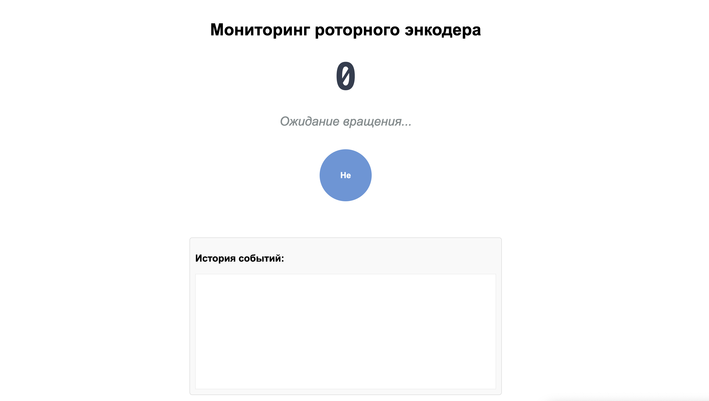

============================================================
Энкодер с веб-интерфейсом
============================================================

Теоретическая часть
-----------------------------------
Роторный энкодер — это устройство ввода, которое преобразует угловое положение вала в цифровой код. В отличие от потенциометра, энкодер может вращаться бесконечно и позволяет определять не только значение, но и направление вращения. Большинство роторных энкодеров также оснащены кнопкой, срабатывающей при нажатии на вал.

В этом уроке мы создадим систему мониторинга роторного энкодера через веб-интерфейс, используя:
- CircuitPython для прямой работы с GPIO и считывания данных с энкодера
- Flask для создания веб-сервера и API
- HTML, CSS и JavaScript для построения интерактивного веб-интерфейса
- Многопоточность для параллельной обработки веб-запросов и опроса энкодера

Такая система может использоваться в различных проектах умного дома, аудиосистемах, пользовательских интерфейсах и других устройствах, где требуется точное управление параметрами.

Необходимые компоненты
--------------------------------------
- Raspberry Pi
- Роторный энкодер с кнопкой
- Соединительные провода
- Устройство с браузером для доступа к веб-интерфейсу (смартфон, планшет, компьютер)

Схема подключения
---------------------------------
.. figure:: images/rotary_encoder.jpg
   :width: 80%
   :align: center

   **Рис. 1:** Схема подключения роторного энкодера

Подключите роторный энкодер к Raspberry Pi следующим образом:
- Вывод A энкодера -> GPIO17
- Вывод B энкодера -> GPIO18
- Вывод кнопки -> GPIO27
- GND -> GND
- VCC (+) -> 3.3V

Установка необходимых библиотек
-----------------------------------------------
Перед запуском кода установите Flask и adafruit-blinka (базовая библиотека CircuitPython):

.. code-block:: bash

   pip install flask adafruit-blinka

Структура проекта
---------------------------------
Создайте следующую структуру файлов:

.. code-block:: bash

   lessons/
   └── encoder_web/
       ├── app.py            # Основное Flask-приложение
       └── templates/
           └── index.html    # HTML-шаблон для веб-интерфейса

Код программы
-----------------------------
**Файл app.py**

.. code-block:: python

   from flask import Flask, render_template, jsonify
   import time
   import board
   import digitalio
   import threading

   app = Flask(__name__)

   # Инициализация выводов энкодера
   # Выходы A и B энкодера подключены к GPIO17 и GPIO18 соответственно
   pin_a = digitalio.DigitalInOut(board.D17)
   pin_b = digitalio.DigitalInOut(board.D18)
   pin_a.direction = digitalio.Direction.INPUT
   pin_b.direction = digitalio.Direction.INPUT
   pin_a.pull = digitalio.Pull.UP  # Подтяжка к питанию
   pin_b.pull = digitalio.Pull.UP  # Подтяжка к питанию

   # Инициализация кнопки энкодера
   button = digitalio.DigitalInOut(board.D27)  # Кнопка на GPIO27
   button.direction = digitalio.Direction.INPUT
   button.pull = digitalio.Pull.UP  # Подтяжка к VCC (кнопка замыкает на GND)

   # Глобальные переменные для хранения состояния
   counter = 0
   button_state = False
   last_button_state = False
   last_a_state = pin_a.value
   last_direction = ""
   events = []  # для хранения истории событий

   # Блокировка для многопоточного доступа
   lock = threading.Lock()

   # Функция для опроса энкодера в отдельном потоке
   def encoder_polling():
       global counter, button_state, last_button_state, last_a_state, last_direction, events
       
       try:
           print("Роторный энкодер: поворачивайте ручку или нажмите на нее")
           
           while True:
               with lock:
                   # Считываем текущее состояние выводов энкодера
                   a_state = pin_a.value
                   b_state = pin_b.value
                   
                   # Если состояние вывода A изменилось, значит произошло вращение
                   if a_state != last_a_state:
                       # Определяем направление вращения сравнивая состояния выводов A и B
                       if b_state != a_state:
                           direction = "по часовой стрелке"
                           counter += 1
                       else:
                           direction = "против часовой стрелки"
                           counter -= 1
                       
                       # Сохраняем направление и добавляем событие
                       last_direction = direction
                       events.append(f"Вращение {direction}, Счетчик: {counter}")
                       # Ограничиваем историю событий до 10
                       if len(events) > 10:
                           events = events[-10:]
                   
                   # Обновляем последнее состояние вывода A
                   last_a_state = a_state
                   
                   # Обработка нажатия кнопки
                   button_state = not button.value  # Инвертируем значение
                   
                   # Проверяем изменение состояния кнопки (обнаружение фронта)
                   if button_state and not last_button_state:
                       events.append(f"Кнопка нажата! Сброс счетчика с {counter} на 0")
                       counter = 0
                   
                   # Обновляем последнее состояние кнопки
                   last_button_state = button_state
               
               # Небольшая задержка для стабилизации
               time.sleep(0.01)
               
       except Exception as e:
           print(f"Ошибка в потоке опроса энкодера: {e}")

   # Маршрут для главной страницы
   @app.route('/')
   def index():
       return render_template('index.html')

   # API для получения текущего состояния энкодера
   @app.route('/api/encoder-state')
   def encoder_state():
       with lock:
           return jsonify({
               'counter': counter,
               'button_state': button_state,
               'last_direction': last_direction,
               'events': events
           })

   # Запуск потока опроса энкодера
   def start_encoder_thread():
       encoder_thread = threading.Thread(target=encoder_polling, daemon=True)
       encoder_thread.start()

   if __name__ == '__main__':
       # Запускаем поток для опроса энкодера
       start_encoder_thread()
       
       # Запускаем веб-сервер Flask
       app.run(host='0.0.0.0', port=5000, debug=False, threaded=True)

**Файл templates/index.html**

.. code-block:: html

   <!DOCTYPE html>
   <html lang="ru">
   <head>
       <meta charset="UTF-8">
       <meta name="viewport" content="width=device-width, initial-scale=1.0">
       <title>Роторный энкодер</title>
       
   </head>
   <body>
       <h1>Мониторинг роторного энкодера</h1>
       
       
0

       
       
Ожидание вращения...

       
       
Кнопка

       
       

           <h3>История событий:</h3>
           

       

       
   </body>
   </html>

Разбор кода
---------------------------

**Разбор app.py:**

1. **Настройка и инициализация GPIO:**
   
.. code-block:: python
    
    pin_a = digitalio.DigitalInOut(board.D17)
    pin_b = digitalio.DigitalInOut(board.D18)
    pin_a.direction = digitalio.Direction.INPUT
    pin_b.direction = digitalio.Direction.INPUT
    pin_a.pull = digitalio.Pull.UP
    pin_b.pull = digitalio.Pull.UP
    
    button = digitalio.DigitalInOut(board.D27)
    button.direction = digitalio.Direction.INPUT
    button.pull = digitalio.Pull.UP

   
   - Настраиваем пины GPIO для контактов энкодера (A и B) и кнопки
   - Устанавливаем их как входы с подтяжкой к высокому уровню (Pull-Up)
   - Это обеспечивает стабильное состояние HIGH, когда контакты не активны

2. **Алгоритм определения направления вращения:**
   
   .. code-block:: python

    if a_state != last_a_state:
        if b_state != a_state:
            direction = "по часовой стрелке"
            counter += 1
        else:
            direction = "против часовой стрелки"
            counter -= 1
   
   - Энкодеры обычно генерируют два сигнала (A и B), смещенные по фазе на 90 градусов
   - Когда сигнал A меняется, мы проверяем состояние сигнала B
   - Если A и B находятся в противоположных состояниях, вращение происходит по часовой стрелке
   - Если A и B находятся в одинаковом состоянии, вращение происходит против часовой стрелки

3. **Обработка нажатия кнопки:**
   
    .. code-block:: python

        button_state = not button.value
        if button_state and not last_button_state:
            events.append(f"Кнопка нажата! Сброс счетчика с {counter} на 0")
            counter = 0

   
   - Инвертируем значение `button.value`, так как при нажатии оно становится LOW из-за подтяжки
   - Используем детектор фронта (сравнение с предыдущим состоянием), чтобы реагировать только на момент нажатия
   - При нажатии сбрасываем счетчик и записываем событие в историю

4. **Многопоточность и безопасность:**
   
   .. code-block:: python

        lock = threading.Lock()
        
        def encoder_polling():
            # ...
            with lock:
                # Безопасный доступ к общим данным
        
        @app.route('/api/encoder-state')
        def encoder_state():
            with lock:
                # Безопасный доступ к общим данным

   
   - Используем `threading.Lock()` для создания блокировки
   - Оборачиваем весь код, работающий с общими данными, в блок `with lock:` для избежания гонок данных
   - Это гарантирует, что данные не изменятся в середине чтения веб-API

**Разбор index.html:**

1. **Стили и визуальное представление:**
   
   - Создаем большой дисплей для счетчика
   - Отображаем направление вращения и состояние кнопки
   - Показываем историю событий в прокручиваемом списке
   - Используем разные цвета для состояний кнопки (нажата/отпущена)

2. **JavaScript для обновления данных:**
   
    .. code-block:: javascript

        function updateEncoderData() {
            fetch('/api/encoder-state')
                .then(response => response.json())
                .then(data => {
                    // Обновление элементов интерфейса
                });
        }
        
        setInterval(updateEncoderData, 100);
   
   - Используем Fetch API для получения данных с сервера
   - Обновляем элементы DOM на основе полученных данных
   - Устанавливаем интервал обновления 100 мс для обеспечения плавного отклика интерфейса

Запуск программы
-------------------------------
1. Сохраните файлы в соответствующих директориях
2. Запустите Flask-приложение:

    .. code-block:: bash

        python3 lessons/encoder_web/app.py

3. Откройте браузер и перейдите по адресу: http://<IP_Raspberry_Pi>:5000
   - где <IP_Raspberry_Pi> - IP-адрес вашего Raspberry Pi в локальной сети
   - например: http://192.168.1.100:5000

Ожидаемый результат
-----------------------------------
После запуска приложения вы увидите веб-страницу с информацией о состоянии роторного энкодера:

1. Большой счетчик в центре страницы, отображающий текущее значение
2. Индикатор направления последнего вращения
3. Круглый индикатор состояния кнопки, меняющий цвет при нажатии
4. Список последних событий (вращения и нажатия кнопки)

   **Рис. 2:** Пример веб-интерфейса для роторного энкодера

Теперь вы можете:
- Вращать энкодер и наблюдать изменение счетчика
- Нажимать на кнопку энкодера для сброса счетчика
- Видеть все события в журнале
- Контролировать энкодер с любого устройства в сети

Практические применения
--------------------------------------
Роторные энкодеры с веб-интерфейсом могут использоваться во множестве проектов:

1. **Системы управления умным домом**:
   - Регулировка яркости освещения
   - Управление температурой и климатом
   - Настройка параметров аудиосистемы

2. **Пользовательские интерфейсы для устройств**:
   - Выбор пунктов меню на дисплеях
   - Ввод данных в медицинских или промышленных устройствах
   - Управление настройками 3D-принтеров или ЧПУ-станков

3. **Образовательные и демонстрационные стенды**:
   - Наглядная демонстрация принципов работы энкодеров
   - Создание интерактивных экспонатов для музеев

4. **Аудиотехника**:
   - Регулировка громкости с точным контролем
   - Управление эквалайзером или эффектами
   - Выбор треков или настройка параметров воспроизведения

Дополнительные задания
-------------------------------------
1. **Добавление визуализации направления**: Добавьте стрелки или анимацию для наглядного отображения направления вращения.
2. **Управление устройствами**: Подключите реле или другие устройства, которыми можно управлять через счетчик энкодера.
3. **Настраиваемые действия**: Добавьте возможность назначать разные действия для разных значений счетчика.
4. **Сохранение состояния**: Реализуйте сохранение состояния счетчика в файл, чтобы оно восстанавливалось после перезапуска.
5. **Длительное нажатие**: Добавьте детектирование длительного нажатия кнопки для выполнения альтернативных действий.

Завершение работы
--------------------------------
Для остановки программы нажмите **Ctrl + C** в терминале. Обратите внимание, что поток опроса энкодера автоматически завершится благодаря использованию daemon-потока.

Поздравляем! 🎉 Вы успешно создали систему мониторинга роторного энкодера через веб-интерфейс. Этот проект демонстрирует, как можно объединить физические устройства ввода с современными веб-технологиями для создания интуитивных и удобных интерфейсов управления.