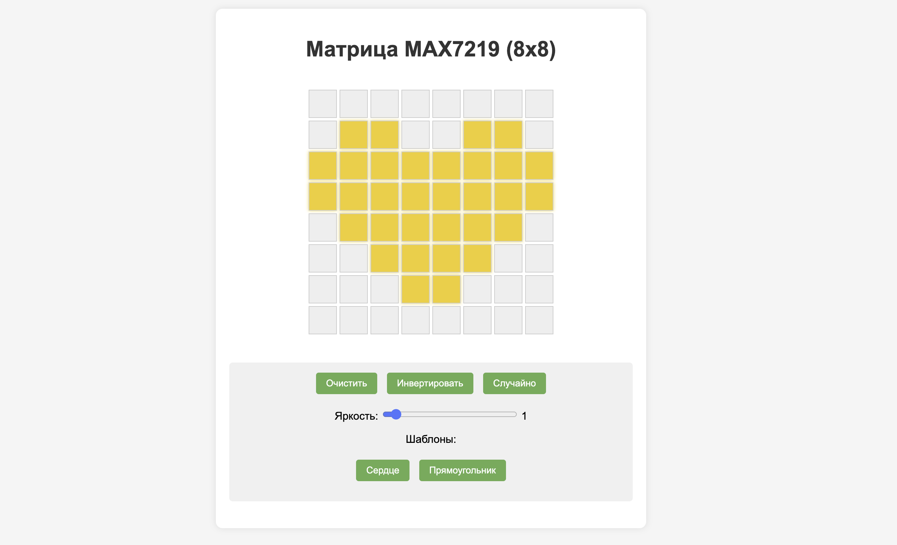

============================================================
MAX7219 и веб-интерфейс
============================================================

Теоретическая часть
--------------------------------------
LED-матрица MAX7219 — это популярный модуль, который позволяет управлять 64 светодиодами (8×8), используя всего несколько пинов микроконтроллера. Это достигается благодаря специализированной микросхеме MAX7219, которая обрабатывает мультиплексирование и контроль яркости светодиодов.

В этом уроке мы создадим веб-интерфейс для управления LED-матрицей, что позволит нам:
- Включать и выключать отдельные пиксели
- Рисовать изображения на матрице через браузер
- Устанавливать яркость отображения
- Применять готовые шаблоны изображений
- Инвертировать и очищать матрицу

Мы будем использовать:
- CircuitPython с библиотекой adafruit_max7219 для управления матрицей
- Flask для создания веб-сервера и API
- HTML, CSS и JavaScript для построения интерактивного веб-интерфейса

Необходимые компоненты
-----------------------------------------
- Raspberry Pi
- LED-матрица с драйвером MAX7219
- Соединительные провода
- Устройство с браузером для доступа к веб-интерфейсу (смартфон, планшет, компьютер)

Схема подключения
------------------------------------
.. figure:: images/max7219_connection.png
   :width: 80%
   :align: center

   **Рис. 1:** Схема подключения LED-матрицы MAX7219 к Raspberry Pi

Подключите LED-матрицу MAX7219 к Raspberry Pi следующим образом:
- VCC -> 5V
- GND -> GND
- DIN (MOSI) -> GPIO10 (SPI MOSI)
- CS -> GPIO5
- CLK -> GPIO11 (SPI CLK)

Установка необходимых библиотек
--------------------------------------------------
Перед запуском кода установите необходимые библиотеки:

.. code-block:: bash

   pip install flask adafruit-circuitpython-max7219

Структура проекта
------------------------------------
Создайте следующую структуру файлов:

.. code-block:: bash

   lessons/
   └── max7219_web/
       ├── app.py            # Основное Flask-приложение
       └── templates/
           └── index.html    # HTML-шаблон для веб-интерфейса

Код программы
--------------------------------
**Файл app.py**

.. code-block:: python

    from flask import Flask, render_template, request, jsonify
    import time
    import board
    import busio
    import digitalio
    from adafruit_max7219 import matrices

    app = Flask(__name__)

    # Конфигурация SPI
    spi = busio.SPI(clock=board.SCK, MOSI=board.MOSI)
    cs = digitalio.DigitalInOut(board.D5)  # Chip Select (CS) на GPIO 5

    # Инициализация одной матрицы MAX7219
    display = matrices.Matrix8x8(spi, cs)
    display.brightness(5)  # Устанавливаем яркость (0-15)

    # Текущее состояние матрицы (0 = выключено, 1 = включено)
    matrix_state = [[0 for _ in range(8)] for _ in range(8)]

    def update_display():
        """Обновление состояния дисплея на основе matrix_state"""
        # Очистка дисплея
        display.fill(0)
        
        # Установка пикселей в соответствии с matrix_state
        for y in range(8):
            for x in range(8):
                if matrix_state[y][x] == 1:
                    display.pixel(x, y, 1)
        
        # Отображаем изменения
        display.show()

    @app.route('/')
    def index():
        """Главная страница с интерфейсом для рисования"""
        return render_template('index.html')

    @app.route('/api/get_matrix', methods=['GET'])
    def get_matrix():
        """API для получения текущего состояния матрицы"""
        return jsonify({'matrix': matrix_state})

    @app.route('/api/set_pixel', methods=['POST'])
    def set_pixel():
        """API для изменения состояния одного пикселя"""
        data = request.get_json()
        x = data.get('x', 0)
        y = data.get('y', 0)
        state = data.get('state', 0)
        
        # Проверка валидности координат
        if 0 <= x < 8 and 0 <= y < 8:
            matrix_state[y][x] = state
            update_display()
            return jsonify({'success': True})
        else:
            return jsonify({'success': False, 'error': 'Invalid coordinates'})

    @app.route('/api/clear', methods=['POST'])
    def clear_matrix():
        """API для очистки всей матрицы"""
        global matrix_state
        matrix_state = [[0 for _ in range(8)] for _ in range(8)]
        display.fill(0)
        display.show()
        return jsonify({'success': True})

    @app.route('/api/set_matrix', methods=['POST'])
    def set_matrix():
        """API для установки всей матрицы сразу"""
        data = request.get_json()
        new_matrix = data.get('matrix', [])
        
        # Проверяем, что входящая матрица правильного размера
        if len(new_matrix) == 8 and all(len(row) == 8 for row in new_matrix):
            global matrix_state
            matrix_state = new_matrix
            update_display()
            return jsonify({'success': True})
        else:
            return jsonify({'success': False, 'error': 'Invalid matrix dimensions'})

    @app.route('/api/set_brightness', methods=['POST'])
    def set_brightness():
        """API для установки яркости дисплея"""
        data = request.get_json()
        brightness = data.get('brightness', 5)
        
        # Ограничиваем значение яркости
        brightness = max(0, min(15, brightness))
        display.brightness(brightness)
        
        return jsonify({'success': True, 'brightness': brightness})

    # Предустановленные шаблоны
    @app.route('/api/show_pattern', methods=['POST'])
    def show_pattern():
        """Отображение предустановленного шаблона"""
        global matrix_state
        data = request.get_json()
        pattern = data.get('pattern', '')
        
        patterns = {
            'heart': [
                [0, 0, 0, 0, 0, 0, 0, 0],
                [0, 1, 1, 0, 0, 1, 1, 0],
                [1, 1, 1, 1, 1, 1, 1, 1],
                [1, 1, 1, 1, 1, 1, 1, 1],
                [0, 1, 1, 1, 1, 1, 1, 0],
                [0, 0, 1, 1, 1, 1, 0, 0],
                [0, 0, 0, 1, 1, 0, 0, 0],
                [0, 0, 0, 0, 0, 0, 0, 0]
            ],
            'rectangle': [
                [1, 1, 1, 1, 1, 1, 1, 1],
                [1, 0, 0, 0, 0, 0, 0, 1],
                [1, 0, 0, 0, 0, 0, 0, 1],
                [1, 0, 0, 0, 0, 0, 0, 1],
                [1, 0, 0, 0, 0, 0, 0, 1],
                [1, 0, 0, 0, 0, 0, 0, 1],
                [1, 0, 0, 0, 0, 0, 0, 1],
                [1, 1, 1, 1, 1, 1, 1, 1]
            ]
        }
        
        if pattern in patterns:
            matrix_state = patterns[pattern]
            update_display()
            return jsonify({'success': True, 'pattern': pattern})
        else:
            return jsonify({'success': False, 'error': 'Pattern not found'})

    if __name__ == '__main__':
        # Очищаем дисплей при запуске
        display.fill(0)
        display.show()
        
        # Запускаем сервер на всех интерфейсах
        app.run(host='0.0.0.0', port=5000, debug=False, threaded=True)

**Файл templates/index.html**

.. code-block:: html

    <!DOCTYPE html>
    <html lang="ru">
    <head>
        <meta charset="UTF-8">
        <meta name="viewport" content="width=device-width, initial-scale=1.0">
        <title>Управление MAX7219</title>
        
    </head>
    <body>
        

            <h1>Матрица MAX7219 (8x8)</h1>
            
            

                <!-- Матрица 8x8 будет создана при помощи JavaScript -->
            

            
            

                <button id="clear-btn">Очистить</button>
                <button id="invert-btn">Инвертировать</button>
                <button id="random-btn">Случайно</button>
                
                

                    <label for="brightness">Яркость:</label>
                    <input type="range" id="brightness" min="0" max="15" value="5">
                    5
                

                
                

                    
Шаблоны:

                    <button id="heart-pattern">Сердце</button>
                    <button id="rectangle-pattern">Прямоугольник</button>
                

            

        

        
        
    </body>
    </html>

Разбор кода
----------------------

**Разбор app.py (серверная часть):**

1. **Настройка и инициализация:**

.. code-block:: python

    # Конфигурация SPI
    spi = busio.SPI(clock=board.SCK, MOSI=board.MOSI)
    cs = digitalio.DigitalInOut(board.D5)  # Chip Select (CS) на GPIO 5

    # Инициализация одной матрицы MAX7219
    display = matrices.Matrix8x8(spi, cs)
    display.brightness(5)  # Устанавливаем яркость (0-15)
   
   - Настраиваем интерфейс SPI для связи с MAX7219
   - Инициализируем объект Matrix8x8 для управления LED-матрицей
   - Устанавливаем начальную яркость

2. **Состояние матрицы и обновление дисплея:**

    .. code-block:: python

        # Текущее состояние матрицы (0 = выключено, 1 = включено)
        matrix_state = [[0 for _ in range(8)] for _ in range(8)]

        def update_display():
            """Обновление состояния дисплея на основе matrix_state"""
            display.fill(0)
            for y in range(8):
                for x in range(8):
                    if matrix_state[y][x] == 1:
                        display.pixel(x, y, 1)
            display.show()

   
   - Храним текущее состояние матрицы в двумерном массиве 8x8
   - Функция `update_display()` синхронизирует физический дисплей с состоянием в массиве

3. **API-маршруты Flask:**
   - `/` - Основная страница с веб-интерфейсом
   - `/api/get_matrix` - Получение текущего состояния матрицы
   - `/api/set_pixel` - Изменение состояния отдельного пикселя
   - `/api/clear` - Очистка всей матрицы
   - `/api/set_matrix` - Установка всей матрицы сразу
   - `/api/set_brightness` - Изменение яркости дисплея
   - `/api/show_pattern` - Отображение предустановленных шаблонов

**Разбор index.html (клиентская часть):**

1. **Создание интерактивной матрицы:**

.. code-block:: javascript

    function createMatrix() {
        matrixGrid.innerHTML = '';
        for (let y = 0; y < 8; y++) {
            const row = document.createElement('div');
            row.className = 'matrix-row';
            
            for (let x = 0; x < 8; x++) {
                const cell = document.createElement('div');
                cell.className = 'matrix-cell';
                cell.dataset.x = x;
                cell.dataset.y = y;
                
                // Добавляем обработчики событий
                cell.addEventListener('click', () => toggleCell(x, y));
                cell.addEventListener('mouseenter', (e) => {
                    if (e.buttons === 1) {
                        toggleCell(x, y);
                    }
                });
                
                row.appendChild(cell);
            }
            
            matrixGrid.appendChild(row);
        }
    }

   
   - Динамически создаем сетку 8x8 для представления LED-матрицы
   - Добавляем обработчики событий для рисования (клик и перетаскивание)

2. **Взаимодействие с API:**

.. code-block:: javascript

    // Переключение состояния ячейки
    function toggleCell(x, y) {
        matrixState[y][x] = matrixState[y][x] === 0 ? 1 : 0;
        updateMatrixDisplay();
        
        fetch('/api/set_pixel', {
            method: 'POST',
            headers: { 'Content-Type': 'application/json' },
            body: JSON.stringify({ x: x, y: y, state: matrixState[y][x] })
        })
        .catch(error => console.error('Ошибка:', error));
    }
    
    // Получение текущего состояния
    function getMatrixState() {
        fetch('/api/get_matrix')
            .then(response => response.json())
            .then(data => {
                // Обновление локального состояния из данных сервера
            })
            .catch(error => console.error('Ошибка:', error));
    }

   
   - Используем Fetch API для взаимодействия с сервером
   - Обновляем локальное состояние и отображение при изменениях

3. **Дополнительные функции:**
   - Очистка матрицы - отправляет запрос на `/api/clear`
   - Инвертирование - меняет все 0 на 1 и наоборот
   - Случайное заполнение - генерирует случайный рисунок
   - Регулировка яркости - отправляет значение на `/api/set_brightness`
   - Шаблоны - загружает предустановленные изображения

Запуск программы
--------------------------
1. Сохраните файлы в соответствующих директориях
2. Запустите Flask-приложение:

   .. code-block:: bash

      python3 lessons/max7219_web/app.py

3. Откройте браузер и перейдите по адресу: http://<IP_Raspberry_Pi>:5000
   - где <IP_Raspberry_Pi> - IP-адрес вашего Raspberry Pi в локальной сети
   - например: http://192.168.1.100:5000

Ожидаемый результат
------------------------------
После запуска приложения вы увидите веб-страницу с интерактивной сеткой 8x8:

   **Рис. 2:** Веб-интерфейс для управления LED-матрицей MAX7219

С помощью этого интерфейса вы можете:
1. Щелкать по ячейкам для включения/выключения отдельных светодиодов
2. Рисовать, удерживая левую кнопку мыши и перемещая указатель
3. Регулировать яркость с помощью ползунка
4. Использовать кнопки для:

   - Очистки всей матрицы
   - Инвертирования текущего изображения
   - Создания случайного узора
   - Применения готовых шаблонов (сердце, прямоугольник)

Практические применения
---------------------------------
Такая система может использоваться в различных проектах:

1. **Информационные дисплеи**:
   - Отображение статуса систем умного дома
   - Индикация погодных условий
   - Отображение уведомлений

2. **Образовательные проекты**:
   - Обучение программированию и электронике
   - Демонстрация принципов работы с матричными дисплеями
   - Создание пиксельной графики

3. **Интерактивные элементы**:
   - Игровые элементы (тетрис, змейка)
   - Анимированные индикаторы
   - Цифровые часы или таймеры

4. **Художественные проекты**:
   - Создание светодиодных инсталляций
   - Интерактивные арт-объекты
   - Динамические световые узоры

Дополнительные задания
--------------------------------
1. **Добавление анимации**: Создайте API для последовательного отображения кадров анимации.
2. **Редактор анимации**: Расширьте интерфейс для создания и сохранения нескольких кадров.
3. **Сохранение рисунков**: Добавьте возможность сохранять созданные рисунки и загружать их позже.
4. **Текстовый режим**: Реализуйте отображение текста с прокруткой на матрице.
5. **Дополнительные шаблоны**: Создайте библиотеку различных изображений и анимаций.

Завершение работы
---------------------------
Для остановки программы нажмите **Ctrl + C** в терминале. При завершении работы матрица будет автоматически очищена.

Поздравляем! 🎉 Вы успешно создали веб-интерфейс для управления LED-матрицей MAX7219. Этот проект демонстрирует, как можно объединить аппаратные возможности Raspberry Pi с современными веб-технологиями для создания интерактивных и интуитивно понятных интерфейсов управления электронными компонентами.