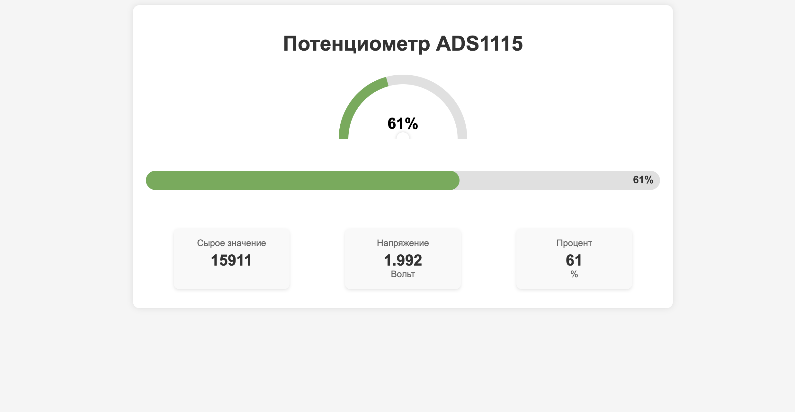

========================================================================================================================
Потенциометр и веб-интерфейс
========================================================================================================================

Теоретическая часть
--------------------------------------
Потенциометр — это переменный резистор, который позволяет изменять выходное напряжение при вращении ручки. Однако Raspberry Pi, в отличие от Arduino, не имеет встроенных аналоговых входов для считывания таких сигналов. Для решения этой проблемы мы используем аналого-цифровой преобразователь (АЦП) ADS1115, который подключается к Raspberry Pi через интерфейс I2C.

В этом уроке мы создадим систему для визуализации данных с потенциометра в реальном времени через веб-интерфейс. Это позволит:
- Считывать аналоговые значения с потенциометра
- Преобразовывать их в напряжение и процентные значения
- Отображать данные на красивых интерактивных приборных панелях в браузере

Мы будем использовать:
- CircuitPython с библиотекой adafruit_ads1x15 для работы с ADS1115
- Flask для создания веб-сервера и API
- HTML, CSS и JavaScript для построения современного интерфейса
- Многопоточность для параллельного опроса датчика и обслуживания веб-запросов

Необходимые компоненты
-----------------------------------------
- Raspberry Pi
- Аналоговый потенциометр
- АЦП ADS1115
- Соединительные провода
- Устройство с браузером для доступа к веб-интерфейсу (смартфон, планшет, компьютер)

Схема подключения
------------------------------------
.. figure:: images/ads1115_potentiometer.jpg
   :width: 80%
   :align: center

   **Рис. 1:** Схема подключения потенциометра и ADS1115 к Raspberry Pi

Подключите компоненты следующим образом:

- **ADS1115 к Raspberry Pi**:

  - VDD -> 3.3V
  - GND -> GND
  - SCL -> SCL (GPIO3)
  - SDA -> SDA (GPIO2)

- **Потенциометр к ADS1115**:

  - Левый вывод -> GND
  - Средний вывод (движок) -> A0
  - Правый вывод -> VDD

Установка необходимых библиотек
--------------------------------------------------
Перед запуском кода установите необходимые библиотеки:

.. code-block:: bash

   pip install flask adafruit-circuitpython-ads1x15

Структура проекта
------------------------------------
Создайте следующую структуру файлов:

.. code-block:: bash

   lessons/
   └── potentiometer_web/
       ├── app.py            # Основное Flask-приложение
       └── templates/
           └── index.html    # HTML-шаблон для веб-интерфейса

Код программы
--------------------------------
**Файл app.py**

.. code-block:: python

   from flask import Flask, render_template, jsonify
   import time
   import board
   import busio
   import adafruit_ads1x15.ads1115 as ADS
   from adafruit_ads1x15.analog_in import AnalogIn
   import threading

   app = Flask(__name__)

   # Инициализация I2C интерфейса
   i2c = busio.I2C(board.SCL, board.SDA)

   # Инициализация ADS1115
   ads = ADS.ADS1115(i2c)

   # Настройка канала A0 для потенциометра
   potentiometer = AnalogIn(ads, ADS.P0)

   # Установка диапазона измерений (±4.096V)
   ads.gain = 1

   # Глобальные переменные для хранения текущих значений
   current_value = 0
   current_voltage = 0
   current_percent = 0

   # Блокировка для многопоточного доступа
   lock = threading.Lock()

   # Функция для преобразования значения в проценты
   def map_to_percent(value, in_min=0, in_max=26000):
       return int((value - in_min) * 100 / (in_max - in_min))

   # Функция опроса АЦП в отдельном потоке
   def adc_polling():
       global current_value, current_voltage, current_percent
       
       try:
           while True:
               # Считываем значение с потенциометра
               raw_value = potentiometer.value
               voltage = potentiometer.voltage
               
               # Преобразуем в проценты
               percent = map_to_percent(raw_value)
               
               # Обновляем глобальные переменные
               with lock:
                   current_value = raw_value
                   current_voltage = voltage
                   current_percent = percent
               
               # Задержка для стабилизации показаний
               time.sleep(0.1)
               
       except Exception as e:
           print(f"Ошибка в потоке опроса АЦП: {e}")

   # Маршрут для главной страницы
   @app.route('/')
   def index():
       return render_template('index.html')

   # API для получения текущих значений
   @app.route('/api/adc-state')
   def adc_state():
       with lock:
           return jsonify({
               'raw_value': current_value,
               'voltage': current_voltage,
               'percent': current_percent
           })

   # Запуск потока опроса АЦП
   def start_adc_thread():
       adc_thread = threading.Thread(target=adc_polling, daemon=True)
       adc_thread.start()

   if __name__ == '__main__':
       # Запускаем поток для опроса АЦП
       start_adc_thread()
       
       # Запускаем веб-сервер Flask
       app.run(host='0.0.0.0', port=5000, debug=False, threaded=True)

**Файл templates/index.html**

.. code-block:: html

   <!DOCTYPE html>
   <html lang="ru">
   <head>
       <meta charset="UTF-8">
       <meta name="viewport" content="width=device-width, initial-scale=1.0">
       <title>Отображение потенциометра</title>
       
   </head>
   <body>
       

           <h1>Потенциометр ADS1115</h1>
           
           

               

               

               

               
0%

           

           
           

               

                   

                   
0%

               

           

           
           

               

                   
Сырое значение

                   
0

               

               
               

                   
Напряжение

                   
0.00

                   
Вольт

               

               
               

                   
Процент

                   
0

                   
%

               

           

       

       
   </body>
   </html>

Разбор кода
------------------------------

**Разбор app.py (серверная часть):**

1. **Настройка и инициализация:**

   .. code-block:: python

        # Инициализация I2C и ADS1115
        i2c = busio.I2C(board.SCL, board.SDA)
        ads = ADS.ADS1115(i2c)
        potentiometer = AnalogIn(ads, ADS.P0)
        ads.gain = 1

   
   - Инициализируем I2C интерфейс для связи с ADS1115
   - Создаем объект ADS1115 и настраиваем канал A0 для работы с потенциометром
   - Устанавливаем коэффициент усиления (gain = 1) для диапазона ±4.096В

2. **Многопоточная архитектура:**

   .. code-block:: python

        def adc_polling():
            global current_value, current_voltage, current_percent
            
            try:
                while True:
                    # Считываем значение с потенциометра
                    raw_value = potentiometer.value
                    voltage = potentiometer.voltage
                    
                    # Преобразуем в проценты
                    percent = map_to_percent(raw_value)
                    
                    # Обновляем глобальные переменные с блокировкой
                    with lock:
                        current_value = raw_value
                        current_voltage = voltage
                        current_percent = percent
                    
                    time.sleep(0.1)
            except Exception as e:
                print(f"Ошибка в потоке опроса АЦП: {e}")

   
   - Создаем отдельный поток для непрерывного считывания данных с АЦП
   - Используем блокировку `threading.Lock()` для безопасного обновления глобальных переменных
   - Это позволяет одновременно обрабатывать веб-запросы и обновлять значения с датчика

3. **API и веб-сервер:**

   .. code-block:: python

        @app.route('/')
        def index():
            return render_template('index.html')

        @app.route('/api/adc-state')
        def adc_state():
            with lock:
                return jsonify({
                    'raw_value': current_value,
                    'voltage': current_voltage,
                    'percent': current_percent
                })

   
   - Маршрут `/` возвращает главную HTML-страницу
   - Endpoint `/api/adc-state` предоставляет текущие значения с АЦП в формате JSON
   - Используем блокировку при доступе к данным для предотвращения гонок данных

**Разбор index.html (клиентская часть):**

1. **Создание визуальных элементов:**
   - Круговой индикатор (gauge) - полукруглая шкала, заполняемая в зависимости от значения
   - Линейный индикатор (slider) - горизонтальная шкала с заполнением
   - Карточки с цифровыми значениями для отображения разных форматов данных

2. **CSS-стили:**
   - Используем позиционирование и трансформации для создания интерактивных элементов
   - Применяем плавные переходы (transitions) для анимации изменений
   - Создаем красивые карточки с тенями и обтеканием

3. **JavaScript для обновления данных:**

   .. code-block:: javascript

        function updateADCData() {
            fetch('/api/adc-state')
                .then(response => response.json())
                .then(data => {
                    // Обновление всех элементов интерфейса
                    document.getElementById('raw-value').textContent = data.raw_value;
                    document.getElementById('voltage').textContent = data.voltage.toFixed(3);
                    document.getElementById('percent').textContent = data.percent;
                    
                    // Обновление линейного индикатора
                    document.getElementById('slider-thumb').style.width = data.percent + '%';
                    
                    // Обновление кругового индикатора (преобразование процента в угол)
                    const rotationAngle = 45 + (data.percent * 2.7);
                    document.getElementById('gauge-fill').style.transform = 
                        `rotate(${rotationAngle}deg)`;
                });
        }
        // Обновление данных каждые 100 мс
        setInterval(updateADCData, 100);
   
   - Используем Fetch API для асинхронных запросов к серверу
   - Обновляем все элементы интерфейса в соответствии с полученными данными
   - Преобразуем процентное значение (0-100%) в угол поворота (45-315 градусов) для кругового индикатора
   - Настраиваем частое обновление (100 мс) для плавного отображения изменений

Запуск программы
----------------------------------
1. Сохраните файлы в соответствующих директориях
2. Запустите Flask-приложение:

   .. code-block:: bash

      python3 lessons/potentiometer_web/app.py

3. Откройте браузер и перейдите по адресу: http://<IP_Raspberry_Pi>:5000
   - где <IP_Raspberry_Pi> - IP-адрес вашего Raspberry Pi в локальной сети
   - например: http://192.168.1.100:5000

Ожидаемый результат
--------------------------------------
После запуска приложения вы увидите веб-страницу с интерактивными элементами:

   **Рис. 2:** Веб-интерфейс для визуализации данных с потенциометра

На странице отображается:
1. Круговой индикатор (полукруг), показывающий текущее процентное значение
2. Линейный индикатор с прогрессом, соответствующим значению потенциометра 
3. Три информационные карточки с различными форматами данных:

   - Сырое значение с АЦП (0-26000 для ADS1115 с gain=1)
   - Напряжение в вольтах (0-3.3В при подключении к 3.3В)
   - Процентное значение (0-100%)

При вращении ручки потенциометра все индикаторы будут обновляться в реальном времени с плавной анимацией.

Практические применения
-----------------------------------------
Такая система визуализации аналоговых данных может использоваться во многих проектах:

1. **Системы мониторинга:**
   - Отображение температуры, влажности, давления и других аналоговых датчиков
   - Визуализация уровня жидкости в баках или резервуарах
   - Контроль уровня шума или освещенности

2. **Управление устройствами:**
   - Создание пользовательских интерфейсов для регуляторов громкости
   - Настройка параметров систем умного дома (яркость освещения, температура)
   - Управление скоростью моторов или интенсивностью светодиодов

3. **Образовательные проекты:**
   - Демонстрация принципов работы АЦП
   - Визуализация физических экспериментов
   - Создание интерактивных учебных стендов

4. **Датчики положения:**
   - Отслеживание угла поворота механизмов
   - Создание электронных компасов или уровней
   - Измерение перемещений и деформаций

Дополнительные задания
----------------------------------------
1. **Добавление исторических данных**: Реализуйте сохранение и отображение графика изменений значений во времени.
2. **Несколько каналов**: Подключите несколько потенциометров к разным каналам ADS1115 и отображайте их параметры на одной странице.
3. **Настраиваемые пороги**: Добавьте возможность устанавливать пороговые значения, при которых будет меняться цвет индикаторов.
4. **Управление устройствами**: Расширьте проект, добавив реле или светодиоды, которые будут активироваться при определенных положениях потенциометра.
5. **Экспорт данных**: Реализуйте функцию сохранения показаний в CSV или JSON файл для дальнейшего анализа.

Завершение работы
-----------------------------------
Для остановки программы нажмите **Ctrl + C** в терминале. Обратите внимание, что поток опроса АЦП автоматически завершится благодаря использованию daemon-потока.

Поздравляем! 🎉 Вы успешно создали систему для визуализации данных с потенциометра через веб-интерфейс. Этот проект демонстрирует, как можно использовать современные веб-технологии вместе с аппаратным интерфейсом Raspberry Pi для создания интуитивно понятных и информативных приборных панелей.