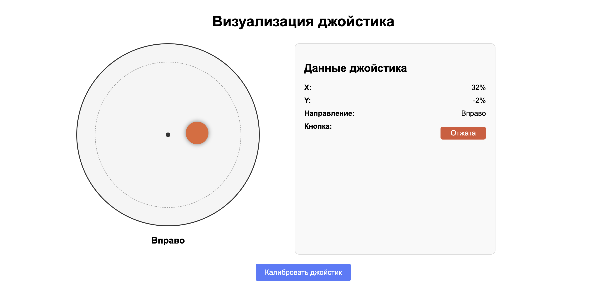

============================================================
Веб-интерфейс и джойстик
============================================================

Теоретическая часть
------------------------------------
В этом уроке мы создадим веб-интерфейс для визуализации данных с аналогового джойстика, подключенного к Raspberry Pi. Мы будем использовать:

- **Flask** - легковесный веб-фреймворк для Python
- **ADS1115** - аналого-цифровой преобразователь для считывания аналоговых значений с джойстика
- **CircuitPython** - для работы с GPIO и аналоговыми входами 
- **JavaScript/HTML/CSS** - для интерактивного веб-интерфейса

Визуализация джойстика в веб-браузере позволит удобно отслеживать его положение в реальном времени и использовать эти данные для различных проектов, включая дистанционное управление, игры и робототехнику.

Необходимые компоненты
---------------------------------------
- Raspberry Pi
- Аналоговый джойстик
- АЦП ADS1115
- Соединительные провода

Схема подключения
----------------------------------
.. figure:: images/joystick_flask_schema.png
   :width: 80%
   :align: center

   **Рис. 1:** Схема подключения джойстика через ADS1115 к Raspberry Pi

В нашей схеме:
- VRx (ось X) джойстика подключена к A0 на ADS1115
- VRy (ось Y) джойстика подключена к A1 на ADS1115
- SW (кнопка) джойстика подключена к GPIO17
- ADS1115 подключен к Raspberry Pi через I2C (SCL и SDA)

Установка необходимых библиотек
------------------------------------------------
Перед началом работы установим необходимые библиотеки:

.. code-block:: bash

   pip install adafruit-circuitpython-ads1x15 flask

Структура проекта
----------------------------------
.. code-block:: bash

   joystick_web/
   ├── app.py           # Основной Flask-скрипт
   └── templates/
       └── index.html   # HTML-шаблон с визуализацией джойстика

Код серверной части (app.py)
---------------------------------------------
Создадим файл `app.py` с следующим содержимым:

.. code-block:: python

   from flask import Flask, render_template, jsonify
   import time
   import board
   import busio
   import digitalio
   import adafruit_ads1x15.ads1115 as ADS
   from adafruit_ads1x15.analog_in import AnalogIn

   app = Flask(__name__)

   # Инициализация I2C интерфейса
   i2c = busio.I2C(board.SCL, board.SDA)

   # Инициализация ADS1115
   ads = ADS.ADS1115(i2c)

   # Настройка каналов для осей X и Y джойстика
   # ADS1115 имеет 4 аналоговых входа (A0-A3)
   x_channel = AnalogIn(ads, ADS.P0)  # Ось X подключена к A0
   y_channel = AnalogIn(ads, ADS.P1)  # Ось Y подключена к A1

   # Кнопка джойстика подключена к GPIO пину
   button = digitalio.DigitalInOut(board.D17)  # Кнопка на GPIO17
   button.direction = digitalio.Direction.INPUT
   button.pull = digitalio.Pull.UP  # Подтяжка к питанию (кнопка замыкает на GND)

   # Переменные для хранения калибровочных значений
   x_center = None
   y_center = None
   x_min = None
   x_max = None
   y_min = None
   y_max = None

   def calibrate_joystick():
       global x_center, y_center, x_min, x_max, y_min, y_max
       
       # Считываем несколько значений для определения центральной позиции
       x_values = []
       y_values = []
       
       print("Калибровка джойстика...")
       print("Пожалуйста, оставьте джойстик в центральном положении")
       
       for _ in range(10):
           x_values.append(x_channel.value)
           y_values.append(y_channel.value)
           time.sleep(0.1)
       
       # Вычисляем средние значения для определения "центра"
       x_center = sum(x_values) // len(x_values)
       y_center = sum(y_values) // len(y_values)
       
       # Определяем предположительные минимумы и максимумы
       x_min = x_center - 10000
       x_max = x_center + 10000
       y_min = y_center - 10000
       y_max = y_center + 10000
       
       print(f"Калибровка завершена: X центр = {x_center}, Y центр = {y_center}")

   def map_to_percent(value, in_min, in_max):
       return int((value - in_min) * 100 / (in_max - in_min))
       
   @app.route('/')
   def index():
       return render_template('index.html')

   @app.route('/joystick')
   def get_joystick_data():
       global x_center, y_center, x_min, x_max, y_min, y_max
       
       # Проверяем, была ли проведена калибровка
       if x_center is None:
           calibrate_joystick()
       
       # Считываем значения с джойстика
       x_value = x_channel.value
       y_value = y_channel.value
       button_pressed = not button.value
       
       # Преобразуем значения в проценты от -100% до 100%
       x_percent = map_to_percent(x_value, x_min, x_max) - 50
       y_percent = map_to_percent(y_value, y_min, y_max) - 50
       
       # Ограничиваем значения в пределах -100% до 100%
       x_percent = max(-100, min(100, x_percent * 2))
       y_percent = max(-100, min(100, y_percent * 2))
       
       # Определяем направление
       direction = "Центр"
       if abs(x_percent) > 10 or abs(y_percent) > 10:  # Учитываем небольшую мертвую зону
           if abs(x_percent) > abs(y_percent):
               direction = "Вправо" if x_percent > 0 else "Влево"
           else:
               direction = "Вверх" if y_percent < 0 else "Вниз"
       
       return jsonify({
           'x': x_percent,
           'y': y_percent,
           'direction': direction,
           'button': button_pressed
       })

   @app.route('/calibrate')
   def calibrate():
       global x_center, y_center, x_min, x_max, y_min, y_max
       calibrate_joystick()
       return jsonify({
           'success': True,
           'message': 'Калибровка завершена',
           'x_center': x_center,
           'y_center': y_center
       })

   if __name__ == '__main__':
       # Вызываем калибровку при запуске
       calibrate_joystick()
       app.run(host='0.0.0.0',
           port=5000,
           debug=True,        # можно оставить отладку
           use_reloader=False # но запрещаем второй запуск
           )

Разбор серверного кода (app.py)
------------------------------------------------

**Импорт необходимых библиотек:**
В этом блоке импортируются все необходимые библиотеки для работы Flask, CircuitPython и АЦП:

.. code-block:: python

   from flask import Flask, render_template, jsonify
   import time
   import board
   import busio
   import digitalio
   import adafruit_ads1x15.ads1115 as ADS
   from adafruit_ads1x15.analog_in import AnalogIn

**Инициализация Flask и аппаратного обеспечения:**
Настраиваем приложение Flask, инициализируем I2C интерфейс и АЦП ADS1115, определяем каналы для осей X и Y джойстика, настраиваем кнопку джойстика:

.. code-block:: python

   app = Flask(__name__)

   # Инициализация I2C интерфейса
   i2c = busio.I2C(board.SCL, board.SDA)

   # Инициализация ADS1115
   ads = ADS.ADS1115(i2c)

   # Настройка каналов для осей X и Y джойстика
   x_channel = AnalogIn(ads, ADS.P0)  # Ось X подключена к A0
   y_channel = AnalogIn(ads, ADS.P1)  # Ось Y подключена к A1

   # Кнопка джойстика подключена к GPIO пину
   button = digitalio.DigitalInOut(board.D17)  # Кнопка на GPIO17
   button.direction = digitalio.Direction.INPUT
   button.pull = digitalio.Pull.UP  # Подтяжка к питанию (кнопка замыкает на GND)

**Функция калибровки джойстика:**
Эта функция определяет центральное положение джойстика и его диапазоны для корректного преобразования значений:

.. code-block:: python

   def calibrate_joystick():
       global x_center, y_center, x_min, x_max, y_min, y_max
       
       # Считываем несколько значений для определения центральной позиции
       x_values = []
       y_values = []
       
       print("Калибровка джойстика...")
       print("Пожалуйста, оставьте джойстик в центральном положении")
       
       for _ in range(10):
           x_values.append(x_channel.value)
           y_values.append(y_channel.value)
           time.sleep(0.1)
       
       # Вычисляем средние значения для определения "центра"
       x_center = sum(x_values) // len(x_values)
       y_center = sum(y_values) // len(y_values)
       
       # Определяем предположительные минимумы и максимумы
       x_min = x_center - 10000
       x_max = x_center + 10000
       y_min = y_center - 10000
       y_max = y_center + 10000
       
       print(f"Калибровка завершена: X центр = {x_center}, Y центр = {y_center}")

**Вспомогательная функция для преобразования значений:**
Функция `map_to_percent` преобразует значения из диапазона АЦП в проценты:

.. code-block:: python

   def map_to_percent(value, in_min, in_max):
       return int((value - in_min) * 100 / (in_max - in_min))

**Маршруты Flask:**
Определяем три основных маршрута:
1. `/` - главная страница с визуализацией
2. `/joystick` - API-эндпоинт для получения текущих данных джойстика
3. `/calibrate` - API-эндпоинт для запуска калибровки джойстика

.. code-block:: python

   @app.route('/')
   def index():
       return render_template('index.html')

   @app.route('/joystick')
   def get_joystick_data():
       # Код для получения данных с джойстика
       # ...
       return jsonify({
           'x': x_percent,
           'y': y_percent,
           'direction': direction,
           'button': button_pressed
       })

   @app.route('/calibrate')
   def calibrate():
       # Код для калибровки джойстика
       # ...
       return jsonify({
           'success': True,
           'message': 'Калибровка завершена',
           'x_center': x_center,
           'y_center': y_center
       })

**Запуск приложения:**
Запускаем Flask-приложение, предварительно выполнив калибровку джойстика:

.. code-block:: python

   if __name__ == '__main__':
       # Вызываем калибровку при запуске
       calibrate_joystick()
       app.run(host='0.0.0.0',
           port=5000,
           debug=True,        # можно оставить отладку
           use_reloader=False # но запрещаем второй запуск
           )

Веб-интерфейс (index.html)
-------------------------------------------
Создадим файл `index.html` в папке `templates`:

.. code-block:: html

   <!DOCTYPE html>
   <html lang="ru">
   <head>
       <meta charset="UTF-8">
       <meta name="viewport" content="width=device-width, initial-scale=1.0">
       <title>Отображение положения джойстика</title>
       
   </head>
   <body>
       <h1>Визуализация джойстика</h1>
       
       

           

               

                   

                   

                   

               

               
               
Центр

           

           
           

               <h2>Данные джойстика</h2>
               

                   X:
                   0%
               

               

                   Y:
                   0%
               

               

                   Направление:
                   Центр
               

               

                   Кнопка:
                   Отжата
               

           

       

       
       <button class="btn-calibrate" id="calibrate-btn">Калибровать джойстик</button>
       
       
   </body>
   </html>

Разбор кода веб-интерфейса (index.html)
--------------------------------------------------------

**HTML-структура страницы:**
Создаём структуру для визуализации джойстика и отображения его данных:

- Визуальное представление джойстика в виде круга с перемещающейся точкой
- Панель информации, отображающая текущие значения по осям X, Y, направление движения
- Индикатор состояния кнопки
- Кнопка для запуска калибровки джойстика

**CSS-стили:**
Применяем стили для создания круглого интерфейса джойстика и информационной панели:

- Круговой контейнер для имитации джойстика с центральной точкой
- Красный круг для отображения положения ручки джойстика
- Стили для информационной панели и индикаторов состояния

**JavaScript для обновления данных:**
Программируем клиентскую логику для получения и отображения данных:

.. code-block:: javascript

   // Функция обновления положения джойстика
   function updateJoystick(x, y, direction, button) {
       // Обновляем визуальное положение джойстика
       const posX = 50 + (x / 2); // Преобразуем от -100..100 к 0..100 (процент)
       const posY = 50 + (y / 2); // Преобразуем от -100..100 к 0..100 (процент)
       
       joystickKnob.style.left = posX + '%';
       joystickKnob.style.top = posY + '%';
       
       // Обновляем текстовую информацию
       xValue.textContent = x + '%';
       yValue.textContent = y + '%';
       directionValue.textContent = direction;
       directionIndicator.textContent = direction;
       
       // Обновляем состояние кнопки
       if (button) {
           buttonState.textContent = 'Нажата';
           buttonState.className = 'button-state btn-pressed';
       } else {
           buttonState.textContent = 'Отжата';
           buttonState.className = 'button-state btn-released';
       }
   }

**Периодическое обновление данных с сервера:**
Настраиваем периодический опрос сервера для получения актуальных данных джойстика:

.. code-block:: javascript

   // Функция для опроса сервера на наличие новых данных
   function fetchJoystickData() {
       fetch('/joystick')
           .then(response => response.json())
           .then(data => {
               updateJoystick(data.x, data.y, data.direction, data.button);
           })
           .catch(error => console.error('Ошибка получения данных джойстика:', error));
   }
   
   // Опрашиваем сервер каждые 100 мс для получения обновленных данных
   setInterval(fetchJoystickData, 100);

**Обработка калибровки:**
Добавляем обработчик событий для кнопки калибровки:

.. code-block:: javascript

   // Калибровка джойстика
   calibrateBtn.addEventListener('click', function() {
       calibrateBtn.disabled = true;
       calibrateBtn.textContent = 'Калибровка...';
       
       fetch('/calibrate')
           .then(response => response.json())
           .then(data => {
               alert(data.message);
               calibrateBtn.disabled = false;
               calibrateBtn.textContent = 'Калибровать джойстик';
           })
           .catch(error => {
               console.error('Ошибка калибровки:', error);
               calibrateBtn.disabled = false;
               calibrateBtn.textContent = 'Калибровать джойстик';
           });
   });

Запуск проекта
-------------------------------

1. Создайте структуру проекта:

   .. code-block:: bash

      mkdir -p joystick_web/templates
      cd joystick_web

2. Создайте файлы `app.py` в корневой папке проекта и `index.html` в папке `templates`.

3. Скопируйте соответствующий код в каждый файл.

4. Запустите Flask-приложение:

   .. code-block:: bash

      python app.py

5. Откройте браузер и перейдите по адресу:
   `http://<Raspberry_Pi_IP>:5000/`

Ожидаемый результат
------------------------------------

При запуске приложения вы увидите в веб-браузере интерактивную визуализацию джойстика:

- Красная точка будет перемещаться в соответствии с положением джойстика
- Панель справа будет отображать:
  - Проценты отклонения по осям X и Y (от -100% до 100%)
  - Текущее направление движения (Центр, Вверх, Вниз, Влево, Вправо)
  - Состояние кнопки (Нажата/Отжата)
- Кнопка "Калибровать джойстик" позволит выполнить повторную калибровку, если требуется

   **Рис. 2:** Пример работы веб-интерфейса для визуализации джойстика

Примечания и советы
-----------------------------------

1. **Автоматическая калибровка:** Программа выполняет начальную калибровку при запуске, при этом важно, чтобы джойстик находился в нейтральном положении.

2. **Адаптация чувствительности:** Если джойстик имеет нестандартный диапазон значений, вы можете изменить коэффициенты в расчетах `x_min`, `x_max`, `y_min`, `y_max`.

3. **Мёртвая зона:** В коде учтена небольшая "мёртвая зона" (10%), чтобы нивелировать шумы и небольшие отклонения джойстика. Вы можете изменить этот порог в зависимости от конкретной модели джойстика.

4. **Расширение функциональности:** На основе этого кода вы можете добавить:
   - Запись данных джойстика для последующего анализа
   - Управление другими устройствами на основе положения джойстика
   - Создание игр с управлением через джойстик

Завершение работы
----------------------------------
Для остановки сервера нажмите **Ctrl + C** в терминале.

Поздравляем! 🎉 Вы успешно создали веб-интерфейс для визуализации данных с джойстика! Теперь вы можете интегрировать эту систему в более сложные проекты, требующие удобного отслеживания положения джойстика в реальном времени.
