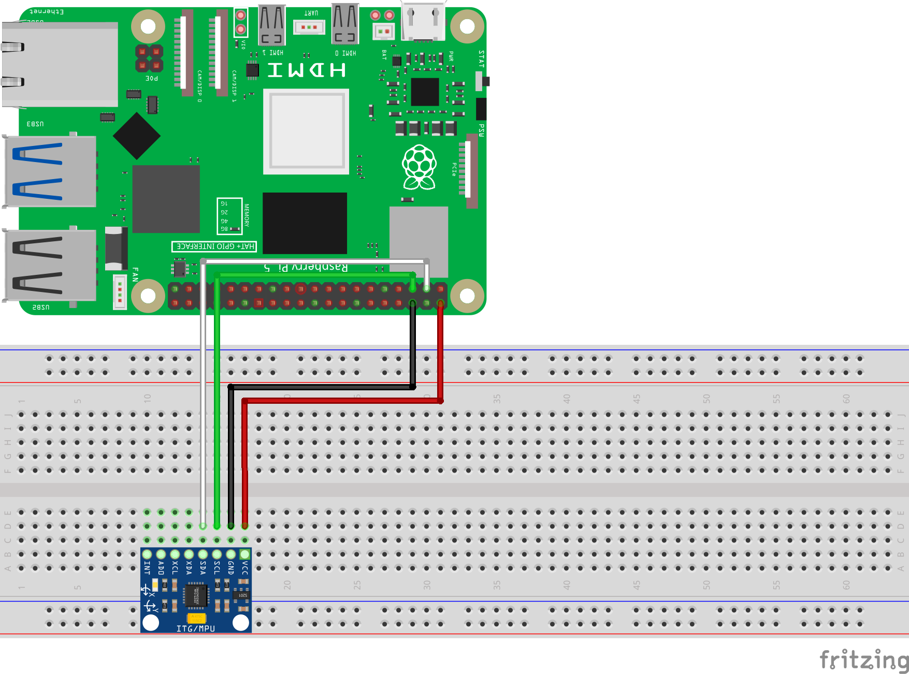
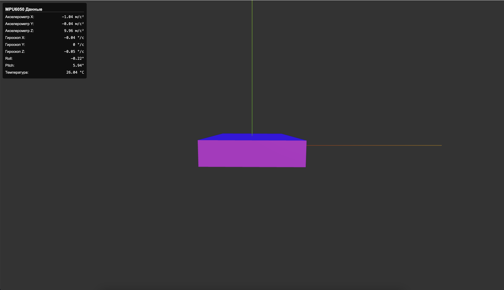

============================================================
3D веб визуализация MPU6050
============================================================

Теоретическая часть
------------------------------------
В этом уроке мы создадим трехмерную визуализацию для датчика MPU6050 (акселерометр/гироскоп) с использованием веб-технологий. MPU6050 — это популярный датчик движения, который сочетает в себе 3-осевой акселерометр и 3-осевой гироскоп, позволяя измерять ускорение, вращение и наклон в трехмерном пространстве.

Наша задача — считывать данные с датчика MPU6050, подключенного к Raspberry Pi, обрабатывать их на сервере Flask и передавать на веб-страницу, где будет отображаться трехмерная модель, которая повторяет движения датчика в реальном времени.

Необходимые компоненты
---------------------------------------
- Raspberry Pi
- Модуль MPU6050
- Соединительные провода

Схема подключения
----------------------------------

   **Рис. 1:** Схема подключения MPU6050 к Raspberry Pi

MPU6050 подключается к Raspberry Pi через интерфейс I2C:
- VCC → 3.3В
- GND → GND
- SCL → GPIO3 (SCL)
- SDA → GPIO2 (SDA)

Установка необходимых библиотек
------------------------------------------------
Прежде чем начать, необходимо установить требуемые библиотеки:

.. code-block:: bash

   pip install adafruit-circuitpython-mpu6050 flask

Структура проекта
----------------------------------
.. code-block:: bash

   mpu6050_visualization/
   ├── app.py              # Сервер Flask
   └── templates/
       └── index.html      # HTML-страница с 3D-визуализацией

Код серверной части (app.py)
---------------------------------------------
Создайте файл `app.py` со следующим содержимым:

.. code-block:: python

   from flask import Flask, render_template, jsonify
   import time
   import board
   import busio
   import adafruit_mpu6050
   import math

   app = Flask(__name__)

   # Инициализация I2C интерфейса
   i2c = busio.I2C(board.SCL, board.SDA)

   # Инициализация MPU6050
   mpu = adafruit_mpu6050.MPU6050(i2c)

   # Установка диапазонов измерения
   mpu.accelerometer_range = adafruit_mpu6050.Range.RANGE_2_G
   mpu.gyro_range = adafruit_mpu6050.GyroRange.RANGE_250_DPS

   # Функция для расчета угла наклона из данных акселерометра
   def calculate_tilt_angles(x, y, z):
       roll = math.atan2(y, z) * 180 / math.pi
       pitch = math.atan2(-x, math.sqrt(y*y + z*z)) * 180 / math.pi
       return roll, pitch

   @app.route('/')
   def index():
       return render_template('index.html')

   @app.route('/sensor_data')
   def get_sensor_data():
       # Считываем данные с акселерометра
       acceleration = mpu.acceleration
       
       # Считываем данные с гироскопа
       gyro = mpu.gyro
       
       # Считываем температуру
       temperature = mpu.temperature
       
       # Вычисляем углы наклона
       roll, pitch = calculate_tilt_angles(acceleration[0], acceleration[1], acceleration[2])
       
       # Формируем JSON с данными
       data = {
           'acceleration': {
               'x': round(acceleration[0], 2),
               'y': round(acceleration[1], 2),
               'z': round(acceleration[2], 2)
           },
           'gyro': {
               'x': round(gyro[0], 2),
               'y': round(gyro[1], 2),
               'z': round(gyro[2], 2)
           },
           'temperature': round(temperature, 2),
           'angles': {
               'roll': round(roll, 2),
               'pitch': round(pitch, 2)
           }
       }
       
       return jsonify(data)

   if __name__ == '__main__':
       app.run(host='0.0.0.0', debug=True)

Код веб-страницы (index.html)
----------------------------------------------
Создайте директорию `templates` и внутри неё файл `index.html`:

.. code-block:: html

   <!DOCTYPE html>
   <html lang="ru">
   <head>
       <meta charset="UTF-8">
       <meta name="viewport" content="width=device-width, initial-scale=1.0">
       <title>MPU6050 3D Визуализация</title>
       
       
   </head>
   <body>
       

           <h3>MPU6050 Данные</h3>
           <table>
               <tr>
                   <td>Акселерометр X:</td>
                   <td class="value" id="accel-x">0.00 м/с²</td>
               </tr>
               <tr>
                   <td>Акселерометр Y:</td>
                   <td class="value" id="accel-y">0.00 м/с²</td>
               </tr>
               <tr>
                   <td>Акселерометр Z:</td>
                   <td class="value" id="accel-z">0.00 м/с²</td>
               </tr>
               <tr>
                   <td>Гироскоп X:</td>
                   <td class="value" id="gyro-x">0.00 °/с</td>
               </tr>
               <tr>
                   <td>Гироскоп Y:</td>
                   <td class="value" id="gyro-y">0.00 °/с</td>
               </tr>
               <tr>
                   <td>Гироскоп Z:</td>
                   <td class="value" id="gyro-z">0.00 °/с</td>
               </tr>
               <tr>
                   <td>Roll:</td>
                   <td class="value" id="roll">0.00°</td>
               </tr>
               <tr>
                   <td>Pitch:</td>
                   <td class="value" id="pitch">0.00°</td>
               </tr>
               <tr>
                   <td>Температура:</td>
                   <td class="value" id="temp">0.00 °C</td>
               </tr>
           </table>
       

       
   </body>
   </html>

Разбор кода
----------------------------

### Серверная часть (app.py)

**Инициализация и настройка:**

В этом блоке мы настраиваем Flask, инициализируем I2C интерфейс и датчик MPU6050:

.. code-block:: python

   from flask import Flask, render_template, jsonify
   import time
   import board
   import busio
   import adafruit_mpu6050
   import math

   app = Flask(__name__)

   # Инициализация I2C интерфейса
   i2c = busio.I2C(board.SCL, board.SDA)

   # Инициализация MPU6050
   mpu = adafruit_mpu6050.MPU6050(i2c)

   # Установка диапазонов измерения
   mpu.accelerometer_range = adafruit_mpu6050.Range.RANGE_2_G
   mpu.gyro_range = adafruit_mpu6050.GyroRange.RANGE_250_DPS

**Расчёт углов наклона:**

Функция `calculate_tilt_angles` вычисляет углы наклона (roll и pitch) из данных акселерометра:

.. code-block:: python

   def calculate_tilt_angles(x, y, z):
       roll = math.atan2(y, z) * 180 / math.pi
       pitch = math.atan2(-x, math.sqrt(y*y + z*z)) * 180 / math.pi
       return roll, pitch

Здесь:
- `roll` - угол наклона вокруг оси X (качение)
- `pitch` - угол наклона вокруг оси Y (тангаж)

Углы вычисляются с использованием тригонометрических функций и преобразуются из радиан в градусы.

**Маршруты Flask:**

Создаем два маршрута: один для отображения главной страницы, второй для получения данных с сенсора:

.. code-block:: python

   @app.route('/')
   def index():
       return render_template('index.html')

   @app.route('/sensor_data')
   def get_sensor_data():
       # Считываем данные с акселерометра, гироскопа и температуру
       # ...
       # Возвращаем данные в формате JSON
       return jsonify(data)

Маршрут `/sensor_data` считывает текущие значения с датчика, вычисляет углы наклона и формирует структурированный JSON-ответ с округлёнными до двух знаков после запятой значениями.

### Клиентская часть (index.html)

**HTML-структура и CSS:**

HTML-документ содержит информационную панель для отображения значений датчика и область для 3D-рендеринга:

.. code-block:: html

   

       <h3>MPU6050 Данные</h3>
       <table>
           <!-- Строки таблицы для отображения данных -->
       </table>
   

CSS стили оформляют интерфейс: создают полупрозрачную информационную панель, форматируют таблицу данных и настраивают отображение 3D-холста.

**Инициализация Three.js:**

В этой части мы настраиваем 3D-сцену, камеру, рендерер и освещение:

.. code-block:: javascript

   // Инициализация Three.js
   const scene = new THREE.Scene();
   const camera = new THREE.PerspectiveCamera(75, window.innerWidth / window.innerHeight, 0.1, 1000);
   const renderer = new THREE.WebGLRenderer({ antialias: true });

   renderer.setSize(window.innerWidth, window.innerHeight);
   renderer.setClearColor(0x333333);
   document.body.appendChild(renderer.domElement);

   // Добавление освещения
   const ambientLight = new THREE.AmbientLight(0x404040);
   scene.add(ambientLight);

   const directionalLight = new THREE.DirectionalLight(0xffffff, 1);
   directionalLight.position.set(1, 1, 1);
   scene.add(directionalLight);

**Создание 3D-модели:**

Создаем куб с разноцветными гранями и координатные оси для наглядности:

.. code-block:: javascript

   // Создание куба
   const cubeSize = 4;
   const geometry = new THREE.BoxGeometry(cubeSize, cubeSize/4, cubeSize*1.5);
   
   // Материалы для каждой грани с разными цветами
   const materials = [
       new THREE.MeshPhongMaterial({ color: 0xff0000 }), // правая сторона - красная
       new THREE.MeshPhongMaterial({ color: 0x00ff00 }), // левая сторона - зеленая
       // ...
   ];

   const cube = new THREE.Mesh(geometry, materials);
   scene.add(cube);
   
   // Создаем координатные оси для наглядности
   const axesHelper = new THREE.AxesHelper(10);
   scene.add(axesHelper);

**Обновление данных и анимация:**

Эта часть кода отвечает за получение данных с сервера и обновление 3D-модели и информационной панели:

.. code-block:: javascript

   // Функция обновления данных с сервера
   function updateSensorData() {
       fetch('/sensor_data')
           .then(response => response.json())
           .then(data => {
               // Обновляем текстовую информацию
               // ...
               
               // Обновляем положение куба
               cube.rotation.set(0, 0, 0);
               
               // Преобразуем градусы в радианы и применяем вращения
               const rollRad = data.angles.roll * Math.PI / 180;
               const pitchRad = data.angles.pitch * Math.PI / 180;
               
               cube.rotateZ(rollRad);  // Вращение вокруг оси Z (Roll)
               cube.rotateX(pitchRad); // Вращение вокруг оси X (Pitch)
           })
           .catch(error => console.error('Ошибка получения данных:', error));
   }

   // Функция анимации сцены и обновление данных
   function animate() {
       requestAnimationFrame(animate);
       renderer.render(scene, camera);
   }
   
   animate();
   setInterval(updateSensorData, 100);

Запуск проекта
-------------------------------

1. Создайте директорию для проекта и внутри неё папку `templates`:

   .. code-block:: bash

      mkdir -p mpu6050_visualization/templates
      cd mpu6050_visualization

2. Создайте файлы `app.py` и `templates/index.html` с приведенным выше кодом.

3. Запустите Flask-приложение:

   .. code-block:: bash

      python app.py

4. Откройте браузер и перейдите по адресу:

   .. code-block:: bash

      http://<IP-адрес_Raspberry_Pi>:5000

Ожидаемый результат
------------------------------------

После запуска приложения вы увидите веб-страницу с 3D-моделью (плоский прямоугольник) и информационной панелью, отображающей данные с датчика MPU6050:

- 3D-модель будет вращаться, имитируя движения датчика MPU6050
- Информационная панель будет отображать текущие значения акселерометра, гироскопа, углов наклона и температуры

   **Рис. 2:** Пример 3D-визуализации данных MPU6050

Когда вы наклоняете или поворачиваете датчик MPU6050, 3D-модель на экране будет повторять эти движения в реальном времени.

Расширение проекта
----------------------------------

Вы можете расширить проект несколькими способами:

1. **Добавьте Yaw (рыскание)**
   
   Для более точного отслеживания ориентации добавьте вычисление угла Yaw с использованием расширенного фильтра Калмана или комплементарного фильтра, который комбинирует данные гироскопа и акселерометра.

2. **Улучшите 3D-модель**
   
   Замените куб на более сложную модель, например, на модель самолёта или дрона, чтобы лучше визуализировать ориентацию.

3. **Добавьте запись данных**
   
   Реализуйте функцию записи данных с датчика для последующего анализа или воспроизведения движений.

4. **Реализуйте калибровку**
   
   Добавьте возможность калибровки датчика для более точных показаний.

Завершение работы
----------------------------------
Для остановки сервера нажмите **Ctrl + C** в терминале.

Поздравляем! 🎉 Вы успешно создали 3D-визуализацию для датчика MPU6050 с использованием Flask и Three.js. Теперь вы можете наглядно отслеживать ориентацию датчика в пространстве и использовать эти данные для различных проектов.
