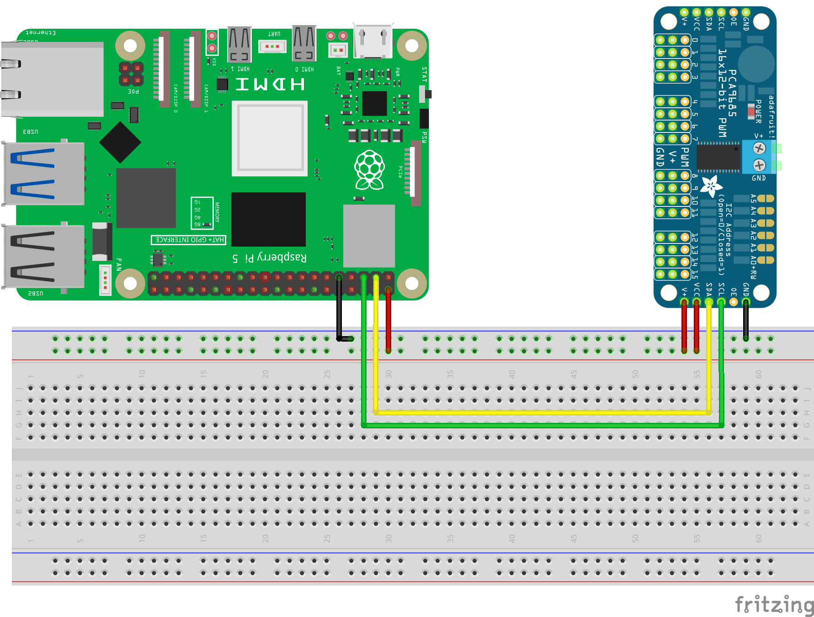
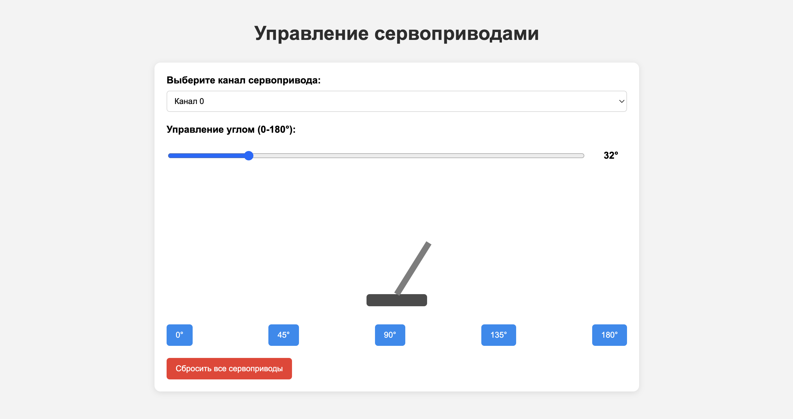

========================================================================================================================
Веб управлениt сервоприводами через PCA9685
========================================================================================================================

Теоретическая часть
--------------------------------------
В этом уроке мы создадим веб-интерфейс для удобного управления несколькими сервоприводами с помощью модуля PCA9685. Такой подход позволяет дистанционно контролировать сервоприводы с любого устройства в локальной сети, что особенно удобно для проектов робототехники, автоматизации и создания механических систем.

PCA9685 - это 16-канальный ШИМ-контроллер с I2C интерфейсом, который позволяет управлять до 16 сервоприводов одновременно через всего два контакта Raspberry Pi (SCL и SDA). Это значительно расширяет возможности проектов и освобождает GPIO-пины для других задач.

Необходимые компоненты
-----------------------------------------
- Raspberry Pi
- Модуль PCA9685
- Сервоприводы (например, SG90)
- Внешний источник питания для сервоприводов (5В)
- Соединительные провода

Схема подключения
------------------------------------

   **Рис. 1:** Схема подключения PCA9685 и сервоприводов

Подключение:
1. **PCA9685 к Raspberry Pi**:

   - VCC → 3.3В (только для логических уровней)
   - GND → GND
   - SCL → GPIO3 (SCL)
   - SDA → GPIO2 (SDA)

2. **Сервоприводы к PCA9685**:

   - Сигнальный провод (обычно оранжевый или желтый) → выходы PWM0-PWM15
   - VCC (красный) → V+ на PCA9685
   - GND (коричневый или черный) → GND на PCA9685

3. **Внешнее питание к PCA9685**:

   - +5В → V+
   - GND → GND (общий с Raspberry Pi)

Установка необходимых библиотек
--------------------------------------------------
Перед запуском кода, установите требуемые библиотеки:

.. code-block:: bash

   pip install adafruit-circuitpython-pca9685 adafruit-circuitpython-motor flask

Структура проекта
------------------------------------
.. code-block:: bash

   servo_controller/
   ├── app.py            # Flask-приложение для управления сервоприводами
   └── templates/
       └── index.html    # HTML-страница с пользовательским интерфейсом

Код серверной части (app.py)
-----------------------------------------------
Создайте файл `app.py` со следующим содержимым:

.. code-block:: python

   from flask import Flask, render_template, request, jsonify
   import time
   import board
   import busio
   from adafruit_pca9685 import PCA9685
   from adafruit_motor import servo

   app = Flask(__name__)

   # Инициализация I2C интерфейса
   i2c = busio.I2C(board.SCL, board.SDA)

   # Инициализация PCA9685
   pca = PCA9685(i2c)

   # Установка частоты ШИМ (50 Гц для большинства сервоприводов)
   pca.frequency = 50

   # Создаем словарь для хранения объектов сервоприводов
   # Мы инициализируем только при первом использовании
   servo_dict = {}

   # Максимальное количество сервоприводов на PCA9685
   MAX_SERVOS = 16

   # Функция для получения объекта сервопривода
   def get_servo(channel):
       # Проверка валидности канала
       if channel < 0 or channel >= MAX_SERVOS:
           return None
       
       # Если сервопривод для этого канала уже создан, возвращаем его
       if channel in servo_dict:
           return servo_dict[channel]
       
       # Иначе создаем новый объект сервопривода
       try:
           servo_obj = servo.Servo(pca.channels[channel], min_pulse=500, max_pulse=2500)
           servo_dict[channel] = servo_obj
           return servo_obj
       except Exception as e:
           print(f"Ошибка при создании сервопривода для канала {channel}: {e}")
           return None

   @app.route('/')
   def index():
       return render_template('index.html', max_servos=MAX_SERVOS)

   @app.route('/set_angle', methods=['POST'])
   def set_angle():
       try:
           data = request.get_json()
           channel = int(data.get('channel', 0))
           angle = float(data.get('angle', 90))
           
           # Получаем объект сервопривода для указанного канала
           servo_obj = get_servo(channel)
           
           if servo_obj is None:
               return jsonify({'status': 'error', 'message': f'Неверный канал: {channel}'}), 400
           
           # Ограничиваем угол в диапазоне от 0 до 180
           angle = max(0, min(180, angle))
           
           # Устанавливаем угол поворота
           servo_obj.angle = angle
           
           return jsonify({'status': 'success', 'message': f'Канал {channel} установлен на угол {angle}°'})
       
       except Exception as e:
           return jsonify({'status': 'error', 'message': str(e)}), 500

   @app.route('/get_angle', methods=['GET'])
   def get_angle():
       try:
           channel = int(request.args.get('channel', 0))
           
           # Получаем объект сервопривода для указанного канала
           servo_obj = get_servo(channel)
           
           if servo_obj is None:
               return jsonify({'status': 'error', 'message': f'Неверный канал: {channel}'}), 400
           
           # Получаем текущий угол
           angle = getattr(servo_obj, 'angle', 90)
           
           return jsonify({'status': 'success', 'angle': angle})
       
       except Exception as e:
           return jsonify({'status': 'error', 'message': str(e)}), 500

   @app.route('/reset', methods=['POST'])
   def reset_servos():
       try:
           # Устанавливаем все инициализированные сервоприводы в нейтральное положение
           for channel, servo_obj in servo_dict.items():
               servo_obj.angle = 90
           
           return jsonify({'status': 'success', 'message': 'Все сервоприводы сброшены в нейтральное положение'})
       
       except Exception as e:
           return jsonify({'status': 'error', 'message': str(e)}), 500

   if __name__ == '__main__':
       try:
           # Запускаем веб-сервер
           app.run(host='0.0.0.0', port=5000, debug=True)
       
       except KeyboardInterrupt:
           # При завершении работы сбрасываем все сервоприводы в нейтральное положение
           for servo_obj in servo_dict.values():
               servo_obj.angle = 90
           print("\nПрограмма завершена.")

Код веб-интерфейса (index.html)
-------------------------------------------------
Создайте директорию `templates` и внутри нее файл `index.html`:

.. code-block:: html

   <!DOCTYPE html>
   <html lang="ru">
   <head>
       <meta charset="UTF-8">
       <meta name="viewport" content="width=device-width, initial-scale=1.0">
       <title>Управление сервоприводами</title>
       
   </head>
   <body>
       <h1>Управление сервоприводами</h1>
       
       

           

               <label for="channel">Выберите канал сервопривода:</label>
               <select id="channel">
                   <!-- Каналы будут добавлены JavaScript -->
               </select>
           

           
           

               <label for="angle">Управление углом (0-180°):</label>
               

                   <input type="range" id="angle" class="slider" min="0" max="180" value="90" step="1">
                   
90°

               

           

           
           

               

               

           

           
           

               <button class="preset-btn" data-angle="0">0°</button>
               <button class="preset-btn" data-angle="45">45°</button>
               <button class="preset-btn" data-angle="90">90°</button>
               <button class="preset-btn" data-angle="135">135°</button>
               <button class="preset-btn" data-angle="180">180°</button>
           

           
           

               <button id="reset-btn" class="reset-btn">Сбросить все сервоприводы</button>
           

           
           

       

       
       
   </body>
   </html>

Разбор кода
------------------------------

### Серверная часть (app.py)

**Инициализация и настройка:**

В этом блоке устанавливаем соединение с модулем PCA9685 через I2C и настраиваем его для работы с сервоприводами:

.. code-block:: python

   from flask import Flask, render_template, request, jsonify
   import time
   import board
   import busio
   from adafruit_pca9685 import PCA9685
   from adafruit_motor import servo

   app = Flask(__name__)

   # Инициализация I2C интерфейса
   i2c = busio.I2C(board.SCL, board.SDA)

   # Инициализация PCA9685
   pca = PCA9685(i2c)

   # Установка частоты ШИМ (50 Гц для большинства сервоприводов)
   pca.frequency = 50

Самый важный параметр здесь - `pca.frequency = 50`, устанавливающий частоту ШИМ-сигнала в 50 Гц, что является стандартом для большинства сервоприводов.

**Ленивая инициализация сервоприводов:**

Вместо инициализации всех 16 сервоприводов сразу, что могло бы быть расточительно, мы используем подход "ленивой инициализации" - создаем объекты сервоприводов только при первом обращении к каждому каналу:

.. code-block:: python

   # Создаем словарь для хранения объектов сервоприводов
   servo_dict = {}

   # Максимальное количество сервоприводов на PCA9685
   MAX_SERVOS = 16

   # Функция для получения объекта сервопривода
   def get_servo(channel):
       # Проверка валидности канала
       if channel < 0 or channel >= MAX_SERVOS:
           return None
       
       # Если сервопривод для этого канала уже создан, возвращаем его
       if channel in servo_dict:
           return servo_dict[channel]
       
       # Иначе создаем новый объект сервопривода
       try:
           servo_obj = servo.Servo(pca.channels[channel], min_pulse=500, max_pulse=2500)
           servo_dict[channel] = servo_obj
           return servo_obj
       except Exception as e:
           print(f"Ошибка при создании сервопривода для канала {channel}: {e}")
           return None

Параметры `min_pulse=500, max_pulse=2500` определяют ширину импульса в микросекундах для положений 0° и 180° соответственно. Эти значения могут требовать настройки в зависимости от модели сервоприводов.

**Маршруты Flask:**

Создаем три основных маршрута:
1. `/` - главная страница с интерфейсом управления
2. `/set_angle` - API для установки угла сервопривода
3. `/get_angle` - API для получения текущего угла
4. `/reset` - API для сброса всех сервоприводов в нейтральное положение

.. code-block:: python

   @app.route('/')
   def index():
       return render_template('index.html', max_servos=MAX_SERVOS)

   @app.route('/set_angle', methods=['POST'])
   def set_angle():
       # Получаем данные из запроса, проверяем и устанавливаем угол

   @app.route('/get_angle', methods=['GET'])
   def get_angle():
       # Получаем и возвращаем текущий угол сервопривода

   @app.route('/reset', methods=['POST'])
   def reset_servos():
       # Сбрасываем все сервоприводы в нейтральное положение (90°)

**Обработка завершения работы:**

При завершении программы важно вернуть все сервоприводы в нейтральное положение, чтобы избежать резких движений при повторном запуске:

.. code-block:: python

   if __name__ == '__main__':
       try:
           # Запускаем веб-сервер
           app.run(host='0.0.0.0', port=5000, debug=True)
       
       except KeyboardInterrupt:
           # При завершении работы сбрасываем все сервоприводы
           for servo_obj in servo_dict.values():
               servo_obj.angle = 90
           print("\nПрограмма завершена.")

### Клиентская часть (index.html)

**HTML-структура и CSS:**

Интерфейс состоит из:
- Выпадающего списка для выбора канала сервопривода
- Слайдера для регулировки угла
- Визуального представления сервопривода
- Кнопок для быстрого выбора предустановленных углов
- Кнопки сброса всех сервоприводов
- Области для отображения статусных сообщений

**JavaScript для управления:**

Основная логика клиентской части осуществляется с помощью JavaScript:

1. **Инициализация и заполнение списка каналов:**

.. code-block:: javascript

   // Получаем максимальное количество сервоприводов из серверной конфигурации
   const maxServos = {{ max_servos }};
   
   // Заполняем выпадающий список каналов
   for (let i = 0; i < maxServos; i++) {
       const option = document.createElement('option');
       option.value = i;
       option.textContent = `Канал ${i}`;
       channelSelect.appendChild(option);
   }

2. **Визуализация положения сервопривода:**

.. code-block:: javascript

   // Обновление визуального представления сервопривода
   function updateServoVisual(angle) {
       servoArm.style.transform = `rotate(${angle}deg)`;
   }

3. **Взаимодействие с сервером:**

Функции для отправки и получения данных:

.. code-block:: javascript

   // Функция для установки угла сервопривода
   function setServoAngle(channel, angle) {
       fetch('/set_angle', { /* ... */ })
       .then(/* ... */)
       .catch(/* ... */);
   }
   
   // Функция для получения текущего угла сервопривода
   function getServoAngle(channel) {
       fetch(`/get_angle?channel=${channel}`)
       .then(/* ... */)
       .catch(/* ... */);
   }
   
   // Функция сброса всех сервоприводов
   function resetAllServos() {
       fetch('/reset', { /* ... */ })
       .then(/* ... */)
       .catch(/* ... */);
   }

4. **Обработчики событий:**

.. code-block:: javascript

   // Обработчик изменения выбранного канала
   channelSelect.addEventListener('change', () => {
       getServoAngle(channelSelect.value);
   });
   
   // Обработчик изменения значения слайдера
   angleSlider.addEventListener('input', () => {
       // Обновляем только визуальное отображение
   });
   
   // Обработчик отпускания слайдера
   angleSlider.addEventListener('change', () => {
       // Отправляем команду на сервер
   });

Запуск проекта
---------------------------------

1. Создайте директорию для проекта и внутри нее папку `templates`:

   .. code-block:: bash

      mkdir -p servo_controller/templates
      cd servo_controller

2. Создайте файлы `app.py` и `templates/index.html` с приведенным выше кодом.

3. Запустите Flask-приложение:

   .. code-block:: bash

      python app.py

4. Откройте браузер и перейдите по адресу:

   .. code-block:: bash

      http://<IP-адрес_Raspberry_Pi>:5000

Ожидаемый результат
--------------------------------------

После запуска приложения вы увидите веб-интерфейс, позволяющий:
- Выбирать канал сервопривода (от 0 до 15)
- Регулировать угол поворота с помощью слайдера или кнопок предустановок
- Видеть визуальное представление текущего положения сервопривода
- Сбрасывать все сервоприводы в нейтральное положение

   **Рис. 2:** Пример интерфейса управления сервоприводами

Практические применения
------------------------------------------

Данный проект можно использовать для:

1. **Управления роботизированной рукой** - каждый сервопривод управляет отдельным суставом
2. **Создания панорамных камер** - сервоприводы управляют положением камеры по осям
3. **Домашней автоматизации** - управление шторами, замками и другими механизмами
4. **Образовательных целей** - демонстрация принципов работы сервоприводов и управления устройствами через веб-интерфейс

Расширение проекта
------------------------------------

Вы можете расширить проект несколькими способами:

1. **Добавить сохранение положений** - хранить предустановленные положения в базе данных
2. **Создать последовательности движений** - программировать серии движений для создания плавных анимаций
3. **Интеграция с камерой** - добавить видеопоток для визуального контроля движений
4. **Управление через мобильное приложение** - создать мобильное приложение с использованием WebView или нативных элементов управления

Завершение работы
------------------------------------
Для остановки сервера нажмите **Ctrl + C** в терминале. При завершении программы все сервоприводы автоматически вернутся в нейтральное положение (90°).

Поздравляем! 🎉 Вы успешно создали веб-интерфейс для управления сервоприводами с использованием модуля PCA9685 и Raspberry Pi. Теперь вы можете легко контролировать до 16 сервоприводов через любое устройство в вашей локальной сети.
