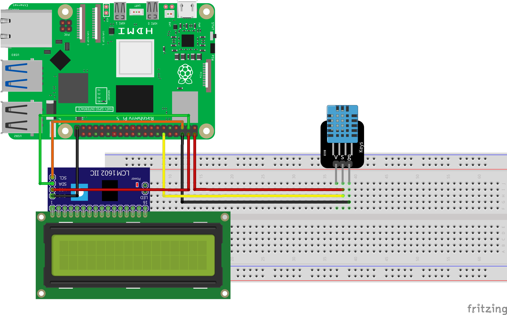
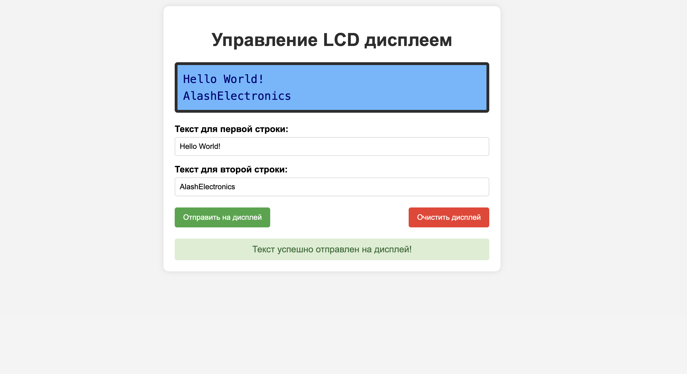

============================================================
Урок: Веб-интерфейс для управления LCD дисплеем
============================================================

Теоретическая часть
--------------------------------------
В этом уроке мы создадим веб-приложение для управления LCD-дисплеем, подключенным к Raspberry Pi через I2C интерфейс. Такой подход позволяет удобно вводить и отображать текст на дисплее с помощью любого устройства (смартфона, планшета, компьютера) в локальной сети.

LCD-дисплеи с модулем I2C широко используются в проектах на базе Raspberry Pi, поскольку требуют всего 2 сигнальных провода (SDA и SCL) для передачи данных, что значительно экономит GPIO-пины по сравнению с прямым подключением (требующим 6+ пинов).

В проекте мы будем использовать:
- **Flask** - легковесный веб-фреймворк для Python
- **RPLCD** - библиотека для управления LCD-дисплеями через GPIO или I2C
- **HTML/CSS/JavaScript** - для создания интуитивно понятного веб-интерфейса

Необходимые компоненты
-----------------------------------------
- Raspberry Pi
- LCD-дисплей 16x2 с модулем I2C (обычно на базе PCF8574)
- Соединительные провода

Схема подключения
------------------------------------

   **Рис. 1:** Схема подключения LCD-дисплея с I2C модулем к Raspberry Pi

Подключение LCD-дисплея с I2C модулем:
- VCC → 5V (или 3.3V, в зависимости от модуля)
- GND → GND
- SDA → GPIO2 (SDA)
- SCL → GPIO3 (SCL)

Установка необходимых библиотек
--------------------------------------------------------------
Перед запуском проекта необходимо установить требуемые библиотеки:

.. code-block:: bash

   # Установка I2C утилит
   sudo apt-get update
   sudo apt-get install -y python-smbus i2c-tools
   
   # Включение I2C в Raspberry Pi, если ещё не включено
   sudo raspi-config
   # Выберите: Interfacing Options → I2C → Yes
   
   # Установка библиотек Python
   pip install flask RPLCD

Проверка I2C-адреса дисплея:

.. code-block:: bash

   sudo i2cdetect -y 1

Выполнение этой команды покажет таблицу с адресами всех подключенных I2C-устройств. Обычно LCD-дисплеи имеют адрес `0x27` или `0x3F`. Запомните этот адрес — он потребуется при настройке кода.

Структура проекта
------------------------------------------------
.. code-block:: bash

   lcd_web_controller/
   ├── app.py           # Серверная часть на Flask
   └── templates/       # Шаблоны для веб-интерфейса
       └── index.html   # Основная страница

Код серверной части (app.py)
-----------------------------------------------------------
Создайте файл `app.py` со следующим содержимым:

.. code-block:: python

   from flask import Flask, render_template, request
   from RPLCD.i2c import CharLCD
   import time

   app = Flask(__name__)

   # Создаем объект LCD
   # Адрес по умолчанию 0x27, при необходимости замените на 0x3F или другой
   lcd = CharLCD(i2c_expander='PCF8574', address=0x27, port=1,
               cols=16, rows=2, dotsize=8)

   @app.route('/')
   def index():
       return render_template('index.html')

   @app.route('/display', methods=['POST'])
   def display_text():
       # Получаем текст из формы
       line1 = request.form['line1']
       line2 = request.form['line2']
       
       # Очищаем дисплей
       lcd.clear()
       
       # Выводим первую строку
       lcd.cursor_pos = (0, 0)  # Первая строка
       lcd.write_string(line1[:16])  # Ограничиваем 16 символами
       
       # Выводим вторую строку
       lcd.cursor_pos = (1, 0)  # Вторая строка
       lcd.write_string(line2[:16])  # Ограничиваем 16 символами
       
       return render_template('index.html', 
                              message="Текст успешно отправлен на дисплей!",
                              line1=line1,
                              line2=line2)

   @app.route('/clear', methods=['POST'])
   def clear_display():
       # Очищаем дисплей
       lcd.clear()
       return render_template('index.html', message="Дисплей очищен!")

   if __name__ == '__main__':
       try:
           # При запуске программы здороваемся
           lcd.clear()
           lcd.write_string("LCD Ready!")
           lcd.cursor_pos = (1, 0)
           lcd.write_string("Web app started")
           
           # Запускаем веб-сервер
           app.run(host='0.0.0.0', port=5000, debug=True)
           
       except KeyboardInterrupt:
           # При выходе очищаем дисплей
           lcd.clear()
           print("Программа завершена.")

Код веб-интерфейса (index.html)
--------------------------------------------------------------
Создайте директорию `templates` и в ней файл `index.html`:

.. code-block:: html

   <!DOCTYPE html>
   <html lang="ru">
   <head>
       <meta charset="UTF-8">
       <meta name="viewport" content="width=device-width, initial-scale=1.0">
       <title>Управление LCD дисплеем</title>
       
   </head>
   <body>
       

           <h1>Управление LCD дисплеем</h1>
           
           <!-- Визуализация LCD дисплея -->
           

               
{{ line1 if line1 else '                ' }}

               
{{ line2 if line2 else '                ' }}

           

           
           <form action="/display" method="post">
               

                   <label for="line1">Текст для первой строки:</label>
                   <input type="text" id="line1" name="line1" maxlength="16" value="{{ line1 }}">
               

               
               

                   <label for="line2">Текст для второй строки:</label>
                   <input type="text" id="line2" name="line2" maxlength="16" value="{{ line2 }}">
               

               
               

                   <button type="submit" class="send-btn">Отправить на дисплей</button>
                   <button type="button" class="clear-btn" onclick="clearDisplay()">Очистить дисплей</button>
               

           </form>
           
           <!-- Форма для очистки дисплея -->
           <form id="clear-form" action="/clear" method="post" style="display: none;">
           </form>
           
           
           

               {{ message }}
           

           
       

       
       
   </body>
   </html>

Разбор кода
------------------------------------------

### Серверная часть (app.py)

**Инициализация и настройка:**

Этот блок кода импортирует необходимые библиотеки и создает экземпляр LCD-дисплея:

.. code-block:: python

   from flask import Flask, render_template, request
   from RPLCD.i2c import CharLCD
   import time

   app = Flask(__name__)

   # Создаем объект LCD
   # Адрес по умолчанию 0x27, при необходимости замените на 0x3F или другой
   lcd = CharLCD(i2c_expander='PCF8574', address=0x27, port=1,
               cols=16, rows=2, dotsize=8)

При создании объекта `CharLCD` мы указываем:
- `i2c_expander='PCF8574'` - тип I2C-расширителя (обычно PCF8574 или PCF8574A)
- `address=0x27` - I2C-адрес дисплея (может быть 0x3F у некоторых моделей)
- `port=1` - номер I2C-порта (обычно 1 для Raspberry Pi 2 и выше)
- `cols=16, rows=2` - размеры дисплея (16 символов, 2 строки)
- `dotsize=8` - размер символа (5x8 точек)

**Маршруты Flask:**

Приложение имеет три маршрута:
1. `/` - показывает основную страницу
2. `/display` - обрабатывает отправку текста на дисплей
3. `/clear` - очищает дисплей

.. code-block:: python

   @app.route('/')
   def index():
       return render_template('index.html')

   @app.route('/display', methods=['POST'])
   def display_text():
       # Получение и отображение текста на дисплее
       # ...
       return render_template('index.html', 
                              message="Текст успешно отправлен на дисплей!",
                              line1=line1,
                              line2=line2)

   @app.route('/clear', methods=['POST'])
   def clear_display():
       # Очистка дисплея
       # ...
       return render_template('index.html', message="Дисплей очищен!")

Функция `display_text()` получает текст из формы, очищает дисплей и выводит текст построчно:

.. code-block:: python

   # Получаем текст из формы
   line1 = request.form['line1']
   line2 = request.form['line2']
   
   # Очищаем дисплей
   lcd.clear()
   
   # Выводим первую строку
   lcd.cursor_pos = (0, 0)  # Первая строка
   lcd.write_string(line1[:16])  # Ограничиваем 16 символами
   
   # Выводим вторую строку
   lcd.cursor_pos = (1, 0)  # Вторая строка
   lcd.write_string(line2[:16])  # Ограничиваем 16 символами

**Запуск приложения:**

При запуске происходит инициализация дисплея и запуск веб-сервера:

.. code-block:: python

   if __name__ == '__main__':
       try:
           # При запуске программы здороваемся
           lcd.clear()
           lcd.write_string("LCD Ready!")
           lcd.cursor_pos = (1, 0)
           lcd.write_string("Web app started")
           
           # Запускаем веб-сервер
           app.run(host='0.0.0.0', port=5000, debug=True)
           
       except KeyboardInterrupt:
           # При выходе очищаем дисплей
           lcd.clear()
           print("Программа завершена.")

Параметр `host='0.0.0.0'` обеспечивает доступность веб-интерфейса со всех устройств в сети.

### Клиентская часть (index.html)

**HTML-структура и CSS:**

HTML-страница содержит:
- Заголовок
- Визуализацию LCD-дисплея
- Форму с полями ввода для двух строк текста
- Кнопки отправки и очистки
- Область для отображения статусных сообщений

CSS стили оформляют интерфейс, включая визуализацию LCD-дисплея:

.. code-block:: css

   .lcd-display {
       width: 100%;
       height: 90px;
       background-color: #73c0ff;
       border: 5px solid #333;
       border-radius: 5px;
       margin: 20px 0;
       padding: 10px;
       box-sizing: border-box;
       color: #000080;
       font-family: monospace;
       font-size: 20px;
       line-height: 30px;
   }

**Работа с формой и дисплеем:**

Форма для отправки текста содержит два поля ввода и кнопки управления:

.. code-block:: html

   <form action="/display" method="post">
       

           <label for="line1">Текст для первой строки:</label>
           <input type="text" id="line1" name="line1" maxlength="16" value="{{ line1 }}">
       

       
       

           <label for="line2">Текст для второй строки:</label>
           <input type="text" id="line2" name="line2" maxlength="16" value="{{ line2 }}">
       

       
       

           <button type="submit" class="send-btn">Отправить на дисплей</button>
           <button type="button" class="clear-btn" onclick="clearDisplay()">Очистить дисплей</button>
       

   </form>

Для кнопки очистки используется скрытая форма:

.. code-block:: html

   <!-- Форма для очистки дисплея -->
   <form id="clear-form" action="/clear" method="post" style="display: none;">
   </form>

**JavaScript для интерактивности:**

JavaScript-код добавляет интерактивные возможности:
- Отправка формы очистки при нажатии на кнопку "Очистить дисплей"
- Обновление визуализации LCD-дисплея в реальном времени при вводе текста
- Дополнение строк пробелами до 16 символов для правильного отображения

.. code-block:: javascript

   function clearDisplay() {
       document.getElementById('clear-form').submit();
   }
   
   // Обновление виртуального дисплея при вводе
   function updateDisplayPreview() {
       var line1 = document.getElementById('line1').value;
       var line2 = document.getElementById('line2').value;
       
       // Отображаем линии на виртуальном дисплее
       var displayLines = document.querySelectorAll('.lcd-display div');
       displayLines[0].textContent = line1.padEnd(16, ' ');
       displayLines[1].textContent = line2.padEnd(16, ' ');
   }

Запуск проекта
---------------------------------------------

1. Создайте директорию для проекта и внутри нее папку `templates`:

   .. code-block:: bash

      mkdir -p lcd_web_controller/templates
      cd lcd_web_controller

2. Создайте файлы `app.py` и `templates/index.html` с приведенным выше кодом.

3. Запустите Flask-приложение:

   .. code-block:: bash

      python app.py

4. Откройте браузер и перейдите по адресу:

   .. code-block:: bash

      http://<IP-адрес_Raspberry_Pi>:5000

Ожидаемый результат
--------------------------------------------------

После запуска приложения вы увидите веб-интерфейс с визуализацией LCD-дисплея и полями для ввода текста. При вводе текста в поля визуализация будет обновляться в реальном времени. После нажатия на кнопку "Отправить на дисплей" текст появится на реальном LCD-дисплее, подключенном к Raspberry Pi.

   **Рис. 2:** Пример веб-интерфейса для управления LCD-дисплеем

Практические применения
-----------------------------------------------------

Данный проект можно использовать для:

1. **Информационных дисплеев** - отображение статусной информации, времени, данных с датчиков
2. **Домашней автоматизации** - вывод информации о состоянии устройств умного дома
3. **Учебных проектов** - изучение работы с I2C и LCD-дисплеями
4. **Встраиваемых систем** - создание удобного интерфейса для управления встраиваемыми устройствами

Расширение проекта
----------------------------------

Вы можете расширить проект несколькими способами:

1. **Добавить специальные символы** - создать и использовать пользовательские символы на LCD-дисплее
2. **Анимация текста** - реализовать бегущую строку или другие эффекты анимации
3. **Автоматическое обновление** - добавить автоматическое отображение времени, температуры или другой информации
4. **Интеграция с датчиками** - подключить датчики и выводить их показания на дисплей
5. **Сохранение предустановок** - добавить возможность сохранять и быстро вызывать часто используемые сообщения

Пример добавления пользовательских символов:

.. code-block:: python

   # Определение пользовательского символа (например, сердце)
   heart = (
       0b00000,
       0b01010,
       0b11111,
       0b11111,
       0b11111,
       0b01110,
       0b00100,
       0b00000,
   )
   
   # Загрузка символа в память дисплея
   lcd.create_char(0, heart)
   
   # Использование символа в тексте (символ с кодом 0)
   lcd.write_string("I \x00 Raspberry Pi")

Завершение работы
----------------------------------
Для остановки сервера нажмите **Ctrl + C** в терминале. Дисплей будет очищен, и программа корректно завершит работу.

Поздравляем! 🎉 Вы успешно создали веб-приложение для управления LCD-дисплеем через I2C. Теперь вы можете легко отправлять сообщения на ваш дисплей с любого устройства в локальной сети.
