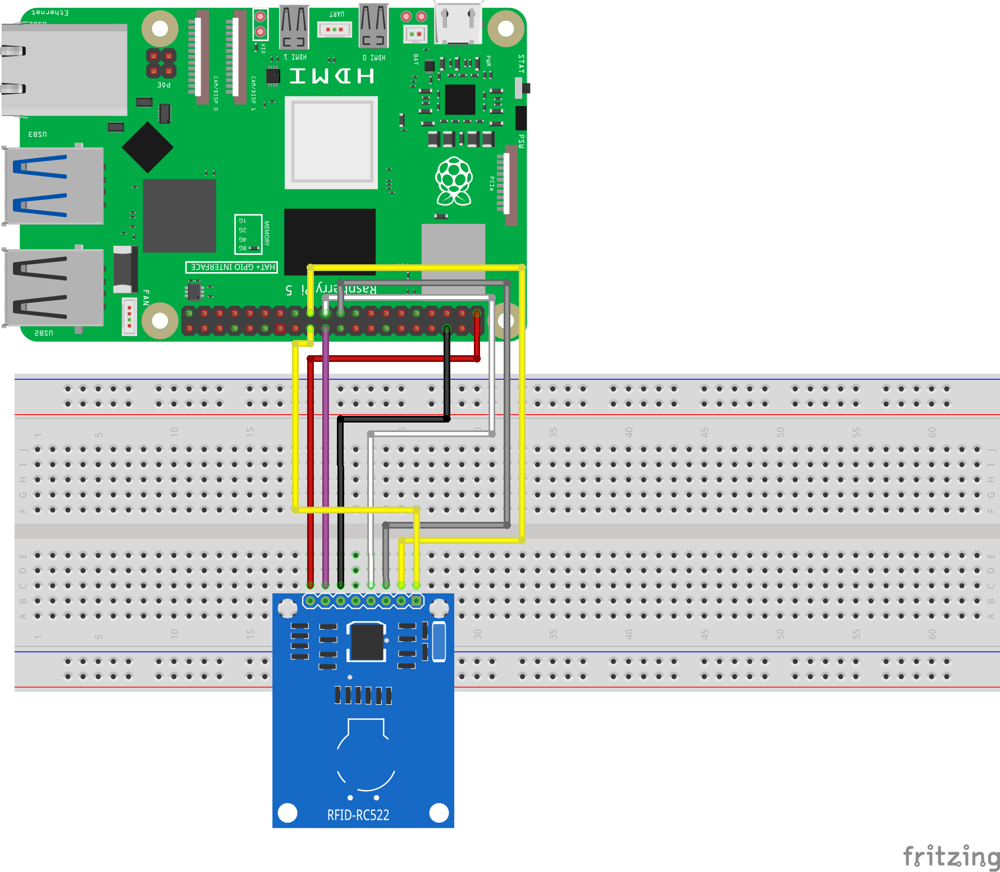
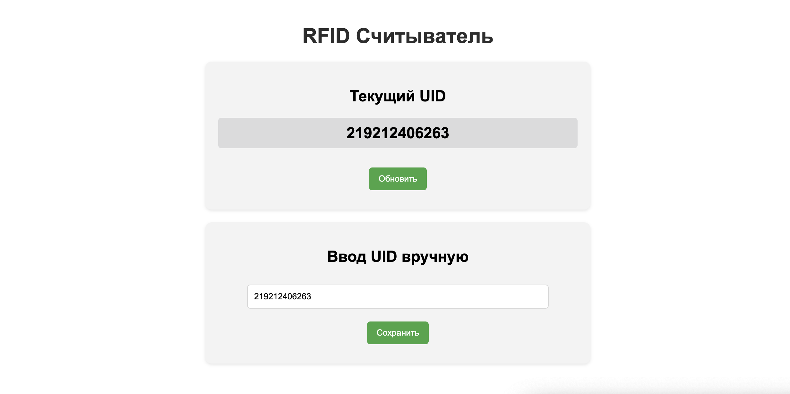

========================================================================================================================
Урок: Веб-интерфейс для RFID считывателя на Raspberry Pi
========================================================================================================================

Теоретическая часть
----------------------------------------------------------------------------
В этом уроке мы создадим веб-интерфейс для RFID считывателя RC522, подключенного к Raspberry Pi. RFID (Radio Frequency IDentification) — это технология радиочастотной идентификации, которая используется для бесконтактного считывания информации с специальных меток (карт, брелоков).

Наше приложение позволит:
1. В реальном времени отслеживать считывание RFID-меток
2. Отображать уникальный идентификатор (UID) считанной карты
3. Вручную вводить и сохранять UID меток

Мы будем использовать:
- Python библиотеку `mfrc522` для работы с RFID считывателем
- Flask для создания веб-сервера
- Многопоточное программирование для одновременного считывания RFID и обслуживания веб-запросов
- HTML, CSS и JavaScript для создания интерактивного интерфейса

Необходимые компоненты
------------------------------------------------------------
- Raspberry Pi
- RFID считыватель RC522
- RFID метки (карты, брелоки)
- Соединительные провода

Схема подключения
-------------------------------------------------------

   **Рис. 1:** Схема подключения RFID считывателя RC522 к Raspberry Pi

Установка необходимых библиотек
--------------------------------------------------------------------------------------
Перед запуском проекта необходимо установить требуемые библиотеки:

.. code-block:: bash

   # Включение SPI в Raspberry Pi, если ещё не включено
   sudo raspi-config
   # Выберите: Interfacing Options → SPI → Yes
   
   # Установка библиотек
   pip install flask mfrc522

Структура проекта
------------------------------------------------------------------------
.. code-block:: bash

   rfid_web_interface/
   ├── app.py           # Основной Python-скрипт
   └── templates/       # Папка с HTML шаблонами
       └── index.html   # Веб-интерфейс

Код серверной части (app.py)
-----------------------------------------------------------------------------------

.. code-block:: python

   from flask import Flask, render_template, request, jsonify
   from mfrc522 import BasicMFRC522
   import threading
   import time

   app = Flask(__name__)

   # Создаем объект считывателя
   reader = BasicMFRC522()

   # Глобальные переменные для хранения данных
   last_uid = None
   is_running = True

   # Функция для фонового считывания карты
   def read_rfid():
       global last_uid, is_running
       last = None
       
       while is_running:
           uid = reader.read_id_no_block()
           if uid and uid != last:  # новый UID
               print(f"Считан UID: {uid}")
               last_uid = uid
               last = uid
               time.sleep(0.15)  # дебаунс
           elif uid is None:
               last = None  # карта убрана — ждём новую
           time.sleep(0.02)  # 50 опросов в секунду

   # Запускаем фоновый поток для считывания
   read_thread = threading.Thread(target=read_rfid)
   read_thread.daemon = True
   read_thread.start()

   @app.route('/')
   def index():
       return render_template('index.html')

   @app.route('/get_uid')
   def get_uid():
       return jsonify({'uid': last_uid})

   # Маршрут для сохранения введенного UID
   @app.route('/save_uid', methods=['POST'])
   def save_uid():
       global last_uid
       data = request.get_json()
       last_uid = data.get('uid')
       return jsonify({'success': True, 'uid': last_uid})

   if __name__ == '__main__':
       try:
           print("[*] RFID веб-приложение запущено (Ctrl-C для выхода)")
           app.run(host='0.0.0.0', port=5000, debug=True, use_reloader=False)
       except KeyboardInterrupt:
           print("[*] Программа остановлена")
           is_running = False  # Останавливаем фоновый поток

Код веб-интерфейса (index.html)
--------------------------------------------------------------------------------------
Создайте директорию `templates` и внутри нее файл `index.html`:

.. code-block:: html

   <!DOCTYPE html>
   <html lang="ru">
   <head>
       <meta charset="UTF-8">
       <meta name="viewport" content="width=device-width, initial-scale=1.0">
       <title>RFID Считыватель</title>
       
   </head>
   <body>
       <h1>RFID Считыватель</h1>
       
       

           <h2>Текущий UID</h2>
           
Ожидание карты...

           

           <button id="refresh-btn">Обновить</button>
       

       
       

           <h2>Ввод UID вручную</h2>
           <input type="text" id="manual-uid" placeholder="Введите UID">
           <button id="save-btn">Сохранить</button>
           

       

       
       
   </body>
   </html>

Разбор кода
------------------------------------------------------------------

### Серверная часть (app.py)

**Инициализация и настройка:**

.. code-block:: python

   from flask import Flask, render_template, request, jsonify
   from mfrc522 import BasicMFRC522
   import threading
   import time

   app = Flask(__name__)

   # Создаем объект считывателя
   reader = BasicMFRC522()

   # Глобальные переменные для хранения данных
   last_uid = None
   is_running = True

В этом блоке:
- Импортируются необходимые библиотеки
- Создается экземпляр Flask-приложения
- Инициализируется объект считывателя RFID
- Определяются глобальные переменные для хранения данных и состояния программы

**Фоновый поток для считывания RFID:**

.. code-block:: python

   # Функция для фонового считывания карты
   def read_rfid():
       global last_uid, is_running
       last = None
       
       while is_running:
           uid = reader.read_id_no_block()
           if uid and uid != last:  # новый UID
               print(f"Считан UID: {uid}")
               last_uid = uid
               last = uid
               time.sleep(0.15)  # дебаунс
           elif uid is None:
               last = None  # карта убрана — ждём новую
           time.sleep(0.02)  # 50 опросов в секунду

   # Запускаем фоновый поток для считывания
   read_thread = threading.Thread(target=read_rfid)
   read_thread.daemon = True
   read_thread.start()

Этот блок кода:
- Определяет функцию `read_rfid()`, которая непрерывно опрашивает RFID-считыватель
- Запускает эту функцию в отдельном потоке
- Настраивает поток как "демон" (daemon=True), чтобы он автоматически завершился при закрытии основной программы
- Использует метод `read_id_no_block()`, который не блокирует выполнение программы при отсутствии карты
- Включает механизм дебаунса для исключения многократного считывания одной и той же карты
- Сохраняет считанный UID в глобальной переменной `last_uid` для доступа из веб-интерфейса

**Маршруты Flask:**

.. code-block:: python

   @app.route('/')
   def index():
       return render_template('index.html')

   @app.route('/get_uid')
   def get_uid():
       return jsonify({'uid': last_uid})

   # Маршрут для сохранения введенного UID
   @app.route('/save_uid', methods=['POST'])
   def save_uid():
       global last_uid
       data = request.get_json()
       last_uid = data.get('uid')
       return jsonify({'success': True, 'uid': last_uid})

Здесь определены три маршрута:
1. `/` - главная страница, возвращает HTML-шаблон интерфейса
2. `/get_uid` - возвращает текущий считанный UID в формате JSON
3. `/save_uid` - принимает вручную введенный UID в формате JSON и сохраняет его в переменной `last_uid`

**Запуск приложения:**

.. code-block:: python

   if __name__ == '__main__':
       try:
           print("[*] RFID веб-приложение запущено (Ctrl-C для выхода)")
           app.run(host='0.0.0.0', port=5000, debug=True, use_reloader=False)
       except KeyboardInterrupt:
           print("[*] Программа остановлена")
           is_running = False  # Останавливаем фоновый поток

Этот блок:
- Запускает Flask-приложение на порту 5000
- Делает его доступным для всех устройств в сети (`host='0.0.0.0'`)
- Отключает автоматическую перезагрузку (`use_reloader=False`), которая мешала бы работе фонового потока
- Обрабатывает завершение работы по Ctrl+C, корректно останавливая фоновый поток

### Клиентская часть (index.html)

**HTML-структура и CSS:**

Веб-интерфейс состоит из:
- Заголовка
- Карточки с отображением текущего UID и кнопкой обновления
- Карточки для ручного ввода UID
- Стилей для создания привлекательного интерфейса

Особенности CSS:
- Адаптивный дизайн с максимальной шириной 600px
- Карточки с тенями и скругленными углами
- Индикатор загрузки (spinner)
- Стилизация кнопок и полей ввода
- Различные стили для статусных сообщений

**JavaScript для взаимодействия с сервером:**

.. code-block:: javascript

   // Функция для получения UID с сервера
   function getUID() {
       loader.style.display = 'block';
       uidDisplay.textContent = 'Считывание...';
       
       fetch('/get_uid')
           .then(response => response.json())
           .then(data => {
               loader.style.display = 'none';
               if (data.uid) {
                   uidDisplay.textContent = data.uid;
                   manualUid.value = data.uid;
               } else {
                   uidDisplay.textContent = 'Карта не обнаружена';
               }
           })
           .catch(error => {
               console.error('Ошибка:', error);
               loader.style.display = 'none';
               uidDisplay.textContent = 'Ошибка связи с сервером';
           });
   }

Функция `getUID()`:
- Показывает индикатор загрузки
- Делает AJAX-запрос к маршруту `/get_uid`
- Обрабатывает полученные данные и обновляет интерфейс
- Обрабатывает возможные ошибки

.. code-block:: javascript

   // Функция для сохранения UID
   function saveUID() {
       const uid = manualUid.value.trim();
       if (!uid) {
           alert('Введите UID');
           return;
       }
       
       fetch('/save_uid', {
           method: 'POST',
           headers: {
               'Content-Type': 'application/json',
           },
           body: JSON.stringify({ uid: uid }),
       })
           .then(response => response.json())
           .then(data => {
               if (data.success) {
                   status.textContent = 'UID успешно сохранен!';
                   status.className = 'status success';
                   status.style.display = 'block';
                   uidDisplay.textContent = data.uid;
                   
                   // Скрываем сообщение через 3 секунды
                   setTimeout(() => {
                       status.style.display = 'none';
                   }, 3000);
               }
           })
           .catch(error => {
               console.error('Ошибка:', error);
               status.textContent = 'Ошибка при сохранении';
               status.className = 'status error';
               status.style.display = 'block';
           });
   }

Функция `saveUID()`:
- Проверяет, что пользователь ввел UID
- Отправляет данные на сервер через POST-запрос
- Обновляет интерфейс при успешном сохранении
- Показывает статусное сообщение, которое автоматически исчезает через 3 секунды

**Автоматическое обновление:**

.. code-block:: javascript

   // Автоматическое обновление каждую секунду
   setInterval(getUID, 1000);
   
   // Автообновление страницы каждые 60 секунд
   setInterval(function() {
       location.reload();
   }, 60000);
   
   // Получаем UID при загрузке страницы
   getUID();

Этот код:
- Запускает функцию `getUID()` при загрузке страницы
- Обновляет данные с сервера каждую секунду
- Полностью перезагружает страницу каждые 60 секунд для обеспечения стабильности

Запуск проекта
---------------------------------------------------------------------

1. Создайте директорию для проекта и внутри нее папку `templates`:

   .. code-block:: bash

      mkdir -p rfid_web_interface/templates
      cd rfid_web_interface

2. Создайте файлы `app.py` и `templates/index.html` с приведенным выше кодом.

3. Запустите Flask-приложение:

   .. code-block:: bash

      python app.py

4. Откройте браузер и перейдите по адресу:

   .. code-block:: bash

      http://<IP-адрес_Raspberry_Pi>:5000

Ожидаемый результат
--------------------------------------------------------------------------

После запуска приложения вы увидите веб-интерфейс со следующими возможностями:

1. В верхней карточке отображается UID последней считанной RFID-метки.
2. При поднесении RFID-метки (карты, брелока) к считывателю, UID автоматически обновляется.
3. При нажатии на кнопку "Обновить" происходит запрос текущего UID с сервера.
4. В нижней карточке можно вручную ввести UID и сохранить его.

   **Рис. 2:** Пример веб-интерфейса для RFID считывателя

Практические применения
-----------------------------------------------------------------------------

Данный проект можно расширить для использования в различных сценариях:

1. **Система контроля доступа** - добавить базу данных для хранения разрешенных UID и управления доступом.
2. **Учет посещаемости** - регистрация прихода/ухода сотрудников или студентов.
3. **Система идентификации** - использование в библиотеках, складах для идентификации книг, товаров.
4. **Автоматизация дома** - запуск различных сценариев при поднесении определенных карт.

Расширение проекта
------------------------------------------------------------------------

Вы можете усовершенствовать проект, добавив следующие функции:

1. **База данных пользователей** - хранение UID с именами пользователей и уровнями доступа.

   .. code-block:: python

      import sqlite3
      
      # Создание базы данных
      def init_db():
          conn = sqlite3.connect('rfid_users.db')
          c = conn.cursor()
          c.execute('''
          CREATE TABLE IF NOT EXISTS users
          (uid TEXT PRIMARY KEY, name TEXT, access_level INTEGER)
          ''')
          conn.commit()
          conn.close()

2. **Запись данных в файл** - логирование всех считанных UID с временными метками.

   .. code-block:: python

      def log_uid(uid):
          with open('rfid_log.txt', 'a') as f:
              f.write(f"{time.strftime('%Y-%m-%d %H:%M:%S')} - UID: {uid}\n")

3. **Управление реле или другими устройствами** - автоматическое включение/выключение в зависимости от считанной карты.

   .. code-block:: python

      from gpiozero import LED
      
      # Инициализация реле
      relay = LED(17)
      
      # Проверка доступа и управление реле
      def check_access(uid):
          # Проверка в базе данных
          if uid in authorized_uids:
              relay.on()  # Открываем дверь/включаем устройство
              time.sleep(3)
              relay.off()
              return True
          return False

4. **Многопользовательский режим** - расширение веб-интерфейса для управления несколькими пользователями.

Завершение работы
------------------------------------------------------------------------
Для остановки сервера нажмите **Ctrl + C** в терминале. Программа корректно завершит работу фонового потока для считывания RFID.

Поздравляем! 🎉 Вы успешно создали веб-интерфейс для RFID считывателя на Raspberry Pi. Теперь вы можете удобно считывать и отображать UID RFID-меток с любого устройства в вашей локальной сети.
