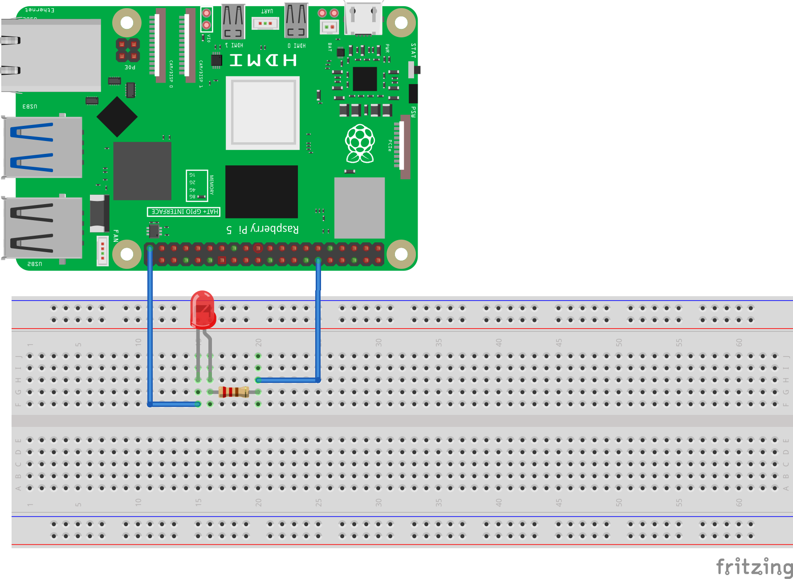
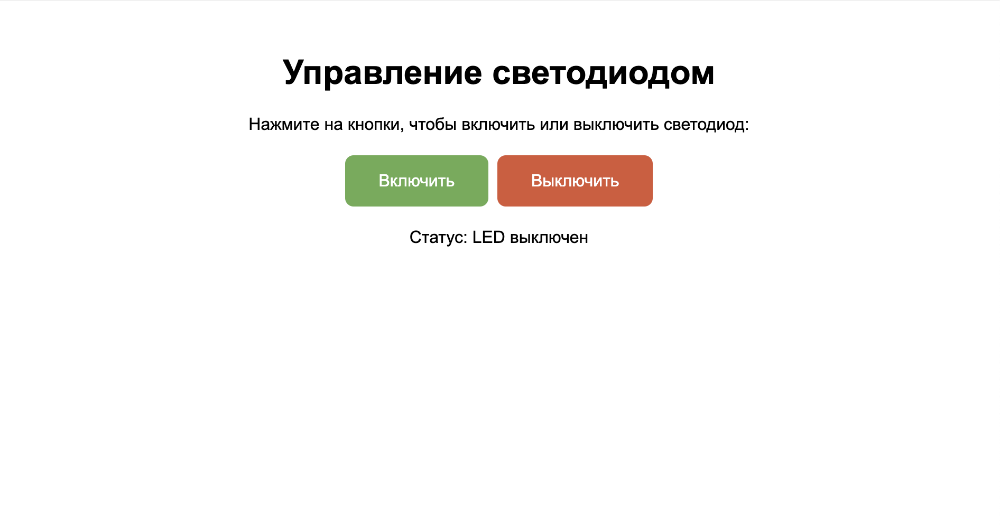

============================================================
Веб светодиод
============================================================

Теоретическая часть
------------------------------------
В этом уроке мы научимся создавать веб-интерфейс для управления светодиодом с помощью Raspberry Pi, используя CircuitPython для работы с GPIO и Flask для создания веб-приложения. Это позволит нам включать и выключать светодиод через любой браузер в локальной сети.

Flask - это легковесный веб-фреймворк для Python, который позволяет быстро создавать веб-приложения с минимальными настройками. В комбинации с библиотекой CircuitPython, мы можем создать интерактивный интерфейс для управления физическими компонентами через веб-браузер.

Необходимые компоненты
----------------------------------------
- Raspberry Pi
- Светодиод
- Резистор 220 Ом
- Макетная плата (breadboard)
- Соединительные провода

Схема подключения
----------------------------------

   **Рис. 1:** Схема подключения светодиода

Подключите светодиод к Raspberry Pi по следующей схеме:
- Анод светодиода (+) подключите к GPIO18 через резистор 220 Ом
- Катод светодиода (-) подключите к GND (земля)

Установка необходимых библиотек
----------------------------------------------
Перед запуском кода установите Flask и убедитесь, что CircuitPython уже установлен:

.. code-block:: bash

   pip install flask adafruit-blinka

Структура проекта
-----------------------------------
Создайте следующую структуру папок и файлов:

.. code-block:: bash

   web_led/
   ├── app.py           # Основной файл Flask-приложения
   └── templates/
       └── index.html   # HTML-шаблон для веб-интерфейса

Код приложения
--------------------------------
Файл: `web_led/app.py`

.. code-block:: python

   from flask import Flask, render_template
   import board
   import digitalio

   app = Flask(__name__)

   # Функция для инициализации пина
   def setup_led():
       led = digitalio.DigitalInOut(board.D18)
       led.direction = digitalio.Direction.OUTPUT
       return led

   # Глобальная переменная для хранения состояния
   led_state = False

   @app.route('/')
   def home():
       return render_template('index.html', status="LED выключен" if not led_state else "LED включен")

   @app.route('/on')
   def led_on():
       global led_state
       led = setup_led()
       led.value = True
       led_state = True
       led.deinit()  # Освобождаем GPIO
       return render_template('index.html', status="LED включен")

   @app.route('/off')
   def led_off():
       global led_state
       led = setup_led()
       led.value = False
       led_state = False
       led.deinit()  # Освобождаем GPIO
       return render_template('index.html', status="LED выключен")

   if __name__ == '__main__':
       app.run(host='0.0.0.0', port=5000, debug=True)

HTML-шаблон
-----------------------------
Файл: `web_led/templates/index.html`

.. code-block:: html

   <!DOCTYPE html>
   <html>
   <head>
       <title>Управление светодиодом</title>
       
   </head>
   <body>
       <h1>Управление светодиодом</h1>
       
       
Нажмите на кнопки, чтобы включить или выключить светодиод:

       
       <a href="/on" class="button">Включить</a>
       <a href="/off" class="button button-off">Выключить</a>
       
       
       
Статус: {{ status }}

       
   </body>
   </html>

Разбор кода
-----------------------------

**Файл app.py:**

1. **Импорт библиотек**

   .. code-block:: python

      from flask import Flask, render_template
      import board
      import digitalio

   Импортируем необходимые модули:
   - `Flask` и `render_template` для работы с веб-приложением
   - `board` и `digitalio` из CircuitPython для работы с GPIO

2. **Инициализация приложения**

   .. code-block:: python

      app = Flask(__name__)

   Создаем экземпляр Flask-приложения.

3. **Функция настройки светодиода**

   .. code-block:: python

      def setup_led():
          led = digitalio.DigitalInOut(board.D18)
          led.direction = digitalio.Direction.OUTPUT
          return led

   Функция, которая инициализирует GPIO18 как выход и возвращает объект для управления светодиодом.

4. **Отслеживание состояния светодиода**

   .. code-block:: python

      led_state = False

   Глобальная переменная для хранения текущего состояния светодиода (включен/выключен).

5. **Маршрут для главной страницы**

   .. code-block:: python

      @app.route('/')
      def home():
          return render_template('index.html', status="LED выключен" if not led_state else "LED включен")

   Обработчик для главной страницы (`/`), который отображает HTML-шаблон с текущим состоянием светодиода.

6. **Маршрут для включения светодиода**

   .. code-block:: python

      @app.route('/on')
      def led_on():
          global led_state
          led = setup_led()
          led.value = True
          led_state = True
          led.deinit()  # Освобождаем GPIO
          return render_template('index.html', status="LED включен")

   При переходе по адресу `/on` светодиод включается, состояние обновляется, и пользователь перенаправляется на главную страницу.

7. **Маршрут для выключения светодиода**

   .. code-block:: python

      @app.route('/off')
      def led_off():
          global led_state
          led = setup_led()
          led.value = False
          led_state = False
          led.deinit()  # Освобождаем GPIO
          return render_template('index.html', status="LED выключен")

   При переходе по адресу `/off` светодиод выключается, состояние обновляется, и пользователь перенаправляется на главную страницу.

8. **Запуск приложения**

   .. code-block:: python

      if __name__ == '__main__':
          app.run(host='0.0.0.0', port=5000, debug=True)

   Запускаем приложение на порту 5000, доступное по всем IP-адресам устройства (`0.0.0.0`).

**Файл index.html:**

HTML-шаблон содержит:
- Заголовок страницы
- CSS-стили для оформления кнопок
- Кнопки "Включить" и "Выключить" в виде ссылок на соответствующие маршруты
- Область для отображения текущего состояния светодиода

Запуск приложения
----------------------------------
1. Сохраните файлы с указанной структурой.
2. Запустите приложение:

   .. code-block:: bash

      python3 app.py

3. Откройте веб-браузер и перейдите по адресу `http://<IP-адрес-Raspberry-Pi>:5000`

   Например: `http://192.168.1.100:5000`

Ожидаемый результат
------------------------------------
1. В браузере появится веб-страница с двумя кнопками: "Включить" и "Выключить".
2. При нажатии на кнопку "Включить" светодиод загорится, и на странице обновится статус.
3. При нажатии на кнопку "Выключить" светодиод погаснет, и статус снова обновится.

   **Рис. 2:** Пример веб-интерфейса управления светодиодом

Завершение работы
---------------------------------
Для остановки веб-сервера нажмите **Ctrl + C** в терминале, где запущено приложение.

Дополнительные задания
--------------------------------------
1. **Добавление второго светодиода**:
   Расширьте приложение, чтобы управлять несколькими светодиодами на разных пинах.

2. **Добавление мигания**:
   Создайте новый маршрут `/blink`, который заставит светодиод мигать несколько раз.

3. **Использование AJAX**:
   Модифицируйте интерфейс, чтобы состояние светодиода менялось без перезагрузки страницы.

4. **Управление яркостью**:
   Добавьте ползунок, который будет управлять яркостью светодиода через PWM.

Поздравляем! 🎉 Вы создали веб-интерфейс для управления светодиодом с помощью Raspberry Pi, CircuitPython и Flask. Это базовый пример IoT (Интернета вещей), который можно расширить для управления более сложными устройствами через веб-интерфейс.