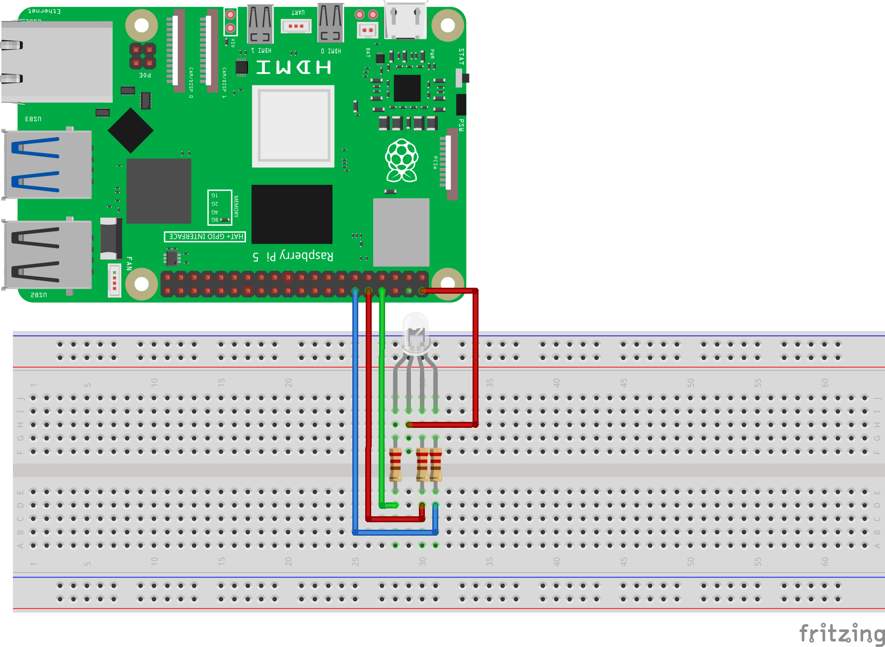
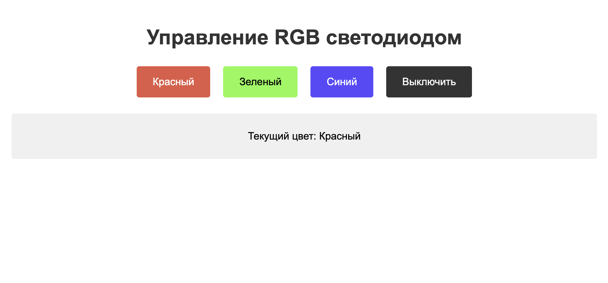

============================================================
RGB веб светодиод
============================================================

Теоретическая часть
-----------------------------------

RGB светодиод представляет собой три светодиода (красный, зеленый и синий) в одном корпусе. Управляя каждым из этих светодиодов, можно получить различные цвета. В этом уроке мы создадим веб-приложение с помощью Flask и CircuitPython, которое позволит управлять RGB светодиодом через веб-браузер.

Flask - это легковесный веб-фреймворк для Python, который позволяет быстро создавать веб-приложения. CircuitPython - это ветвь MicroPython, адаптированная для работы с микроконтроллерами и одноплатными компьютерами, включая Raspberry Pi. Вместе эти инструменты позволяют создать интерактивный интерфейс для управления электронными компонентами.

Необходимые компоненты
---------------------------------------

- Raspberry Pi
- RGB светодиод (общий катод)
- 3 резистора 220 Ом (по одному для каждого цвета)
- Макетная плата (breadboard)
- Соединительные провода

Схема подключения
---------------------------------

   **Рис. 1:** Схема подключения RGB светодиода

Подключите RGB светодиод к Raspberry Pi по следующей схеме:
- Общий катод (-) к GND
- Анод красного светодиода к GPIO14 через резистор 220 Ом
- Анод зеленого светодиода к GPIO15 через резистор 220 Ом
- Анод синего светодиода к GPIO18 через резистор 220 Ом

Установка необходимых библиотек
-----------------------------------------------

Перед запуском кода установите необходимые библиотеки:

.. code-block:: bash

   pip install flask adafruit-blinka

Структура проекта
----------------------------------

Создайте следующую структуру папок и файлов:

.. code-block:: bash

   rgb_web_control/
   ├── app.py           # Основной файл Flask-приложения
   └── templates/
       └── index.html   # HTML-шаблон для веб-интерфейса

Код приложения
------------------------------

Файл: `rgb_web_control/app.py`

.. code-block:: python

   import board
   import digitalio
   from flask import Flask, render_template, redirect, url_for

   # Настройка пинов для RGB светодиода
   red_pin = digitalio.DigitalInOut(board.D14)  # GPIO14 для красного
   green_pin = digitalio.DigitalInOut(board.D15)  # GPIO15 для зеленого
   blue_pin = digitalio.DigitalInOut(board.D18)  # GPIO18 для синего

   # Настраиваем все пины как выходы
   red_pin.direction = digitalio.Direction.OUTPUT
   green_pin.direction = digitalio.Direction.OUTPUT
   blue_pin.direction = digitalio.Direction.OUTPUT

   # Инициализация Flask приложения
   app = Flask(__name__)

   # Глобальная переменная для отслеживания текущего цвета
   current_color = "Выключен"

   # Функция для установки цвета RGB светодиода
   def set_color(r, g, b):
       red_pin.value = r
       green_pin.value = g
       blue_pin.value = b

   # Маршруты Flask
   @app.route('/')
   def index():
       return render_template('index.html', current_color=current_color)

   @app.route('/color/<color>')
   def set_led_color(color):
       global current_color
       
       if color == 'red':
           set_color(True, False, False)
           current_color = "Красный"
       elif color == 'green':
           set_color(False, True, False)
           current_color = "Зеленый"
       elif color == 'blue':
           set_color(False, False, True)
           current_color = "Синий"
       elif color == 'off':
           set_color(False, False, False)
           current_color = "Выключен"
       
       return redirect(url_for('index'))

   if __name__ == '__main__':
       # Выключаем светодиод при запуске
       set_color(False, False, False)
       
       # Запускаем веб-сервер
       # Используем 0.0.0.0 чтобы сервер был доступен извне
       app.run(host='0.0.0.0', port=8080)

HTML-шаблон
---------------------------

Файл: `rgb_web_control/templates/index.html`

.. code-block:: html

   <!DOCTYPE html>
   <html>
   <head>
       <title>Управление RGB светодиодом</title>
       <meta name="viewport" content="width=device-width, initial-scale=1">
       
   </head>
   <body>
       <h1>Управление RGB светодиодом</h1>
       
       

           <a href="/color/red"><button class="red">Красный</button></a>
           <a href="/color/green"><button class="green">Зеленый</button></a>
           <a href="/color/blue"><button class="blue">Синий</button></a>
           <a href="/color/off"><button class="off">Выключить</button></a>
       

       
       

           
Текущий цвет: {{ current_color }}

       

   </body>
   </html>

Разбор кода
---------------------------

**Python-код (app.py):**

1. **Импорт библиотек**

   .. code-block:: python

      import board
      import digitalio
      from flask import Flask, render_template, redirect, url_for

   - `board` и `digitalio` из CircuitPython для работы с GPIO
   - `Flask`, `render_template`, `redirect` и `url_for` для создания веб-приложения

2. **Настройка GPIO пинов**

   .. code-block:: python

      red_pin = digitalio.DigitalInOut(board.D14)
      green_pin = digitalio.DigitalInOut(board.D15)
      blue_pin = digitalio.DigitalInOut(board.D18)

      red_pin.direction = digitalio.Direction.OUTPUT
      green_pin.direction = digitalio.Direction.OUTPUT
      blue_pin.direction = digitalio.Direction.OUTPUT

   Настраиваем три пина GPIO (14, 15 и 18) как выходы для управления RGB светодиодом.

3. **Инициализация Flask и глобальные переменные**

   .. code-block:: python

      app = Flask(__name__)
      current_color = "Выключен"

   Создаем экземпляр Flask-приложения и переменную для отслеживания текущего цвета.

4. **Функция установки цвета**

   .. code-block:: python

      def set_color(r, g, b):
          red_pin.value = r
          green_pin.value = g
          blue_pin.value = b

   Функция принимает три булевых значения и устанавливает соответствующие значения на пинах.

5. **Маршрут для главной страницы**

   .. code-block:: python

      @app.route('/')
      def index():
          return render_template('index.html', current_color=current_color)

   Отображает HTML-шаблон, передавая текущий цвет в качестве параметра.

6. **Маршрут для изменения цвета**

   .. code-block:: python

      @app.route('/color/<color>')
      def set_led_color(color):
          global current_color
          
          if color == 'red':
              set_color(True, False, False)
              current_color = "Красный"
          # ... другие условия ...
          
          return redirect(url_for('index'))

   Принимает параметр `color` из URL и:
   - Устанавливает соответствующий цвет светодиода
   - Обновляет глобальную переменную `current_color`
   - Перенаправляет пользователя обратно на главную страницу

7. **Запуск приложения**

   .. code-block:: python

      if __name__ == '__main__':
          set_color(False, False, False)
          app.run(host='0.0.0.0', port=8080)

   Выключает светодиод при запуске и запускает Flask-сервер на порту 8080, доступный для всех интерфейсов (`0.0.0.0`).

**HTML-шаблон (index.html):**

1. **Структура HTML**
   - Метатег viewport для адаптивности на мобильных устройствах
   - Заголовок страницы
   - Контейнер для кнопок
   - Блок статуса для отображения текущего цвета

2. **CSS-стили**
   - Стили для общей компоновки страницы
   - Стили для кнопок с соответствующими цветами фона
   - Стили для блока статуса

3. **Кнопки управления**
   - Четыре кнопки, стилизованные в соответствии с их функцией
   - Каждая кнопка является ссылкой на соответствующий маршрут для изменения цвета

4. **Вывод статуса**
   - Блок для отображения текущего цвета светодиода
   - Значение подставляется из переменной `current_color`, переданной из Python-кода

Запуск приложения
--------------------------------

1. Сохраните файлы с указанной структурой.
2. Запустите приложение:

   .. code-block:: bash

      python3 app.py

3. Откройте веб-браузер и перейдите по адресу `http://<IP-адрес-Raspberry-Pi>:8080`

   Например: `http://192.168.1.100:8080`

Ожидаемый результат
----------------------------------

1. В браузере появится веб-страница с четырьмя кнопками: "Красный", "Зеленый", "Синий" и "Выключить".
2. При нажатии на цветную кнопку RGB светодиод загорится соответствующим цветом.
3. В блоке статуса будет отображаться текущий цвет светодиода.
4. Интерфейс будет корректно отображаться как на десктопных, так и на мобильных устройствах.

   **Рис. 2:** Пример веб-интерфейса управления RGB светодиодом

Завершение работы
--------------------------------

Для остановки веб-сервера нажмите **Ctrl + C** в терминале, где запущено приложение.

Важные замечания
-------------------------------

1. **Безопасность**: Данное приложение не имеет механизмов аутентификации, поэтому его рекомендуется использовать только в защищенной локальной сети.

2. **Восстановление пинов**: При завершении работы приложения порты GPIO остаются в последнем установленном состоянии. Для их освобождения и возврата в исходное состояние можно добавить обработку сигнала завершения приложения.

3. **Адаптация для разных типов RGB светодиодов**: Этот код предназначен для RGB светодиодов с общим катодом. Для светодиодов с общим анодом логику включения нужно инвертировать.

Дополнительные задания
------------------------------------

1. **Добавление смешанных цветов**:
   Добавьте кнопки для создания смешанных цветов (желтый, пурпурный, голубой, белый) путем включения нескольких светодиодов одновременно.

2. **Регулировка яркости**:
   Модифицируйте приложение для управления яркостью каждого светодиода с помощью PWM (широтно-импульсной модуляции).

3. **Сохранение состояния**:
   Добавьте функцию сохранения последнего выбранного цвета в файл, чтобы при перезапуске приложения светодиод возвращался к последнему установленному цвету.

4. **Цветовое колесо**:
   Создайте интерактивное цветовое колесо для выбора любого цвета из RGB-спектра.

Поздравляем! 🎉 Вы создали веб-приложение для управления RGB светодиодом с помощью Raspberry Pi, CircuitPython и Flask. Этот проект демонстрирует, как можно интегрировать веб-технологии с управлением физическими устройствами, что является основой для создания более сложных IoT-решений.