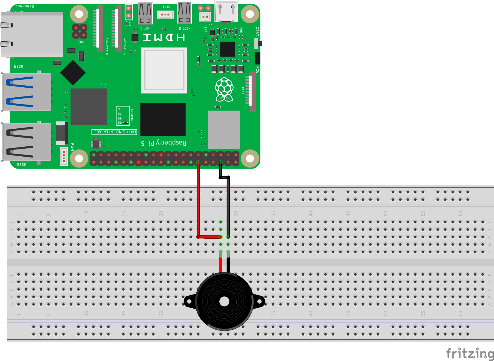
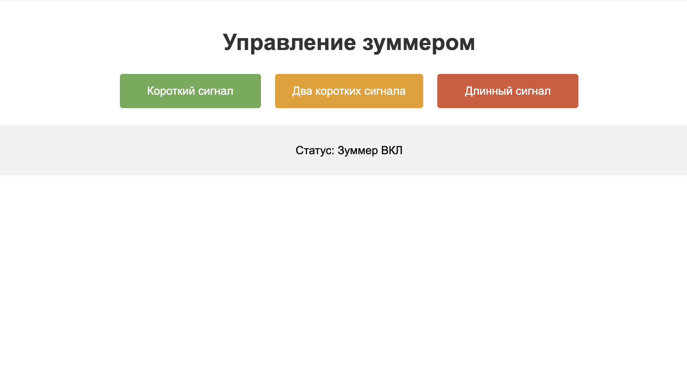

============================================================
Управление зуммером через веб-интерфейс
============================================================

Теоретическая часть
---------------------------------

Активный зуммер (buzzer) - это электронный компонент, который генерирует звук при подаче на него напряжения. В отличие от пассивного зуммера, активный имеет встроенный генератор звука, поэтому для его работы достаточно просто подать питание, без необходимости генерировать сигнал определенной частоты.

В этом уроке мы создадим веб-приложение, которое позволит управлять зуммером через браузер. Для этого мы будем использовать:

1. **CircuitPython** для управления GPIO пинами Raspberry Pi
2. **Flask** для создания веб-сервера и интерфейса
3. **Многопоточность (Threading)** для выполнения звуковых сигналов без блокировки веб-интерфейса

Необходимые компоненты
-------------------------------------

- Raspberry Pi
- Активный зуммер
- Резистор 220 Ом (опционально, для ограничения тока)
- Макетная плата (breadboard)
- Соединительные провода

Схема подключения
-------------------------------

   **Рис. 1:** Схема подключения активного зуммера

Подключите активный зуммер к Raspberry Pi следующим образом:
- Положительный вывод зуммера (+) через резистор 220 Ом к GPIO18
- Отрицательный вывод зуммера (-) к GND (земля)

Установка необходимых библиотек
---------------------------------------------

Перед запуском кода установите Flask и убедитесь, что CircuitPython уже установлен:

.. code-block:: bash

   pip install flask adafruit-blinka

Структура проекта
--------------------------------

Создайте следующую структуру папок и файлов:

.. code-block:: bash

   buzzer_web_control/
   ├── app.py           # Основной файл Flask-приложения
   └── templates/
       └── index.html   # HTML-шаблон для веб-интерфейса

Код приложения
----------------------------

Файл: `buzzer_web_control/app.py`

.. code-block:: python

   import board
   import digitalio
   import time
   import threading
   from flask import Flask, render_template, redirect, url_for

   # Настройка пина для активного зуммера
   buzzer_pin = digitalio.DigitalInOut(board.D18)  # GPIO18
   buzzer_pin.direction = digitalio.Direction.OUTPUT

   # Инициализация Flask приложения
   app = Flask(__name__)

   # Глобальная переменная для отслеживания статуса
   status = "Ожидание"
   buzzer_active = False

   # Функция для подачи звукового сигнала
   def beep(duration):
       global status, buzzer_active
       
       # Предотвращаем одновременное выполнение нескольких сигналов
       if buzzer_active:
           return
       
       buzzer_active = True
       buzzer_pin.value = True
       status = "Зуммер ВКЛ"
       time.sleep(duration)
       buzzer_pin.value = False
       status = "Ожидание"
       buzzer_active = False

   # Функция для запуска двух сигналов
   def double_beep():
       global status, buzzer_active
       
       if buzzer_active:
           return
       
       buzzer_active = True
       
       # Первый сигнал
       buzzer_pin.value = True
       status = "Зуммер ВКЛ (1/2)"
       time.sleep(0.2)
       buzzer_pin.value = False
       time.sleep(0.2)
       
       # Второй сигнал
       buzzer_pin.value = True
       status = "Зуммер ВКЛ (2/2)"
       time.sleep(0.2)
       buzzer_pin.value = False
       
       status = "Ожидание"
       buzzer_active = False

   # Маршруты Flask
   @app.route('/')
   def index():
       return render_template('index.html', status=status)

   @app.route('/beep/<beep_type>')
   def trigger_beep(beep_type):
       thread = None
       
       if beep_type == 'short':
           thread = threading.Thread(target=beep, args=(0.2,))
       elif beep_type == 'double':
           thread = threading.Thread(target=double_beep)
       elif beep_type == 'long':
           thread = threading.Thread(target=beep, args=(1.0,))
       
       if thread:
           thread.daemon = True
           thread.start()
       
       return redirect(url_for('index'))

   # Функция очистки при завершении
   def cleanup():
       buzzer_pin.value = False
       print("\nПрограмма завершена")

   if __name__ == '__main__':
       # Регистрируем функцию очистки
       import atexit
       atexit.register(cleanup)
       
       try:
           # Запускаем веб-сервер
           print("Веб-сервер запущен. Нажмите Ctrl+C для завершения.")
           app.run(host='0.0.0.0', port=8080)
       except KeyboardInterrupt:
           cleanup()

HTML-шаблон
-------------------------

Файл: `buzzer_web_control/templates/index.html`

.. code-block:: html

   <!DOCTYPE html>
   <html>
   <head>
       <title>Управление зуммером</title>
       <meta name="viewport" content="width=device-width, initial-scale=1">
       
   </head>
   <body>
       <h1>Управление зуммером</h1>
       
       

           <a href="/beep/short"><button class="short">Короткий сигнал</button></a>
           <a href="/beep/double"><button class="double">Два коротких сигнала</button></a>
           <a href="/beep/long"><button class="long">Длинный сигнал</button></a>
       

       
       

           
Статус: {{ status }}

       

   </body>
   </html>

Разбор кода
-------------------------

**Python-код (app.py):**

1. **Импорт библиотек**

   .. code-block:: python

      import board
      import digitalio
      import time
      import threading
      from flask import Flask, render_template, redirect, url_for

   - `board` и `digitalio` из CircuitPython для работы с GPIO
   - `time` для создания задержек
   - `threading` для выполнения сигналов в отдельных потоках
   - `Flask` и связанные функции для создания веб-приложения

2. **Настройка GPIO для зуммера**

   .. code-block:: python

      buzzer_pin = digitalio.DigitalInOut(board.D18)
      buzzer_pin.direction = digitalio.Direction.OUTPUT

   Настраиваем GPIO18 как выход для управления зуммером.

3. **Инициализация Flask и глобальные переменные**

   .. code-block:: python

      app = Flask(__name__)
      status = "Ожидание"
      buzzer_active = False

   - Создаем экземпляр Flask-приложения
   - Инициализируем переменную `status` для отслеживания состояния зуммера
   - Переменная `buzzer_active` служит флагом активности зуммера

4. **Функция для одиночного сигнала**

   .. code-block:: python

      def beep(duration):
          global status, buzzer_active
          
          if buzzer_active:
              return
          
          buzzer_active = True
          buzzer_pin.value = True
          status = "Зуммер ВКЛ"
          time.sleep(duration)
          buzzer_pin.value = False
          status = "Ожидание"
          buzzer_active = False

   - Проверяем флаг `buzzer_active`, чтобы избежать одновременного выполнения сигналов
   - Включаем зуммер, устанавливая `buzzer_pin.value = True`
   - Обновляем статус и ждем указанное время
   - Выключаем зуммер и сбрасываем флаг активности

5. **Функция для двойного сигнала**

   .. code-block:: python

      def double_beep():
          global status, buzzer_active
          
          if buzzer_active:
              return
          
          buzzer_active = True
          
          # Первый сигнал
          buzzer_pin.value = True
          status = "Зуммер ВКЛ (1/2)"
          time.sleep(0.2)
          buzzer_pin.value = False
          time.sleep(0.2)
          
          # Второй сигнал
          buzzer_pin.value = True
          status = "Зуммер ВКЛ (2/2)"
          time.sleep(0.2)
          buzzer_pin.value = False
          
          status = "Ожидание"
          buzzer_active = False

   - Аналогично `beep()`, но генерирует два коротких сигнала с паузой между ними
   - Обновляет статус для каждого этапа выполнения

6. **Маршруты Flask**

   .. code-block:: python

      @app.route('/')
      def index():
          return render_template('index.html', status=status)

      @app.route('/beep/<beep_type>')
      def trigger_beep(beep_type):
          thread = None
          
          if beep_type == 'short':
              thread = threading.Thread(target=beep, args=(0.2,))
          elif beep_type == 'double':
              thread = threading.Thread(target=double_beep)
          elif beep_type == 'long':
              thread = threading.Thread(target=beep, args=(1.0,))
          
          if thread:
              thread.daemon = True
              thread.start()
          
          return redirect(url_for('index'))

   - Маршрут `'/'` отображает главную страницу с текущим статусом
   - Маршрут `/beep/<beep_type>` обрабатывает запросы на разные типы сигналов
   - Создаем отдельный поток для выполнения выбранного сигнала
   - Поток помечается как `daemon=True`, чтобы он завершался вместе с основным потоком
   - Перенаправляем пользователя обратно на главную страницу

7. **Функция очистки и запуск приложения**

   .. code-block:: python

      def cleanup():
          buzzer_pin.value = False
          print("\nПрограмма завершена")

      if __name__ == '__main__':
          import atexit
          atexit.register(cleanup)
          
          try:
              print("Веб-сервер запущен. Нажмите Ctrl+C для завершения.")
              app.run(host='0.0.0.0', port=8080)
          except KeyboardInterrupt:
              cleanup()

   - Функция `cleanup()` выключает зуммер при завершении программы
   - Регистрируем функцию очистки через `atexit`, чтобы она выполнялась при выходе
   - Запускаем Flask-сервер на порту 8080, доступный для всех интерфейсов (`0.0.0.0`)
   - Обрабатываем сигнал прерывания (Ctrl+C) для корректного завершения

**HTML-шаблон (index.html):**

1. **Структура HTML и метаданные**
   - DOCTYPE и базовая структура HTML
   - Метатег viewport для адаптивности на мобильных устройствах
   - Заголовок страницы

2. **CSS-стили**
   - Базовые стили для страницы и текста
   - Стили для контейнера кнопок с flex-элементами
   - Стили для кнопок разных типов сигналов с соответствующими цветами
   - Стили для блока статуса

3. **Содержимое страницы**
   - Заголовок "Управление зуммером"
   - Контейнер с тремя кнопками, каждая из которых ссылается на свой маршрут
   - Блок статуса, отображающий текущее состояние зуммера

4. **Передача данных**
   - Шаблонная переменная `{{ status }}` заполняется из Python-кода

Важно отметить использование многопоточности. Это позволяет выполнять длительные операции (звуковые сигналы) без блокировки веб-интерфейса, что делает приложение более отзывчивым.

Запуск приложения
------------------------------

1. Сохраните файлы с указанной структурой.
2. Запустите приложение:

   .. code-block:: bash

      python3 app.py

3. Откройте веб-браузер и перейдите по адресу `http://<IP-адрес-Raspberry-Pi>:8080`

   Например: `http://192.168.1.100:8080`

Ожидаемый результат
--------------------------------

1. В браузере появится веб-страница с тремя кнопками разных цветов:
   - Зеленая кнопка "Короткий сигнал"
   - Оранжевая кнопка "Два коротких сигнала"
   - Красная кнопка "Длинный сигнал"

2. При нажатии на любую из кнопок:
   - Зуммер издаст соответствующий звуковой сигнал
   - Статус на странице обновится, показывая текущее состояние
   - После завершения сигнала статус вернется к "Ожидание"

3. Интерфейс будет корректно отображаться как на десктопных, так и на мобильных устройствах благодаря адаптивному дизайну.

   **Рис. 2:** Пример веб-интерфейса управления зуммером

Завершение работы
------------------------------

Для остановки веб-сервера нажмите **Ctrl + C** в терминале, где запущено приложение. Функция `cleanup()` автоматически выключит зуммер.

Особенности и расширенные концепции
-----------------------------------------------

1. **Многопоточность**

   Использование `threading` позволяет выполнять звуковые сигналы в фоновом режиме, не блокируя ответы веб-сервера. Это решает проблему, когда длительные операции могут приводить к зависанию веб-интерфейса.

2. **Предотвращение конфликтов**

   Переменная `buzzer_active` служит флагом, который предотвращает одновременное выполнение нескольких сигналов. Если пользователь нажимает другую кнопку, пока предыдущий сигнал еще не завершен, новая команда игнорируется.

3. **Корректное завершение программы**

   При завершении программы через Ctrl+C или обычного выхода, функция `cleanup()` гарантирует, что зуммер будет выключен. Это важно для предотвращения ситуации, когда зуммер может остаться включенным после завершения программы.

Дополнительные задания
----------------------------------

1. **Добавление морзе-кода**:
   Расширьте приложение для отправки сообщений азбукой Морзе. Например, добавьте поле ввода текста и кнопку для преобразования текста в последовательность звуковых сигналов.

2. **Настраиваемые сигналы**:
   Добавьте возможность настройки длительности и паттерна сигналов через веб-интерфейс (например, слайдеры для настройки длительности и количества сигналов).

3. **Звуковые шаблоны**:
   Создайте библиотеку предустановленных звуковых шаблонов (например, "SOS", "Тревога", "Мелодия") и добавьте кнопки для их воспроизведения.

4. **Интеграция с событиями**:
   Настройте автоматическое воспроизведение сигналов при определенных событиях (например, при определенном времени или при срабатывании датчика, подключенного к Raspberry Pi).

5. **Обновление статуса в реальном времени**:
   Используйте WebSockets для обновления статуса на веб-странице в реальном времени без перезагрузки страницы.

Поздравляем! 🎉 Вы создали веб-приложение для управления зуммером с помощью Raspberry Pi, CircuitPython и Flask. Этот проект демонстрирует, как можно интегрировать веб-технологии с управлением физическими устройствами и использовать многопоточность для создания более отзывчивого интерфейса.