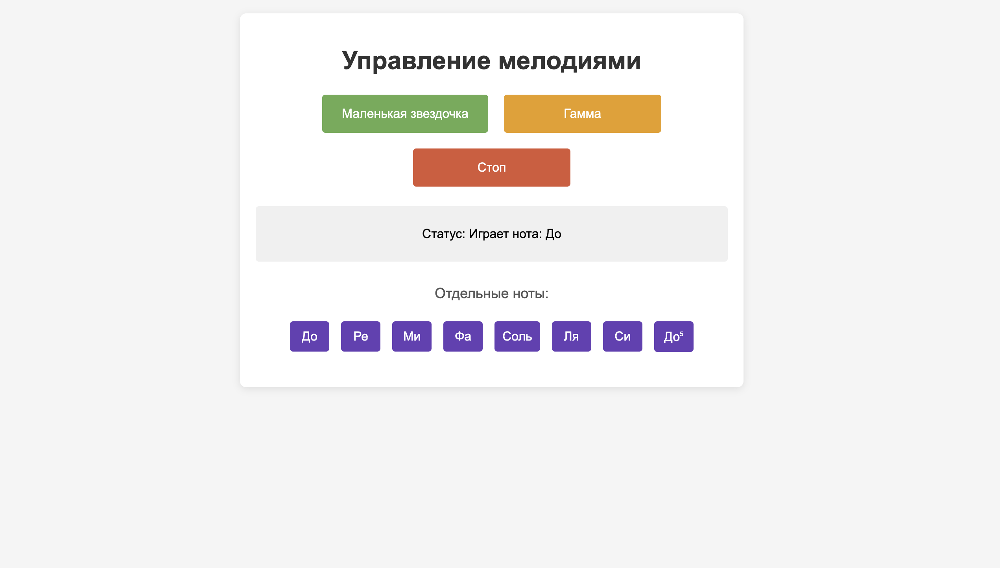

========================================================================================================================
Пассивный зуммер в веб интерфейсе
========================================================================================================================

Теоретическая часть
------------------------------------

**Пассивный зуммер** отличается от активного тем, что не имеет встроенного генератора звука. Для извлечения звука через пассивный зуммер необходимо подавать сигнал определенной частоты. Изменяя эту частоту, можно получать различные ноты музыкальной гаммы, что позволяет воспроизводить мелодии.

Для генерации сигналов различной частоты будем использовать технологию **PWM** (широтно-импульсная модуляция). PWM позволяет контролировать как частоту сигнала (определяет высоту ноты), так и рабочий цикл (влияет на громкость).

В этом уроке мы создадим веб-приложение, которое позволит:
- Воспроизводить предустановленные мелодии
- Играть отдельные ноты как на пианино
- Останавливать воспроизведение
- Отслеживать текущую ноту или статус воспроизведения

Для реализации этого проекта будем использовать:
1. **CircuitPython** для управления GPIO пинами и PWM на Raspberry Pi
2. **Flask** для создания веб-сервера и интерфейса
3. **Многопоточность (Threading)** для воспроизведения звуков без блокировки веб-интерфейса

Необходимые компоненты
----------------------------------------------------------

- Raspberry Pi
- Пассивный зуммер
- Резистор 220 Ом (опционально, для ограничения тока)
- Макетная плата (breadboard)
- Соединительные провода

Схема подключения
----------------------------------------------------

.. figure:: images/passive_buzzer_circuit.png
   :width: 80%
   :align: center

   **Рис. 1:** Схема подключения пассивного зуммера

Подключите пассивный зуммер к Raspberry Pi следующим образом:
- Положительный вывод (+) к GPIO18
- Отрицательный вывод (-) к GND (земля)

Установка необходимых библиотек
------------------------------------------------------------------

Перед запуском кода установите Flask и CircuitPython:

.. code-block:: bash

   pip install flask adafruit-blinka

Структура проекта
-----------------------------------------------------

Создайте следующую структуру папок и файлов:

.. code-block:: bash

   music_buzzer/
   ├── app.py           # Основной файл Flask-приложения
   └── templates/
       └── index.html   # HTML-шаблон для веб-интерфейса

Код приложения
-------------------------------------------------

Файл: `music_buzzer/app.py`

.. code-block:: python

   import board
   import pwmio
   import time
   import threading
   from flask import Flask, render_template, redirect, url_for

   # Настройка пина для пассивного зуммера с использованием PWM
   buzzer = pwmio.PWMOut(board.D18, frequency=440, duty_cycle=0)

   # Инициализация Flask приложения
   app = Flask(__name__)

   # Глобальные переменные для управления состоянием
   status = "Готов к воспроизведению"
   playing = False
   stop_playing = False

   # Словарь нот и их частот в Гц
   NOTES = {
       'C4': 262,  # До четвертой октавы
       'D4': 294,  # Ре
       'E4': 330,  # Ми
       'F4': 349,  # Фа
       'G4': 392,  # Соль
       'A4': 440,  # Ля
       'B4': 494,  # Си
       'C5': 523,  # До пятой октавы
       'REST': 0,  # Пауза
   }

   # Мелодия "Маленькая звездочка" (Twinkle Twinkle Little Star)
   TWINKLE = [
       ('C4', 0.3), ('C4', 0.3), ('G4', 0.3), ('G4', 0.3),
       ('A4', 0.3), ('A4', 0.3), ('G4', 0.6),
       ('F4', 0.3), ('F4', 0.3), ('E4', 0.3), ('E4', 0.3),
       ('D4', 0.3), ('D4', 0.3), ('C4', 0.6),
   ]

   # Гамма
   SCALE = [
       ('C4', 0.3), ('D4', 0.3), ('E4', 0.3), ('F4', 0.3),
       ('G4', 0.3), ('A4', 0.3), ('B4', 0.3), ('C5', 0.3),
       ('C5', 0.3), ('B4', 0.3), ('A4', 0.3), ('G4', 0.3),
       ('F4', 0.3), ('E4', 0.3), ('D4', 0.3), ('C4', 0.3),
   ]

   # Функция для проигрывания ноты заданной длительности
   def play_note(note, duration):
       global status
       
       if note == 'REST':
           # Пауза - просто ждем
           buzzer.duty_cycle = 0
           status = f"Пауза: {duration} сек"
           time.sleep(duration)
       else:
           # Устанавливаем частоту ноты
           buzzer.frequency = NOTES[note]
           # Устанавливаем громкость (50% от максимальной)
           buzzer.duty_cycle = 32768  # 50% от 65535
           
           note_names = {
               'C4': 'До', 'D4': 'Ре', 'E4': 'Ми', 'F4': 'Фа',
               'G4': 'Соль', 'A4': 'Ля', 'B4': 'Си', 'C5': 'До⁵'
           }
           status = f"Играет нота: {note_names.get(note, note)}"
           
           # Ждем заданную длительность
           time.sleep(duration)
           # Выключаем звук
           buzzer.duty_cycle = 0
           # Небольшая пауза между нотами
           time.sleep(0.05)

   # Функция для проигрывания мелодии
   def play_melody(melody_name):
       global playing, stop_playing, status
       
       if playing:
           return  # Если уже играет мелодия, не запускаем новую
       
       playing = True
       stop_playing = False
       
       melody = []
       if melody_name == "twinkle":
           melody = TWINKLE
           status = "Играет: Маленькая звездочка"
       elif melody_name == "scale":
           melody = SCALE
           status = "Играет: Гамма"
       
       def play_thread():
           global playing, stop_playing, status
           
           try:
               while not stop_playing:
                   # Проигрываем мелодию один раз
                   for note, duration in melody:
                       if stop_playing:
                           break
                       play_note(note, duration)
                   
                   if stop_playing:
                       break
                   
                   # Пауза перед повторением
                   time.sleep(0.5)
               
               buzzer.duty_cycle = 0
               status = "Воспроизведение остановлено"
               playing = False
               
           except Exception as e:
               buzzer.duty_cycle = 0
               status = f"Ошибка: {str(e)}"
               playing = False
       
       # Запускаем воспроизведение в отдельном потоке
       threading.Thread(target=play_thread, daemon=True).start()

   # Маршруты Flask
   @app.route('/')
   def index():
       return render_template('index.html', status=status)

   @app.route('/play/<melody>')
   def play(melody):
       play_melody(melody)
       return redirect(url_for('index'))

   @app.route('/note/<note>')
   def play_single_note(note):
       global status
       
       if note in NOTES:
           # Остановим любое текущее воспроизведение
           stop()
           
           # Проигрываем отдельную ноту в отдельном потоке
           def note_thread():
               play_note(note, 0.5)  # Играем ноту 0.5 секунды
               global status
               status = "Готов к воспроизведению"
           
           threading.Thread(target=note_thread, daemon=True).start()
       
       return redirect(url_for('index'))

   @app.route('/stop')
   def stop():
       global stop_playing, status
       
       stop_playing = True
       buzzer.duty_cycle = 0
       status = "Готов к воспроизведению"
       
       return redirect(url_for('index'))

   # Функция очистки при завершении
   def cleanup():
       buzzer.duty_cycle = 0
       print("\nПрограмма завершена")

   if __name__ == '__main__':
       # Регистрируем функцию очистки
       import atexit
       atexit.register(cleanup)
       
       try:
           # Запускаем веб-сервер
           print("Веб-сервер запущен на порту 8080. Нажмите Ctrl+C для завершения.")
           app.run(host='0.0.0.0', port=8080, debug=False)
       except KeyboardInterrupt:
           cleanup()

HTML-шаблон
----------------------------------------------

Файл: `music_buzzer/templates/index.html`

.. code-block:: html

   <!DOCTYPE html>
   <html>
   <head>
       <title>Управление зуммером - Мелодии</title>
       <meta name="viewport" content="width=device-width, initial-scale=1">
       
   </head>
   <body>
       

           <h1>Управление мелодиями</h1>
           
           

               <a href="/play/twinkle"><button class="twinkle">Маленькая звездочка</button></a>
               <a href="/play/scale"><button class="scale">Гамма</button></a>
               <a href="/stop"><button class="stop">Стоп</button></a>
           

           
           

               
Статус: {{ status }}

           

           
           
Отдельные ноты:

           

               <a href="/note/C4"><button class="note-button">До</button></a>
               <a href="/note/D4"><button class="note-button">Ре</button></a>
               <a href="/note/E4"><button class="note-button">Ми</button></a>
               <a href="/note/F4"><button class="note-button">Фа</button></a>
               <a href="/note/G4"><button class="note-button">Соль</button></a>
               <a href="/note/A4"><button class="note-button">Ля</button></a>
               <a href="/note/B4"><button class="note-button">Си</button></a>
               <a href="/note/C5"><button class="note-button">До⁵</button></a>
           

       

   </body>
   </html>

Разбор кода
----------------------------------------------

**Python-код (app.py):**

1. **Настройка зуммера с использованием PWM**

   .. code-block:: python

      buzzer = pwmio.PWMOut(board.D18, frequency=440, duty_cycle=0)

   - Инициализируем PWM на GPIO18 с начальной частотой 440 Гц (нота Ля)
   - Устанавливаем `duty_cycle=0`, что означает отсутствие звука при запуске

2. **Определение музыкальных нот и их частот**

   .. code-block:: python

      NOTES = {
          'C4': 262,  # До четвертой октавы
          # ...
      }

   - Создаем словарь, где ключи — названия нот, а значения — их частоты в Герцах
   - Это позволяет задавать мелодии символьными обозначениями нот

3. **Определение мелодий**

   .. code-block:: python

      TWINKLE = [
          ('C4', 0.3), ('C4', 0.3), # ...
      ]

   - Мелодии представлены в виде списков кортежей (нота, длительность)
   - Для каждой ноты указывается ее длительность в секундах

4. **Функция воспроизведения отдельной ноты**

   .. code-block:: python

      def play_note(note, duration):
          # ...
          if note == 'REST':
              # Обработка паузы
          else:
              # Установка частоты и рабочего цикла
              buzzer.frequency = NOTES[note]
              buzzer.duty_cycle = 32768  # 50% от 65535
              # ...

   - Если нота — пауза (`REST`), просто ждем указанное время
   - Для обычных нот устанавливаем соответствующую частоту и рабочий цикл 50%
   - Обновляем статус и добавляем перевод нот с английской нотации на русскую

5. **Функция воспроизведения мелодии**

   .. code-block:: python

      def play_melody(melody_name):
          global playing, stop_playing, status
          
          if playing:
              return  # Предотвращаем наложение мелодий
          
          # Выбор мелодии и установка статуса
          # ...
          
          def play_thread():
              # Код для воспроизведения мелодии в цикле
              # ...
          
          # Запуск в отдельном потоке
          threading.Thread(target=play_thread, daemon=True).start()

   - Используется флаг `playing` для предотвращения одновременного проигрывания нескольких мелодий
   - Создается вложенная функция `play_thread()`, которая воспроизводит мелодию в цикле
   - Используется многопоточность (`threading`) для запуска воспроизведения без блокировки веб-интерфейса
   - Поток помечается как `daemon=True`, чтобы он завершался вместе с основным потоком

6. **Маршруты Flask**

   .. code-block:: python

      @app.route('/')
      def index():
          return render_template('index.html', status=status)

      @app.route('/play/<melody>')
      def play(melody):
          play_melody(melody)
          return redirect(url_for('index'))

      @app.route('/note/<note>')
      def play_single_note(note):
          # ...
          
      @app.route('/stop')
      def stop():
          # ...

   - Маршрут `/` — главная страница с текущим статусом
   - Маршрут `/play/<melody>` — запуск воспроизведения выбранной мелодии
   - Маршрут `/note/<note>` — воспроизведение отдельной ноты
   - Маршрут `/stop` — остановка текущего воспроизведения

7. **Функция очистки и запуск приложения**

   .. code-block:: python

      def cleanup():
          buzzer.duty_cycle = 0
          print("\nПрограмма завершена")

      if __name__ == '__main__':
          import atexit
          atexit.register(cleanup)
          # ...

   - Функция `cleanup()` выключает зуммер при завершении программы
   - Используется `atexit.register()` для регистрации функции очистки, которая выполнится при завершении программы
   - Запуск Flask-сервера с отключенным режимом отладки для повышения производительности

**HTML-шаблон (index.html):**

1. **Структура страницы**
   - Адаптивный дизайн с использованием контейнера с максимальной шириной
   - Заголовок страницы
   - Раздел с кнопками для воспроизведения мелодий
   - Блок статуса
   - Раздел с кнопками для отдельных нот (мини-пианино)

2. **CSS-стили**
   - Стили для улучшения внешнего вида страницы
   - Цветовая кодировка для разных типов кнопок
   - Адаптивная вёрстка с использованием flexbox
   - Эффекты при наведении для кнопок

3. **Особенности интерфейса**
   - Карточный дизайн с тенями и закругленными углами
   - Цветовое разделение кнопок по функциям
   - Компактное расположение кнопок для нот
   - Отображение текущего статуса в отдельном блоке

Запуск приложения
---------------------------------------------------

1. Сохраните файлы с указанной структурой.
2. Запустите приложение:

   .. code-block:: bash

      python3 app.py

3. Откройте веб-браузер и перейдите по адресу `http://<IP-адрес-Raspberry-Pi>:8080`

   Например: `http://192.168.1.100:8080`

Ожидаемый результат
-----------------------------------------------------

1. В браузере загрузится страница с тремя основными кнопками:
   - "Маленькая звездочка" — для воспроизведения первой мелодии
   - "Гамма" — для воспроизведения музыкальной гаммы
   - "Стоп" — для остановки текущего воспроизведения

2. Ниже будет отображаться текущий статус воспроизведения.

3. В нижней части страницы будут расположены кнопки для воспроизведения отдельных нот: "До", "Ре", "Ми", "Фа", "Соль", "Ля", "Си", "До⁵".

4. При нажатии на кнопку мелодии:
   - Пассивный зуммер начнет воспроизводить выбранную мелодию
   - Статус на странице будет обновляться, показывая текущую ноту
   - Мелодия будет циклически повторяться до нажатия кнопки "Стоп"

5. При нажатии на кнопку ноты:
   - Зуммер воспроизведет выбранную ноту в течение 0.5 секунды
   - Если в этот момент играла мелодия, она будет остановлена

   **Рис. 2:** Пример веб-интерфейса управления музыкальным зуммером

Завершение работы
---------------------------------------------------

Для остановки веб-сервера нажмите **Ctrl + C** в терминале, где запущено приложение. Функция `cleanup()` автоматически выключит зуммер.

Технические детали и особенности реализации
----------------------------------------------------------------------------

1. **Использование PWM для генерации звука**

   PWM (Pulse Width Modulation, Широтно-импульсная модуляция) позволяет генерировать периодические сигналы с заданной частотой. В нашем случае это используется для создания звуковых волн определенной частоты, соответствующей музыкальным нотам.

2. **Многопоточность**

   Многопоточность позволяет выполнять длительные операции (воспроизведение мелодии) без блокировки основного потока, в котором работает веб-сервер. Это делает интерфейс более отзывчивым — пользователь может взаимодействовать с веб-страницей во время воспроизведения звука.

3. **Механизм защиты от наложения**

   В коде реализован механизм, предотвращающий одновременное воспроизведение нескольких мелодий. Если пользователь нажмет на кнопку новой мелодии, пока текущая еще не закончилась, новая мелодия не запустится.

4. **Мелодии как структуры данных**

   Мелодии представлены в виде списков кортежей, где каждый кортеж содержит название ноты и ее длительность. Это делает код более читаемым и упрощает добавление новых мелодий.

5. **Перевод нот**

   В функции `play_note()` реализован перевод нот из стандартной музыкальной нотации (C4, D4, и т.д.) в русскоязычную нотацию (До, Ре, и т.д.), что делает интерфейс более дружелюбным для русскоязычных пользователей.

Возможные улучшения и расширения
----------------------------------------------------------------

1. **Добавление новых мелодий**:
   Вы можете расширить набор предустановленных мелодий, добавив их в код, например:

   .. code-block:: python

      # Мелодия "В лесу родилась елочка" (первые такты)
      FOREST_TREE = [
          ('E4', 0.3), ('E4', 0.3), ('E4', 0.6),
          ('E4', 0.3), ('E4', 0.3), ('E4', 0.6),
          ('E4', 0.3), ('G4', 0.3), ('C4', 0.3), ('D4', 0.3),
          ('E4', 1.2),
          # ...
      ]

2. **Регулировка громкости**:
   Добавьте слайдер для управления громкостью звука, изменяя значение `duty_cycle`.

3. **Сохранение пользовательских мелодий**:
   Создайте интерфейс для создания и сохранения пользовательских мелодий.

4. **Визуализация воспроизведения**:
   Добавьте визуальные эффекты, такие как подсветка кнопок нот при их воспроизведении в мелодии.

5. **Использование WebSocket**:
   Замените обновление страницы на WebSocket для получения обновлений статуса в реальном времени без перезагрузки страницы.

6. **Регулировка темпа**:
   Добавьте возможность ускорять или замедлять воспроизведение мелодии.

Заключение
--------------------------------------------

В этом уроке мы создали веб-приложение для управления пассивным зуммером, которое позволяет воспроизводить мелодии и отдельные ноты через веб-интерфейс. Мы использовали технологию PWM для генерации звуковых сигналов различной частоты, а также многопоточность для обеспечения отзывчивости интерфейса.

Проект демонстрирует интеграцию технологий управления аппаратными средствами (CircuitPython и PWM) с веб-технологиями (Flask, HTML, CSS), что является хорошим примером IoT-приложения.

Этот проект может служить основой для создания более сложных музыкальных приложений и быть использован в образовательных целях для изучения основ музыки, программирования и электроники.