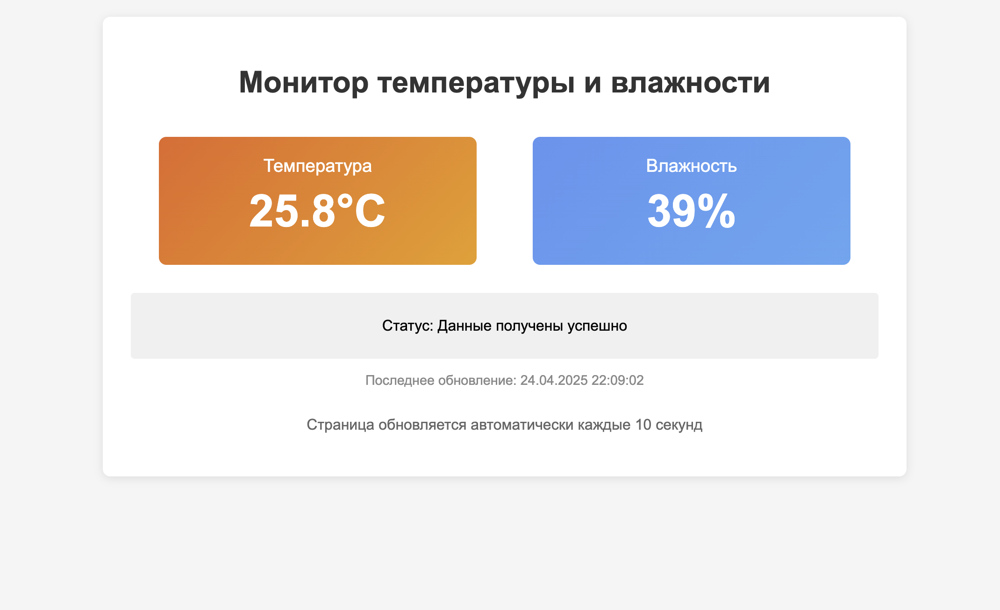

========================================================================================================================
Мини веб метостанция
========================================================================================================================

Теоретическая часть
------------------------------------

Датчик **DHT11** (или его более точный аналог DHT22) — это популярный датчик для измерения температуры и влажности воздуха. Он прост в использовании и отлично подходит для домашних метеостанций, систем умного дома и аналогичных проектов.

В этом уроке мы создадим веб-приложение для мониторинга температуры и влажности с использованием Flask и CircuitPython. Приложение будет автоматически считывать данные с датчика и отображать их на стильной веб-странице, доступной с любого устройства в локальной сети.

Ключевые технологии и концепции:
- **DHT11/DHT22** для измерения температуры и влажности
- **CircuitPython** для взаимодействия с аппаратной частью Raspberry Pi
- **Flask** для создания веб-сервера
- **Многопоточность** для параллельного считывания данных и работы веб-сервера
- **Адаптивный веб-дизайн** для корректного отображения на разных устройствах

Необходимые компоненты
----------------------------------------

- Raspberry Pi (любая модель с GPIO)
- Датчик DHT11 или DHT22
- Резистор 10 кОм (подтягивающий)
- Макетная плата (breadboard)
- Соединительные провода

Схема подключения
----------------------------------

.. figure:: images/dht11_circuit.png
   :width: 80%
   :align: center

   **Рис. 1:** Схема подключения датчика DHT11 к Raspberry Pi

Подключите DHT11 к Raspberry Pi следующим образом:
- VCC датчика к 3.3В на Raspberry Pi
- GND датчика к GND (земля) на Raspberry Pi
- DATA датчика к GPIO18 через резистор 10 кОм

.. note::
   Резистор 10 кОм необходим для подтягивания линии данных к высокому уровню. Некоторые модули DHT11 уже имеют встроенный резистор на плате — в этом случае внешний резистор не требуется.

Установка необходимых библиотек
------------------------------------------------

Перед запуском кода установите необходимые библиотеки:

.. code-block:: bash

   pip install flask adafruit-circuitpython-dht

.. note::
   Для работы библиотеки DHT также может потребоваться установка системных библиотек: sudo apt-get install libgpiod2

Структура проекта
-----------------------------------

Создайте следующую структуру папок и файлов:

.. code-block:: bash

   dht_web_monitor/
   ├── app.py              # Основной файл Flask-приложения
   └── templates/
       └── index.html      # HTML-шаблон для веб-интерфейса

Код приложения
-------------------------------

Файл: `dht_web_monitor/app.py`

.. code-block:: python

   import time
   import board
   import adafruit_dht
   from flask import Flask, render_template
   from datetime import datetime

   # Инициализация Flask приложения
   app = Flask(__name__)

   # Инициализация DHT11 датчика
   dht_device = adafruit_dht.DHT11(board.D18)  # DHT11 подключен к GPIO18
   # Если вы используете DHT22, замените на:
   # dht_device = adafruit_dht.DHT22(board.D18)

   # Глобальные переменные для хранения последних показаний
   temperature = 0
   humidity = 0
   status = "Ожидание данных..."
   last_update = "Никогда"

   # Функция для обновления данных с датчика
   def update_sensor_data():
       global temperature, humidity, status, last_update
       
       try:
           # Считываем температуру и влажность
           temperature = dht_device.temperature
           humidity = dht_device.humidity
           
           # Обновляем статус и время
           status = "Данные получены успешно"
           last_update = datetime.now().strftime("%d.%m.%Y %H:%M:%S")
           
           return True
       
       except RuntimeError as e:
           # Ошибки чтения датчика случаются довольно часто, особенно на DHT11
           status = f"Ошибка чтения: {e}"
           return False
       
       except Exception as e:
           status = f"Критическая ошибка: {e}"
           return False

   # Маршруты Flask
   @app.route('/')
   def index():
       # Пытаемся обновить данные с датчика
       update_sensor_data()
       
       # Рендерим шаблон с текущими данными
       return render_template(
           'index.html', 
           temperature=temperature, 
           humidity=humidity, 
           status=status,
           last_update=last_update
       )

   # Функция для запуска фонового обновления данных
   def background_update():
       while True:
           update_sensor_data()
           # DHT11 может обновлять данные только раз в 1-2 секунды
           time.sleep(2.0)

   # Функция очистки при завершении
   def cleanup():
       try:
           dht_device.exit()
           print("\nРесурсы датчика освобождены")
       except:
           pass
       print("Программа завершена")

   if __name__ == '__main__':
       # Регистрируем функцию очистки
       import atexit
       atexit.register(cleanup)
       
       # Запускаем фоновое обновление данных в отдельном потоке
       import threading
       sensor_thread = threading.Thread(target=background_update, daemon=True)
       sensor_thread.start()
       
       try:
           # Запускаем веб-сервер
           print("Веб-сервер запущен на порту 8080. Нажмите Ctrl+C для завершения.")
           app.run(host='0.0.0.0', port=8080, debug=False)
       except KeyboardInterrupt:
           cleanup()

HTML-шаблон
----------------------------

Файл: `dht_web_monitor/templates/index.html`

.. code-block:: html

   <!DOCTYPE html>
   <html>
   <head>
       <title>Монитор температуры и влажности</title>
       <meta name="viewport" content="width=device-width, initial-scale=1">
       <meta http-equiv="refresh" content="10">
       
   </head>
   <body>
       

           <h1>Монитор температуры и влажности</h1>
           
           

               

                   
Температура

                   
{{ temperature }}°C

               

               
               

                   
Влажность

                   
{{ humidity }}%

               

           

           
           

               
Статус: {{ status }}

           

           
           

               
Последнее обновление: {{ last_update }}

           

           
           

               
Страница обновляется автоматически каждые 10 секунд

           

       

   </body>
   </html>

Разбор кода
----------------------------

**Python-код (app.py):**

1. **Импорт библиотек**

   .. code-block:: python

      import time
      import board
      import adafruit_dht
      from flask import Flask, render_template
      from datetime import datetime

   - `board` и `adafruit_dht` из CircuitPython для работы с датчиком DHT11/DHT22
   - `Flask` и `render_template` для создания веб-приложения
   - `datetime` для отслеживания времени последнего обновления данных

2. **Инициализация Flask и датчика**

   .. code-block:: python

      app = Flask(__name__)
      dht_device = adafruit_dht.DHT11(board.D18)

   - Создаем экземпляр Flask-приложения
   - Инициализируем датчик DHT11, подключенный к GPIO18

3. **Глобальные переменные для хранения данных**

   .. code-block:: python

      temperature = 0
      humidity = 0
      status = "Ожидание данных..."
      last_update = "Никогда"

   - Переменные для хранения текущих показаний и статуса
   - Используются глобальные переменные для доступа из разных функций и потоков

4. **Функция обновления данных**

   .. code-block:: python

      def update_sensor_data():
          global temperature, humidity, status, last_update
          
          try:
              temperature = dht_device.temperature
              humidity = dht_device.humidity
              status = "Данные получены успешно"
              last_update = datetime.now().strftime("%d.%m.%Y %H:%M:%S")
              return True
          
          except RuntimeError as e:
              status = f"Ошибка чтения: {e}"
              return False
          
          except Exception as e:
              status = f"Критическая ошибка: {e}"
              return False

   - Считывает данные с датчика и обновляет глобальные переменные
   - Обрабатывает два типа ошибок:
     - `RuntimeError` - обычные ошибки чтения, которые могут возникать регулярно
     - Другие исключения - критические ошибки, которые требуют внимания

5. **Веб-маршрут основной страницы**

   .. code-block:: python

      @app.route('/')
      def index():
          update_sensor_data()
          
          return render_template(
              'index.html', 
              temperature=temperature, 
              humidity=humidity, 
              status=status,
              last_update=last_update
          )

   - Определяет маршрут для главной страницы
   - Обновляет данные при каждом обращении к странице
   - Рендерит HTML-шаблон с текущими значениями

6. **Функция фонового обновления**

   .. code-block:: python

      def background_update():
          while True:
              update_sensor_data()
              time.sleep(2.0)

   - Бесконечный цикл для регулярного обновления данных
   - Задержка 2 секунды между считываниями (датчик DHT11 не способен обновлять данные чаще)

7. **Функция очистки ресурсов**

   .. code-block:: python

      def cleanup():
          try:
              dht_device.exit()
              print("\nРесурсы датчика освобождены")
          except:
              pass
          print("Программа завершена")

   - Освобождает ресурсы датчика при завершении программы
   - Выводит сообщение о завершении программы

8. **Запуск приложения**

   .. code-block:: python

      if __name__ == '__main__':
          import atexit
          atexit.register(cleanup)
          
          import threading
          sensor_thread = threading.Thread(target=background_update, daemon=True)
          sensor_thread.start()
          
          try:
              print("Веб-сервер запущен на порту 8080. Нажмите Ctrl+C для завершения.")
              app.run(host='0.0.0.0', port=8080, debug=False)
          except KeyboardInterrupt:
              cleanup()

   - Регистрируем функцию очистки через `atexit`
   - Запускаем фоновое обновление данных в отдельном потоке
   - Запускаем Flask-сервер на порту 8080, доступный по всем IP-адресам
   - Обрабатываем сигнал завершения (Ctrl+C)

**HTML-шаблон (index.html):**

1. **Структура и метаданные**

   .. code-block:: html

      <!DOCTYPE html>
      <html>
      <head>
          <title>Монитор температуры и влажности</title>
          <meta name="viewport" content="width=device-width, initial-scale=1">
          <meta http-equiv="refresh" content="10">
          <!-- CSS стили ... -->
      </head>

   - Стандартная структура HTML-документа
   - Метатег viewport для адаптивности на мобильных устройствах
   - `<meta http-equiv="refresh" content="10">` - автоматическое обновление страницы каждые 10 секунд

2. **CSS-стили**

   Стили определяют внешний вид страницы:
   - Основной контейнер с тенью и закругленными углами
   - Карточки показаний с градиентным фоном
   - Адаптивная вёрстка с использованием flexbox
   - Различные размеры текста и отступы

3. **Структура содержимого**

   .. code-block:: html

      

          <h1>Монитор температуры и влажности</h1>
          
          

              <!-- Карточки показаний... -->
          

          
          

              
Статус: {{ status }}

          

          
          

              
Последнее обновление: {{ last_update }}

          

          
          

              
Страница обновляется автоматически каждые 10 секунд

          

      

   - Контейнер для всего содержимого
   - Секция с карточками показаний
   - Блок статуса и информации о последнем обновлении
   - Информационная строка о периоде обновления

4. **Карточки показаний**

   .. code-block:: html

      

          

              
Температура

              
{{ temperature }}°C

          

          
          

              
Влажность

              
{{ humidity }}%

          

      

   - Две карточки: для температуры и влажности
   - Шаблонные переменные `{{ temperature }}` и `{{ humidity }}` подставляются из Flask
   - Красивое оформление с крупными значениями и подписями

Особенности реализации
--------------------------------------

1. **Многопоточность**

   Использование `threading` позволяет разделить приложение на два параллельных процесса:
   - Основной поток для работы веб-сервера
   - Фоновый поток для регулярного считывания данных с датчика

   Это обеспечивает более стабильную работу и позволяет иметь актуальные данные даже между обновлениями страницы.

2. **Обработка ошибок датчика**

   DHT11/DHT22 могут периодически выдавать ошибки чтения. В коде реализована обработка таких ошибок:
   - Временные ошибки чтения обрабатываются как `RuntimeError`
   - Более серьезные проблемы отлавливаются через общий блок `except Exception`
   - В обоих случаях пользователь получает информативное сообщение о статусе

3. **Автоматическое обновление страницы**

   Метатег `<meta http-equiv="refresh" content="10">` обеспечивает автоматическое обновление страницы каждые 10 секунд без необходимости писать JavaScript-код.

4. **Адаптивный дизайн**

   CSS использует flexbox и относительные единицы измерения, что позволяет странице корректно отображаться на устройствах с разными размерами экрана — от смартфонов до настольных компьютеров.

5. **Корректное завершение работы**

   Комбинация `atexit.register()` и обработки `KeyboardInterrupt` гарантирует, что ресурсы датчика будут корректно освобождены при любом сценарии завершения приложения.

Запуск приложения
---------------------------------

1. Сохраните файлы с указанной структурой.
2. Запустите приложение:

   .. code-block:: bash

      python3 app.py

3. Откройте веб-браузер и перейдите по адресу `http://<IP-адрес-Raspberry-Pi>:8080`

   Например: `http://192.168.1.100:8080`

Ожидаемый результат
-----------------------------------

1. В браузере загрузится страница с двумя карточками:
   - Оранжевая карточка с текущей температурой
   - Синяя карточка с текущей влажностью

2. Внизу страницы будет отображаться:
   - Текущий статус работы датчика
   - Время последнего обновления данных
   - Информация о том, что страница обновляется автоматически

3. Страница будет обновляться каждые 10 секунд, показывая актуальные данные.

4. При возникновении ошибок чтения (что нормально для DHT11) статус будет отображать соответствующее сообщение.

   **Рис. 2:** Пример веб-интерфейса мониторинга температуры и влажности

Завершение работы
---------------------------------

Для остановки веб-сервера нажмите **Ctrl + C** в терминале, где запущено приложение. Функция `cleanup()` автоматически освободит ресурсы датчика.

Возможные улучшения
-----------------------------------

1. **Графическое отображение данных**:
   Добавьте графики для отображения изменения температуры и влажности во времени с использованием библиотек JavaScript, таких как Chart.js.

2. **База данных для истории**:
   Реализуйте сохранение истории показаний в базу данных (например, SQLite) для последующего анализа.

3. **API для доступа к данным**:
   Создайте API-эндпоинт для получения данных в формате JSON, что позволит интегрировать монитор с другими системами.

4. **Уведомления**:
   Добавьте функцию отправки уведомлений (email, SMS, Telegram), если температура или влажность выходят за заданные пределы.

5. **Настройка параметров**:
   Создайте страницу настроек для задания пороговых значений, периодов обновления и других параметров.

6. **WebSocket вместо обновления страницы**:
   Замените meta refresh на WebSocket для обновления данных без перезагрузки страницы, что обеспечит более плавный пользовательский опыт.

7. **Поддержка нескольких датчиков**:
   Расширьте приложение для работы с несколькими датчиками одновременно, например, для мониторинга разных комнат.

Заключение
--------------------------

В этом уроке мы создали веб-приложение для мониторинга температуры и влажности с использованием датчика DHT11/DHT22, подключенного к Raspberry Pi. Мы использовали CircuitPython для работы с аппаратной частью, Flask для создания веб-интерфейса и многопоточность для обеспечения стабильной работы.

Наш веб-монитор предоставляет удобный интерфейс для просмотра текущих условий окружающей среды и может служить основой для более сложных систем мониторинга микроклимата, умного дома или автоматизации.

Этот проект демонстрирует, как можно объединить микроконтроллерное программирование с веб-технологиями для создания полезных и практичных IoT-решений.