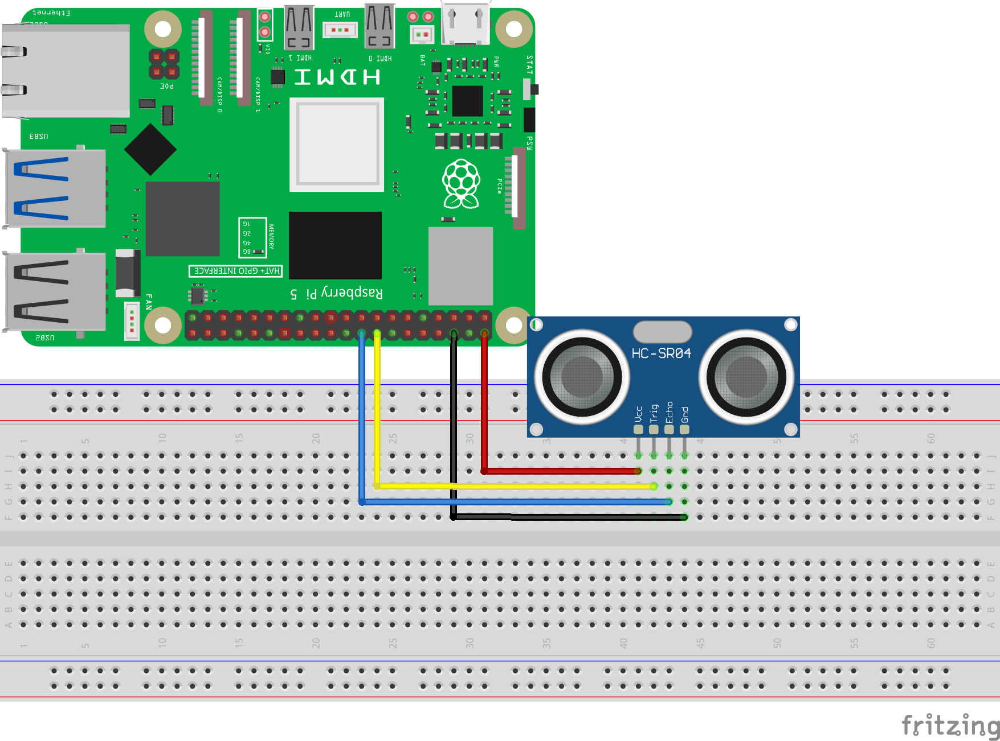
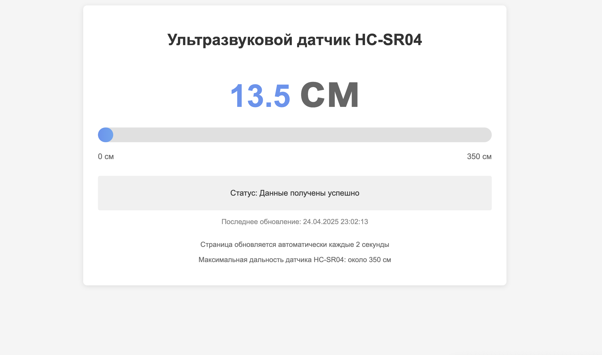

========================================================================================================================
Веб ультразвуковая страница
========================================================================================================================

Теоретическая часть
------------------------------------------------------

Ультразвуковой датчик **HC-SR04** — это популярный сенсор для измерения расстояния без физического контакта. Принцип его работы основан на эхолокации: датчик отправляет ультразвуковой импульс и измеряет время, которое требуется звуковой волне, чтобы отразиться от объекта и вернуться обратно. Зная скорость звука в воздухе, можно вычислить расстояние до объекта.

В этом уроке мы создадим веб-приложение для мониторинга расстояния в реальном времени. Показания будут отображаться на элегантной веб-странице с графическим индикатором, доступной с любого устройства в локальной сети.

Ключевые технологии и концепции, которые мы будем использовать:
- **HC-SR04** для измерения расстояния
- **CircuitPython** для взаимодействия с аппаратной частью Raspberry Pi
- **Flask** для создания веб-сервера
- **Многопоточность** для параллельного считывания данных
- **Адаптивный веб-дизайн** с прогресс-баром для визуализации расстояния

Необходимые компоненты
----------------------------------------------------------------------------

- Raspberry Pi (любая модель с GPIO)
- Ультразвуковой датчик HC-SR04
- Соединительные провода
- Макетная плата (breadboard)
- Резисторы для создания делителя напряжения (если нужен; см. примечание)

.. note::
   HC-SR04 работает от 5V, но пин Echo выдает сигнал 5V, что может повредить Raspberry Pi (GPIO рассчитаны на 3.3V). Для безопасного использования можно добавить делитель напряжения для пина Echo или использовать встроенную защиту CircuitPython.

Схема подключения
----------------------------------------------------------------------

   **Рис. 1:** Схема подключения HC-SR04 к Raspberry Pi

Подключите HC-SR04 к Raspberry Pi следующим образом:
- VCC датчика к 5V на Raspberry Pi
- GND датчика к GND (земля) на Raspberry Pi
- Trig (Trigger) датчика к GPIO23
- Echo датчика к GPIO24 (через делитель напряжения, если используется)

Установка необходимых библиотек
------------------------------------------------------------------------------------

Перед запуском кода установите необходимые библиотеки:

.. code-block:: bash

   pip install flask adafruit-circuitpython-hcsr04

Структура проекта
-----------------------------------------------------------------------

Создайте следующую структуру папок и файлов:

.. code-block:: bash

   hcsr04_web_monitor/
   ├── app.py              # Основной файл Flask-приложения
   └── templates/
       └── index.html      # HTML-шаблон для веб-интерфейса

Код приложения
-------------------------------------------------------------------

Файл: `hcsr04_web_monitor/app.py`

.. code-block:: python

   import time
   import board
   import adafruit_hcsr04
   from flask import Flask, render_template
   from datetime import datetime
   import threading

   # Инициализация Flask приложения
   app = Flask(__name__)

   # Настраиваем пины для ультразвукового датчика
   sonar = adafruit_hcsr04.HCSR04(trigger_pin=board.D23, echo_pin=board.D24)

   # Глобальные переменные для хранения данных
   distance = 0
   status = "Ожидание данных..."
   last_update = "Никогда"

   # Функция для обновления данных с датчика
   def update_sensor_data():
       global distance, status, last_update
       
       try:
           # Получаем расстояние в сантиметрах
           distance = sonar.distance
           
           # Округляем до одного десятичного знака
           distance = round(distance, 1)
           
           # Обновляем статус и время
           status = "Данные получены успешно"
           last_update = datetime.now().strftime("%d.%m.%Y %H:%M:%S")
           
           return True
       
       except RuntimeError as e:
           # Обработка ошибок чтения
           status = "Ошибка чтения данных, проверьте подключение"
           return False
       
       except Exception as e:
           status = f"Критическая ошибка: {str(e)}"
           return False

   # Маршруты Flask
   @app.route('/')
   def index():
       # Обновляем данные с датчика
       update_sensor_data()
       
       # Вычисляем процент для прогресс-бара (0-350 см)
       max_distance = 350  # Максимальная дальность HC-SR04 около 350-400 см
       
       # Ограничиваем значение в пределах 0-100%
       if distance > max_distance:
           percentage = 100
       else:
           percentage = (distance / max_distance) * 100
       
       # Рендерим шаблон с текущими данными
       return render_template(
           'index.html', 
           distance=distance, 
           percentage=percentage,
           status=status,
           last_update=last_update
       )

   # Функция для запуска фонового обновления данных
   def background_update():
       while True:
           update_sensor_data()
           time.sleep(0.5)  # Обновляем каждые 0.5 секунд

   # Функция очистки при завершении
   def cleanup():
       print("\nПрограмма остановлена")

   if __name__ == '__main__':
       # Регистрируем функцию очистки
       import atexit
       atexit.register(cleanup)
       
       # Запускаем фоновое обновление данных в отдельном потоке
       sensor_thread = threading.Thread(target=background_update, daemon=True)
       sensor_thread.start()
       
       try:
           # Запускаем веб-сервер
           print("Веб-сервер запущен на порту 8080. Нажмите Ctrl+C для завершения.")
           app.run(host='0.0.0.0', port=8080, debug=False)
       except KeyboardInterrupt:
           cleanup()

HTML-шаблон
----------------------------------------------------------------

Файл: `hcsr04_web_monitor/templates/index.html`

.. code-block:: html

   <!DOCTYPE html>
   <html>
   <head>
       <title>Ультразвуковой датчик HC-SR04</title>
       <meta name="viewport" content="width=device-width, initial-scale=1">
       <meta http-equiv="refresh" content="2">
       
   </head>
   <body>
       

           <h1>Ультразвуковой датчик HC-SR04</h1>
           
           

               

                   {{ distance }} см
               

               
               

                   

               

               
               

                   0 см
                   350 см
               

           

           
           

               
Статус: {{ status }}

           

           
           

               
Последнее обновление: {{ last_update }}

           

           
           

               
Страница обновляется автоматически каждые 2 секунды

               
Максимальная дальность датчика HC-SR04: около 350 см

           

       

   </body>
   </html>

Разбор кода
----------------------------------------------------------------

**Python-код (app.py):**

1. **Импорт библиотек**

   .. code-block:: python

      import time
      import board
      import adafruit_hcsr04
      from flask import Flask, render_template
      from datetime import datetime
      import threading

   - `adafruit_hcsr04` для работы с ультразвуковым датчиком
   - `board` для доступа к пинам Raspberry Pi
   - `flask` для создания веб-приложения
   - `threading` для многопоточности
   - `datetime` для отслеживания времени обновления данных

2. **Инициализация Flask и датчика**

   .. code-block:: python

      app = Flask(__name__)
      sonar = adafruit_hcsr04.HCSR04(trigger_pin=board.D23, echo_pin=board.D24)

   - Создаем экземпляр Flask-приложения
   - Инициализируем датчик HC-SR04 с указанием пинов для триггера и эхо

3. **Глобальные переменные для хранения данных**

   .. code-block:: python

      distance = 0
      status = "Ожидание данных..."
      last_update = "Никогда"

   - Переменные для хранения измеренного расстояния, статуса и времени последнего обновления
   - Используются глобальные переменные для доступа из разных функций и потоков

4. **Функция обновления данных**

   .. code-block:: python

      def update_sensor_data():
          global distance, status, last_update
          
          try:
              distance = sonar.distance
              distance = round(distance, 1)
              status = "Данные получены успешно"
              last_update = datetime.now().strftime("%d.%m.%Y %H:%M:%S")
              return True
          
          except RuntimeError as e:
              status = "Ошибка чтения данных, проверьте подключение"
              return False
          
          except Exception as e:
              status = f"Критическая ошибка: {str(e)}"
              return False

   - Получает расстояние от датчика и обновляет глобальные переменные
   - Округляет результат до одного десятичного знака для лучшей читаемости
   - Обрабатывает два типа ошибок:
     - `RuntimeError` - временные ошибки чтения (например, эхо не вернулось вовремя)
     - Другие исключения - более серьезные проблемы

5. **Веб-маршрут основной страницы**

   .. code-block:: python

      @app.route('/')
      def index():
          update_sensor_data()
          
          max_distance = 350
          if distance > max_distance:
              percentage = 100
          else:
              percentage = (distance / max_distance) * 100
          
          return render_template(
              'index.html', 
              distance=distance, 
              percentage=percentage,
              status=status,
              last_update=last_update
          )

   - Определяет маршрут для главной страницы
   - Обновляет данные при каждом обращении к странице
   - Вычисляет процентное значение для прогресс-бара (0-100%)
   - Рендерит HTML-шаблон с передачей всех необходимых данных

6. **Функция фонового обновления**

   .. code-block:: python

      def background_update():
          while True:
              update_sensor_data()
              time.sleep(0.5)

   - Бесконечный цикл для регулярного обновления данных
   - Обновление происходит каждые 0.5 секунды

7. **Запуск приложения**

   .. code-block:: python

      if __name__ == '__main__':
          import atexit
          atexit.register(cleanup)
          
          sensor_thread = threading.Thread(target=background_update, daemon=True)
          sensor_thread.start()
          
          try:
              app.run(host='0.0.0.0', port=8080, debug=False)
          except KeyboardInterrupt:
              cleanup()

   - Регистрируем функцию очистки через `atexit`
   - Запускаем фоновое обновление данных в отдельном потоке
   - Помечаем поток как демон (`daemon=True`), чтобы он автоматически завершался вместе с основным потоком
   - Запускаем Flask-сервер на порту 8080, доступный для всех интерфейсов (`0.0.0.0`)
   - Обрабатываем сигнал завершения (Ctrl+C)

**HTML-шаблон (index.html):**

1. **Структура и метаданные**

   .. code-block:: html

      <!DOCTYPE html>
      <html>
      <head>
          <title>Ультразвуковой датчик HC-SR04</title>
          <meta name="viewport" content="width=device-width, initial-scale=1">
          <meta http-equiv="refresh" content="2">
          <!-- CSS стили ... -->
      </head>

   - Стандартная структура HTML-документа
   - Метатег viewport для адаптивности на мобильных устройствах
   - `<meta http-equiv="refresh" content="2">` - автоматическое обновление страницы каждые 2 секунды

2. **CSS-стили**

   CSS-стили определяют современный и функциональный интерфейс:
   - Контейнер с тенью и закругленными углами
   - Большое отображение значения расстояния с яркой цветовой схемой
   - Прогресс-бар с градиентной заливкой и плавной анимацией
   - Адаптивная вёрстка для разных устройств

3. **Основной контент**

   .. code-block:: html

      

          <h1>Ультразвуковой датчик HC-SR04</h1>
          
          

              <!-- Отображение расстояния и прогресс-бар -->
          

          
          

              
Статус: {{ status }}

          

          
          

              
Последнее обновление: {{ last_update }}

          

          
          

              
Страница обновляется автоматически каждые 2 секунды

              
Максимальная дальность датчика HC-SR04: около 350 см

          

      

   - Структурированный контейнер с различными информационными блоками
   - Блок статуса для отображения текущего состояния датчика
   - Информация о времени последнего обновления
   - Дополнительная информация о работе приложения

4. **Отображение расстояния и прогресс-бар**

   .. code-block:: html

      

          

              {{ distance }} см
          

          
          

              

          

          
          

              0 см
              350 см
          

      

   - Крупное отображение текущего расстояния с единицей измерения
   - Прогресс-бар, визуально отображающий измеренное расстояние
   - Подписи минимального и максимального значений
   - Динамическое изменение ширины заполнения прогресс-бара через шаблонную переменную

Особенности реализации
--------------------------------------------------------------------------

1. **Визуализация данных с помощью прогресс-бара**

   Прогресс-бар с градиентной заливкой даёт наглядное представление об измеренном расстоянии. Использование переменной `percentage` позволяет динамически изменять ширину заполнения.

   .. code-block:: html

      

2. **Многопоточное считывание данных**

   Использование отдельного потока для считывания данных с датчика позволяет:
   - Избежать блокировки веб-сервера во время измерений
   - Обеспечить постоянное обновление данных в фоновом режиме
   - Иметь актуальные данные к моменту запроса страницы пользователем

3. **Обработка ошибок датчика**

   Ультразвуковые датчики могут периодически выдавать ошибки из-за помех, неправильных отражений или других факторов. Код включает обработку этих ошибок:
   - Отлавливаются исключения `RuntimeError`, которые обычно связаны с временными проблемами чтения
   - Более серьезные ошибки также обрабатываются, и пользователю показывается соответствующий статус

4. **Автоматическое обновление страницы**

   Метатег `<meta http-equiv="refresh" content="2">` обеспечивает автоматическое обновление страницы каждые 2 секунды. Это простой, но эффективный способ получать актуальные данные без использования JavaScript.

5. **Плавные переходы в CSS**

   Свойство `transition: width 0.5s ease-in-out` в CSS для `.progress-fill` обеспечивает плавное изменение прогресс-бара при обновлении данных, что делает интерфейс более приятным для пользователя.

Запуск приложения
---------------------------------------------------------------------

1. Сохраните файлы с указанной структурой.
2. Запустите приложение:

   .. code-block:: bash

      python3 app.py

3. Откройте веб-браузер и перейдите по адресу `http://<IP-адрес-Raspberry-Pi>:8080`

   Например: `http://192.168.1.100:8080`

Ожидаемый результат
-----------------------------------------------------------------------

1. В браузере загрузится страница с крупным отображением текущего расстояния до объекта в сантиметрах.

2. Под значением будет отображаться прогресс-бар, графически показывающий измеренное расстояние относительно максимального диапазона датчика (350 см).

3. Внизу страницы будет показан текущий статус датчика и время последнего обновления данных.

4. Страница будет автоматически обновляться каждые 2 секунды, показывая актуальные данные.

5. При перемещении объекта ближе или дальше от датчика значения и прогресс-бар будут соответственно изменяться.

   **Рис. 2:** Пример веб-интерфейса для мониторинга расстояния

Завершение работы
---------------------------------------------------------------------

Для остановки веб-сервера нажмите **Ctrl + C** в терминале, где запущено приложение. Функция `cleanup()` автоматически выполнится при завершении программы.

Практические применения
--------------------------------------------------------------------------

1. **Система парковки**
   Используйте датчик для помощи при парковке автомобиля, показывая расстояние до стены или другого препятствия.

2. **Измерение уровня жидкости**
   Размещение датчика над резервуаром позволяет измерять уровень воды или другой жидкости.

3. **Система безопасности**
   Обнаружение движения или присутствия объектов в определенной зоне.

4. **Робототехника**
   Помощь роботам в определении расстояния до препятствий для навигации.

5. **Интерактивные инсталляции**
   Создание интерактивных арт-проектов, реагирующих на расстояние до посетителей.

Возможные улучшения
-----------------------------------------------------------------------

1. **Графики изменения расстояния**
   Добавьте график, показывающий изменение расстояния с течением времени, используя библиотеки JavaScript, такие как Chart.js.

2. **Звуковые сигналы**
   Реализуйте звуковые оповещения, когда объект приближается ближе определенного порога.

3. **Запись и анализ данных**
   Сохраняйте измерения в базу данных для последующего анализа тенденций или построения более сложных графиков.

4. **Множественные датчики**
   Расширьте приложение для работы с несколькими датчиками HC-SR04, размещенными в разных точках.

5. **WebSocket вместо обновления страницы**
   Замените meta refresh на WebSocket для обновления данных без перезагрузки страницы, что обеспечит более плавный пользовательский опыт.

6. **Настраиваемые пороги**
   Добавьте возможность настраивать пороговые значения расстояния и цветовую индикацию в зависимости от текущего значения.

Заключение
--------------------------------------------------------------

В этом уроке мы создали веб-приложение для мониторинга расстояния с использованием ультразвукового датчика HC-SR04, подключенного к Raspberry Pi. Мы использовали CircuitPython для работы с датчиком, Flask для создания веб-интерфейса и многопоточность для обеспечения стабильной работы.

Наш веб-монитор предоставляет наглядный интерфейс для отслеживания расстояния до объектов в реальном времени. Благодаря интуитивно понятной визуализации с помощью прогресс-бара, пользователь может быстро оценить измеренное расстояние.

Этот проект демонстрирует, как можно объединить микроконтроллерное программирование с веб-технологиями для создания полезных и визуально привлекательных IoT-решений.