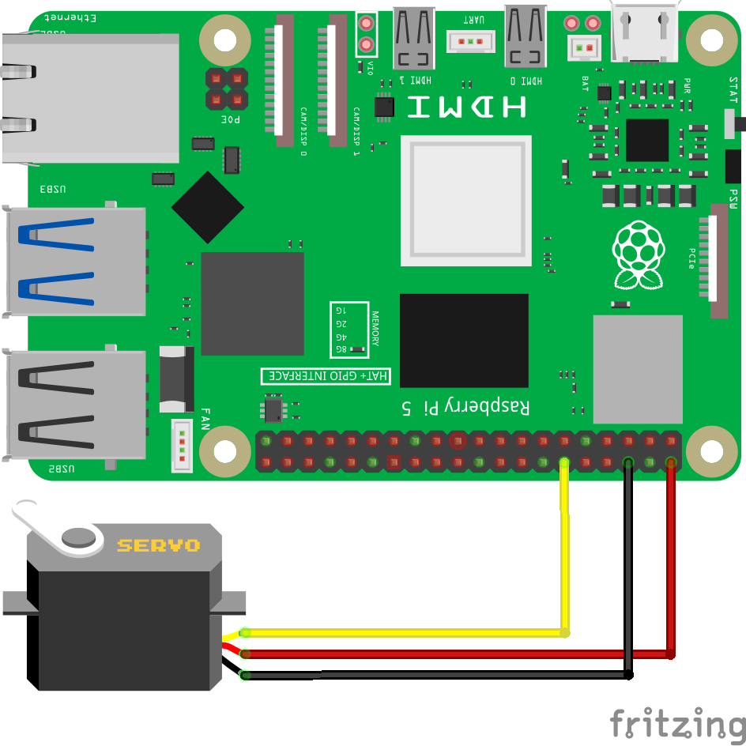
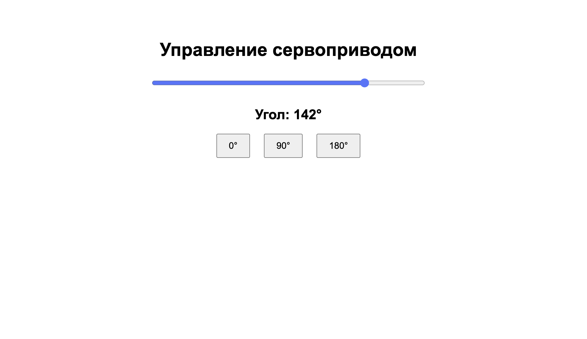

========================================================================================================================
Веб сайт для управления сервоприводом
========================================================================================================================

Теоретическая часть
------------------------------------

Сервопривод - это электромеханическое устройство, которое позволяет точно контролировать угол поворота вала. В отличие от обычных двигателей, сервоприводы обеспечивают точное позиционирование, что делает их незаменимыми в робототехнике, автоматизации и различных творческих проектах.

В этом уроке мы создадим систему, которая позволит управлять сервоприводом через веб-интерфейс. Это означает, что вы сможете изменять положение сервопривода с любого устройства, имеющего браузер и доступ к вашей локальной сети.

Мы будем использовать:
- **Raspberry Pi** в качестве контроллера
- **CircuitPython** для управления аппаратной частью
- **Flask** для создания веб-сервера
- **HTML, CSS и JavaScript** для создания интерактивного интерфейса
- **Fetch API** для асинхронного обмена данными между браузером и сервером

Необходимые компоненты
----------------------------------------

- Raspberry Pi (любая модель с GPIO)
- Сервопривод (например, SG90)
- Соединительные провода
- Источник питания для сервопривода (опционально, для больших сервоприводов)

Схема подключения
----------------------------------

   **Рис. 1:** Схема подключения сервопривода к Raspberry Pi

Подключите сервопривод к Raspberry Pi следующим образом:
- Красный провод (VCC) к пину 5V на Raspberry Pi
- Коричневый/черный провод (GND) к пину GND на Raspberry Pi
- Оранжевый/желтый провод (сигнальный) к пину GPIO19

.. note::
   Если вы используете мощный сервопривод, который потребляет более 200-300 мА, рекомендуется использовать внешний источник питания для сервопривода, подключая только сигнальный провод и GND к Raspberry Pi.

Установка необходимых библиотек
------------------------------------------------

Перед запуском кода установите необходимые библиотеки:

.. code-block:: bash

   pip install flask adafruit-circuitpython-motor

Структура проекта
-----------------------------------

Создайте следующую структуру папок и файлов:

.. code-block:: bash

   servo_web_control/
   ├── app.py              # Основной файл Flask-приложения
   └── templates/
       └── index.html      # HTML-шаблон для веб-интерфейса

Код приложения
-------------------------------

Файл: `servo_web_control/app.py`

.. code-block:: python

   from flask import Flask, render_template, request, jsonify
   import board
   import pwmio
   from adafruit_motor import servo
   import threading
   import time

   app = Flask(__name__)

   # Инициализация PWM на GPIO 18
   pwm = pwmio.PWMOut(board.D19, duty_cycle=2 ** 15, frequency=50)

   # Создание объекта сервопривода
   my_servo = servo.Servo(pwm, min_pulse=750, max_pulse=2250)

   # Установка начального положения (90 градусов)
   my_servo.angle = 90

   # Текущий угол сервопривода
   current_angle = 90

   # Блокировка для безопасного доступа к сервоприводу из разных потоков
   servo_lock = threading.Lock()

   @app.route('/')
   def index():
       return render_template('index.html', angle=current_angle)

   @app.route('/set_angle', methods=['POST'])
   def set_angle():
       global current_angle
       
       data = request.get_json()
       angle = int(data.get('angle', 90))
       
       # Ограничиваем угол от 0 до 180
       angle = max(0, min(180, angle))
       
       with servo_lock:
           my_servo.angle = angle
           current_angle = angle
       
       return jsonify({"status": "success", "angle": angle})

   @app.route('/get_angle', methods=['GET'])
   def get_angle():
       return jsonify({"angle": current_angle})

   if __name__ == '__main__':
       try:
           app.run(host='0.0.0.0',
           port=5000,
           debug=True,        # можно оставить отладку
           use_reloader=False # но запрещаем второй запуск
           )
       finally:
           # При завершении программы устанавливаем сервопривод в нейтральное положение
           with servo_lock:
               my_servo.angle = 90
           # Освобождаем ресурсы
           pwm.deinit()

HTML-шаблон
----------------------------

Файл: `servo_web_control/templates/index.html`

.. code-block:: html

   <!DOCTYPE html>
   <html lang="ru">
   <head>
       <meta charset="UTF-8">
       <meta name="viewport" content="width=device-width, initial-scale=1.0">
       <title>Управление сервоприводом</title>
       
   </head>
   <body>
       

           <h1>Управление сервоприводом</h1>
           
           

               <input type="range" min="0" max="180" value="90" id="angle-slider">
           

           
           

               Угол: 90°
           

           
           

               <button onclick="setAngle(0)">0°</button>
               <button onclick="setAngle(90)">90°</button>
               <button onclick="setAngle(180)">180°</button>
           

       

       
   </body>
   </html>

Разбор кода
----------------------------

**Python-код (app.py):**

1. **Импорт необходимых библиотек**

   .. code-block:: python

      from flask import Flask, render_template, request, jsonify
      import board
      import pwmio
      from adafruit_motor import servo
      import threading
      import time

   - `Flask` и связанные функции для создания веб-приложения
   - `board` и `pwmio` из CircuitPython для работы с GPIO и PWM
   - `servo` из adafruit_motor для упрощенного управления сервоприводом
   - `threading` для обеспечения потокобезопасности

2. **Инициализация Flask и сервопривода**

   .. code-block:: python

      app = Flask(__name__)
      pwm = pwmio.PWMOut(board.D19, duty_cycle=2 ** 15, frequency=50)
      my_servo = servo.Servo(pwm, min_pulse=750, max_pulse=2250)
      my_servo.angle = 90

   - Создаем экземпляр Flask-приложения
   - Инициализируем PWM на GPIO19 с частотой 50 Гц (стандарт для сервоприводов)
   - Создаем объект сервопривода с настроенными минимальной и максимальной длительностями импульса
   - Устанавливаем начальный угол 90° (центральное положение)

3. **Глобальные переменные и блокировка**

   .. code-block:: python

      current_angle = 90
      servo_lock = threading.Lock()

   - `current_angle` хранит текущий угол сервопривода
   - `servo_lock` - это объект блокировки, который обеспечивает потокобезопасность при доступе к сервоприводу

4. **Маршрут для главной страницы**

   .. code-block:: python

      @app.route('/')
      def index():
          return render_template('index.html', angle=current_angle)

   - Определяет маршрут для главной страницы
   - Рендерит HTML-шаблон, передавая текущий угол как параметр

5. **Маршрут для установки угла**

   .. code-block:: python

      @app.route('/set_angle', methods=['POST'])
      def set_angle():
          global current_angle
          
          data = request.get_json()
          angle = int(data.get('angle', 90))
          
          # Ограничиваем угол от 0 до 180
          angle = max(0, min(180, angle))
          
          with servo_lock:
              my_servo.angle = angle
              current_angle = angle
          
          return jsonify({"status": "success", "angle": angle})

   - Обрабатывает POST-запросы на установку угла
   - Получает данные из JSON-запроса
   - Ограничивает угол в пределах от 0° до 180°
   - Использует блокировку для безопасного доступа к сервоприводу
   - Возвращает JSON-ответ с подтверждением

6. **Маршрут для получения текущего угла**

   .. code-block:: python

      @app.route('/get_angle', methods=['GET'])
      def get_angle():
          return jsonify({"angle": current_angle})

   - Обрабатывает GET-запросы для получения текущего угла
   - Возвращает текущий угол в формате JSON

7. **Запуск приложения и обработка завершения**

   .. code-block:: python

      if __name__ == '__main__':
          try:
              app.run(host='0.0.0.0',
              port=5000,
              debug=True,        # можно оставить отладку
              use_reloader=False # но запрещаем второй запуск
              )
          finally:
              # При завершении программы устанавливаем сервопривод в нейтральное положение
              with servo_lock:
                  my_servo.angle = 90
              # Освобождаем ресурсы
              pwm.deinit()

   - Запускает Flask-сервер на порту 5000, доступный по всем IP-адресам
   - Отключает автоматическую перезагрузку, которая может привести к проблемам с оборудованием
   - При завершении устанавливает сервопривод в нейтральное положение
   - Освобождает ресурсы PWM с помощью `deinit()`

**HTML-шаблон и JavaScript (index.html):**

1. **Структура HTML и стили CSS**

   В HTML-шаблоне определяется структура страницы и стили, которые создают простой, но эффективный интерфейс:
   - Контейнер с заголовком
   - Слайдер для выбора угла
   - Текстовое отображение текущего угла
   - Кнопки для быстрого выбора предустановленных углов

2. **JavaScript для интерактивности**

   JavaScript обеспечивает интерактивность интерфейса:

   - **Инициализация**:
     
     .. code-block:: javascript

        window.onload = function() {
            fetch('/get_angle')
                .then(response => response.json())
                .then(data => {
                    slider.value = data.angle;
                    angleValue.textContent = data.angle;
                });
        };

     При загрузке страницы запрашивает текущий угол с сервера и устанавливает начальное положение слайдера.

   - **Обработка ввода**:
     
     .. code-block:: javascript

        // Обновление значения при перемещении слайдера
        slider.oninput = function() {
            angleValue.textContent = this.value;
        };
        
        // Отправка нового значения угла на сервер при отпускании слайдера
        slider.onchange = function() {
            sendAngle(this.value);
        };

     Отслеживает перемещение слайдера и обновляет отображаемое значение. При отпускании слайдера отправляет новое значение на сервер.

   - **Установка угла кнопками**:
     
     .. code-block:: javascript

        function setAngle(angle) {
            slider.value = angle;
            angleValue.textContent = angle;
            sendAngle(angle);
        }

     Устанавливает фиксированный угол при нажатии на кнопки.

   - **Отправка данных на сервер**:
     
     .. code-block:: javascript

        function sendAngle(angle) {
            fetch('/set_angle', {
                method: 'POST',
                headers: {
                    'Content-Type': 'application/json',
                },
                body: JSON.stringify({ angle: parseInt(angle) })
            })
            .then(response => response.json())
            .then(data => {
                console.log('Угол установлен:', data.angle);
            })
            .catch(error => {
                console.error('Ошибка:', error);
            });
        }

     Отправляет выбранный угол на сервер с помощью Fetch API, используя метод POST и JSON для передачи данных.

Ключевые технические особенности
-----------------------------------------------

1. **Безопасное управление сервоприводом**

   Использование `threading.Lock()` является важной частью кода, так как оно обеспечивает безопасный доступ к сервоприводу из разных потоков. Это особенно важно, когда несколько клиентов могут одновременно отправлять запросы на изменение угла.

   .. code-block:: python

      with servo_lock:
          my_servo.angle = angle
          current_angle = angle

2. **Асинхронное обновление интерфейса**

   Fetch API в JavaScript позволяет отправлять запросы на сервер без перезагрузки страницы, что обеспечивает плавное взаимодействие с пользователем.

3. **Корректное освобождение ресурсов**

   Блок `finally` в основной части кода обеспечивает освобождение ресурсов даже при аварийном завершении программы:

   .. code-block:: python

      finally:
          with servo_lock:
              my_servo.angle = 90
          pwm.deinit()

   Это предотвращает возможные проблемы при повторном запуске программы.

4. **Отключение автоматической перезагрузки**

   Параметр `use_reloader=False` отключает встроенную в Flask функцию автоматической перезагрузки при изменении файлов. Это важно, поскольку автоматическая перезагрузка может привести к проблемам с инициализацией аппаратных ресурсов.

Запуск приложения
---------------------------------

1. Сохраните файлы с указанной структурой.
2. Запустите приложение:

   .. code-block:: bash

      python3 app.py

3. Откройте веб-браузер и перейдите по адресу `http://<IP-адрес-Raspberry-Pi>:5000`

   Например: `http://192.168.1.100:5000`

Ожидаемый результат
-----------------------------------

1. В браузере загрузится страница с интерфейсом управления сервоприводом.
2. В центре страницы будет отображаться слайдер для выбора угла от 0° до 180°.
3. Под слайдером будет показан текущий угол.
4. Внизу будут три кнопки для быстрой установки фиксированных углов (0°, 90°, 180°).
5. При перемещении слайдера или нажатии на кнопки сервопривод будет поворачиваться на соответствующий угол.

   **Рис. 2:** Пример веб-интерфейса для управления сервоприводом

Практические применения
--------------------------------------

1. **Роботизированные системы**
   Управление различными частями робота, например, поворотом головы или перемещением манипулятора.

2. **Умный дом**
   Управление сервоприводами для открытия/закрытия жалюзи, штор или вентиляционных отверстий.

3. **Системы наблюдения**
   Управление поворотом камеры для изменения угла обзора.

4. **Образовательные проекты**
   Демонстрация принципов управления сервоприводами, веб-разработки и IoT.

5. **Интерактивные инсталляции**
   Создание интерактивных художественных проектов, реагирующих на действия посетителей.

Возможные улучшения
-----------------------------------

1. **Плавное перемещение**
   Добавьте функцию для плавного перемещения сервопривода от текущего положения к целевому, а не резкого изменения угла.

2. **Сохранение последнего положения**
   Реализуйте сохранение последнего положения сервопривода в файл, чтобы при перезапуске приложения сервопривод возвращался в это положение.

3. **Управление несколькими сервоприводами**
   Расширьте приложение для работы с несколькими сервоприводами одновременно, например, для управления роботизированной рукой.

4. **Графическая визуализация**
   Добавьте графическое отображение положения сервопривода в реальном времени с помощью SVG или Canvas в JavaScript.

5. **Реализация последовательностей движений**
   Создайте интерфейс для программирования последовательностей движений сервопривода с возможностью сохранения и воспроизведения.

6. **Улучшение безопасности**
   Добавьте аутентификацию для защиты интерфейса управления сервоприводом от несанкционированного доступа.

Заключение
--------------------------

В этом уроке мы создали веб-приложение для управления сервоприводом с использованием Raspberry Pi, CircuitPython и Flask. Мы реализовали интерактивный веб-интерфейс, который позволяет изменять угол поворота сервопривода с помощью слайдера или кнопок.

Проект демонстрирует, как можно объединить аппаратное управление с веб-технологиями для создания интуитивно понятного интерфейса. Такой подход позволяет управлять физическими устройствами с любого устройства, имеющего браузер и подключение к локальной сети.

Особое внимание было уделено безопасной работе с аппаратными ресурсами, включая использование блокировок для потокобезопасности и корректное освобождение ресурсов при завершении работы приложения.

Этот проект может служить основой для более сложных систем управления, включающих множество сервоприводов и датчиков.