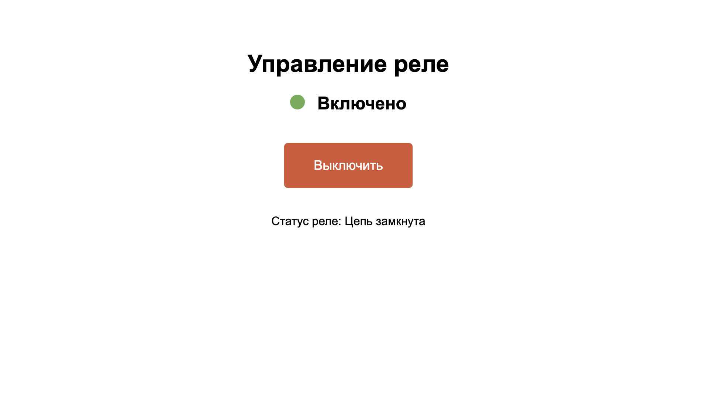

============================================================
Веб реле
============================================================

Теоретическая часть
--------------------------------------
В этом уроке мы создадим веб-приложение для удаленного управления реле через браузер. Комбинация Flask (фреймворк для веб-приложений на Python) и CircuitPython позволит нам создать интерактивный интерфейс для включения и выключения реле с любого устройства в вашей локальной сети.

Реле - это электромеханический переключатель, управляемый электрическим сигналом. Он позволяет включать и выключать электрические цепи с потенциально высоким напряжением или током, используя низковольтные сигналы от Raspberry Pi.

В данном проекте мы:
- Настроим Flask-сервер на Raspberry Pi
- Создадим веб-интерфейс с кнопкой включения/выключения
- Реализуем API для управления реле и получения его состояния
- Обеспечим безопасное управление реле с обработкой ошибок

Необходимые компоненты
-----------------------------------------
- Raspberry Pi
- Модуль реле (1-канальный)
- Соединительные провода
- Устройство с браузером для доступа к веб-интерфейсу (смартфон, планшет, компьютер)

Схема подключения
------------------------------------
.. figure:: images/relay_flask.jpg
   :width: 80%
   :align: center

   **Рис. 1:** Схема подключения модуля реле

Подключите модуль реле к Raspberry Pi:
- VCC реле к 5V Pin на Raspberry Pi
- GND реле к GND Pin на Raspberry Pi
- IN (сигнальный вход) реле к GPIO18 на Raspberry Pi

Установка необходимых библиотек
--------------------------------------------------
Перед запуском кода установите Flask:

.. code-block:: bash

   pip install flask

Структура проекта
------------------------------------
Создайте следующую структуру папок и файлов:

.. code-block:: bash

   lessons/
   └── relay_web/
       ├── app.py            # Основное Flask-приложение
       └── templates/
           └── index.html    # HTML-шаблон для веб-интерфейса

Код программы
--------------------------------
**Файл app.py**

.. code-block:: python

   from flask import Flask, render_template, request, jsonify
   import board
   import digitalio
   import threading

   app = Flask(__name__)

   # Инициализация пина GPIO18 как выход для управления реле
   relay = digitalio.DigitalInOut(board.D18)
   relay.direction = digitalio.Direction.OUTPUT

   # Устанавливаем начальное состояние реле - выключено
   relay.value = True  # Для реле с инверсной логикой True = выключено

   # Текущее состояние реле
   relay_state = False  # False = выключено, True = включено

   # Блокировка для безопасного доступа к реле из разных потоков
   relay_lock = threading.Lock()

   @app.route('/')
   def index():
       return render_template('index.html', state=relay_state)

   @app.route('/toggle_relay', methods=['POST'])
   def toggle_relay():
       global relay_state
       
       data = request.get_json()
       state = data.get('state', False)
       
       with relay_lock:
           if state:
               # Включаем реле (для инверсной логики значение FALSE)
               relay.value = False
               relay_state = True
           else:
               # Выключаем реле (для инверсной логики значение TRUE)
               relay.value = True
               relay_state = False
       
       return jsonify({
           "status": "success", 
           "state": relay_state, 
           "message": "Реле включено" if relay_state else "Реле выключено"
       })

   @app.route('/get_state', methods=['GET'])
   def get_state():
       return jsonify({"state": relay_state})

   if __name__ == '__main__':
       try:
           # Запуск Flask приложения на всех интерфейсах (0.0.0.0)
           # Чтобы можно было подключиться с других устройств в сети
           app.run(host='0.0.0.0', port=5000, debug=True)
       finally:
           # При завершении программы отключаем реле (безопасное состояние)
           with relay_lock:
               relay.value = True  # Для реле с инверсной логикой

**Файл templates/index.html**

.. code-block:: html

   <!DOCTYPE html>
   <html lang="ru">
   <head>
       <meta charset="UTF-8">
       <meta name="viewport" content="width=device-width, initial-scale=1.0">
       <title>Управление реле</title>
       
   </head>
   <body>
       

           <h1>Управление реле</h1>
           
           

               
               Загрузка...
           

           
           <button id="toggle-button" class="toggle-button">Включить</button>
           
           

               
Статус реле: Загрузка...

           

       

       
   </body>
   </html>

Разбор кода
------------------------------

**Разбор app.py:**

1. **Инициализация и импорты:**

   .. code-block:: python

   from flask import Flask, render_template, request, jsonify
   import board
   import digitalio
   import threading

   app = Flask(__name__)
   
   - Импортируем необходимые модули из Flask для создания веб-приложения
   - Импортируем `board` и `digitalio` для работы с GPIO через CircuitPython
   - Импортируем `threading` для безопасного доступа к реле из разных потоков

2. **Настройка реле:**

   .. code-block:: python

   relay = digitalio.DigitalInOut(board.D18)
   relay.direction = digitalio.Direction.OUTPUT
   relay.value = True  # Для реле с инверсной логикой True = выключено
   relay_state = False  # False = выключено, True = включено
   relay_lock = threading.Lock()
   
   - Инициализируем GPIO18 как выход для управления реле
   - Устанавливаем начальное состояние реле как выключенное
   - Создаем блокировку для безопасного доступа к реле из разных потоков

3. **Маршруты Flask:**
   - `@app.route('/')` - Основной маршрут, возвращает HTML-страницу
   - `@app.route('/toggle_relay', methods=['POST'])` - API для изменения состояния реле
   - `@app.route('/get_state', methods=['GET'])` - API для получения текущего состояния реле

4. **Безопасное завершение:**

   .. code-block:: python

   try:
       app.run(host='0.0.0.0', port=5000, debug=True)
   finally:
       with relay_lock:
           relay.value = True  # Для реле с инверсной логикой
   
   - При завершении программы гарантируем, что реле будет выключено (безопасное состояние)

**Разбор index.html:**

1. **Стили CSS:**
   - Определяем стили для кнопки включения/выключения
   - Создаем индикатор состояния, который меняет цвет в зависимости от состояния реле
   
2. **HTML-структура:**
   - Заголовок и контейнер для элементов управления
   - Индикатор состояния с цветным кружком
   - Кнопка для переключения реле
   - Текстовое поле, отображающее статус реле
   
3. **JavaScript-логика:**
   - `fetchRelayState()` - функция для получения текущего состояния реле
   - `updateInterface(state)` - обновление интерфейса в зависимости от состояния
   - Обработка нажатия кнопки и отправка POST-запроса для изменения состояния реле
   - Автоматическое обновление состояния каждые 5 секунд

Запуск программы
----------------------------------
1. Сохраните файлы в соответствующих директориях
2. Запустите Flask-приложение:

   .. code-block:: bash

      python3 lessons/relay_web/app.py

3. Откройте браузер и перейдите по адресу: http://<IP_Raspberry_Pi>:5000
   - где <IP_Raspberry_Pi> - IP-адрес вашего Raspberry Pi в локальной сети
   - например: http://192.168.1.100:5000

Ожидаемый результат
--------------------------------------
После запуска приложения вы увидите веб-страницу с кнопкой и индикатором состояния реле. При нажатии на кнопку реле будет включаться и выключаться, а состояние интерфейса будет обновляться соответственно.

   **Рис. 2:** Пример веб-интерфейса управления реле

Дополнительные задания
----------------------------------------
1. **Таймер автоматического выключения**: Добавьте функцию, которая автоматически выключает реле через заданное время.
2. **Расширение до нескольких реле**: Модифицируйте код для управления несколькими реле.
3. **Журналирование**: Добавьте запись истории включений и выключений с отметками времени.
4. **Авторизация**: Реализуйте простую систему авторизации для защиты от несанкционированного доступа.

Завершение работы
-----------------------------------
Для остановки программы нажмите **Ctrl + C** в терминале. При завершении программы реле будет автоматически выключено, что гарантирует безопасное состояние вашей электрической цепи.

Поздравляем! 🎉 Вы успешно создали веб-приложение для удаленного управления реле через браузер. Этот проект является отличной основой для создания системы домашней автоматизации, позволяя управлять различными электрическими устройствами с помощью смартфона или компьютера.