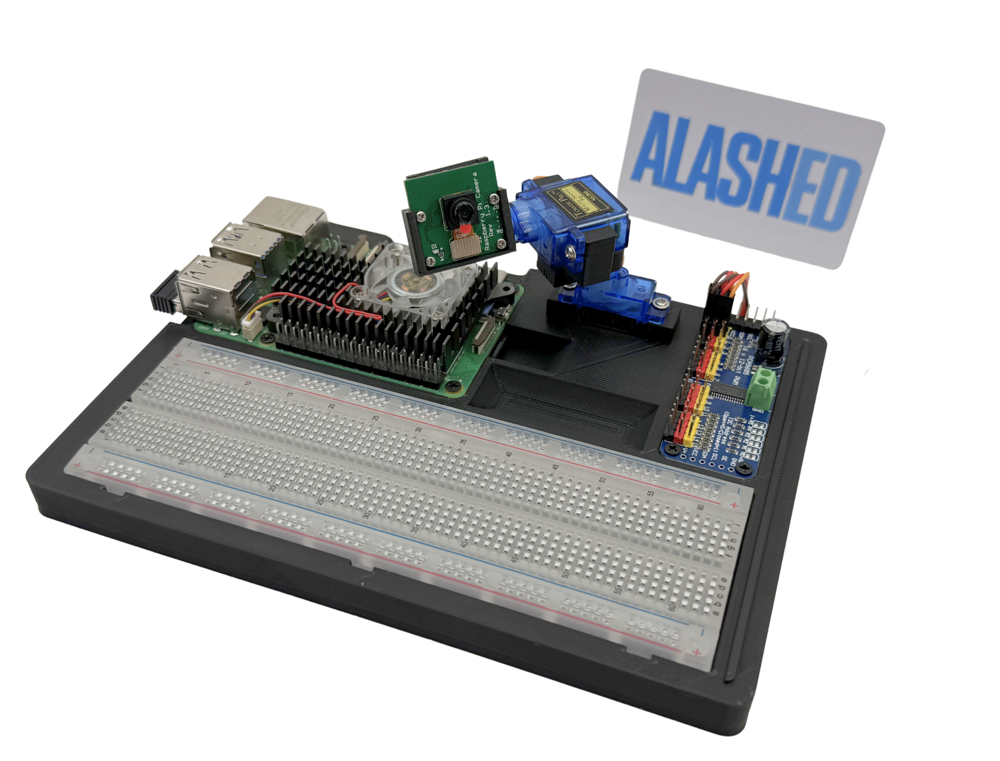

Alash Raspberry Pi 5 Kit documentation
======================================

   **Рис. 1:** Raspberry Pi Board

Этот образовательный набор представляет собой полностью настроенный и готовый к использованию образ операционной системы для Raspberry Pi 5, предназначенный для изучения электроники, программирования и системной инженерии. Образ включает в себя все необходимые инструменты, библиотеки, примеры проектов и документацию для комфортного и увлекательного обучения.

.. toctree::
   :maxdepth: 1
   :caption: Содержание:

   about/about
   specifications/specifications

.. toctree::
   :maxdepth: 2

   parts/index
   start/index

.. toctree::
   :maxdepth: 3

   circuitPythonLessons/index
   lessons/index

.. toctree::
   :maxdepth: 1

   components/index

.. toctree::
   :maxdepth: 2

   appendix/index

.. toctree::
   :maxdepth: 1

   thankyou/thankyou

