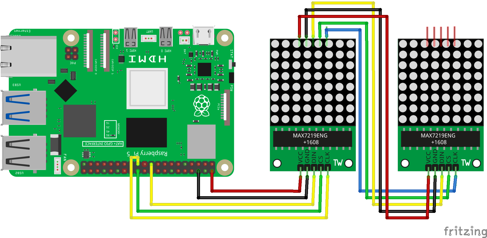

============================
Урок 12: LED-матрица MAX7219
============================

Теоретическая часть
-------------------
Модуль **MAX7219** используется для управления 8×8 светодиодной матрицей (или несколькими каскадированными модулями). С помощью библиотеки **luma.led_matrix** можно выводить бегущую строку, статический текст или простые рисунки, используя SPI-интерфейс.

Необходимые компоненты
----------------------
- Raspberry Pi
- Минимум один модуль **MAX7219** (8×8), в данном примере каскадировано 2 модуля
- Соединительные провода (MOSI, MISO, SCLK, CE, GND, VCC)

Схема подключения
-----------------

Установка необходимых библиотек
-------------------------------
Прежде чем запускать код, убедитесь, что у вас установлена библиотека **luma.led_matrix**:

.. code-block:: bash

   pip install luma.led_matrix luma.core

Запуск кода
-----------
1. Создайте файл `led_matrix.py` в папке `lessons/lesson11/`:

   .. code-block:: bash

      nano lessons/lesson11/led_matrix.py

2. Скопируйте в него следующий код.
3. Запустите программу (при условии, что SPI включён в `raspi-config` или `config.txt`):

   .. code-block:: bash

      python3 lessons/lesson11/led_matrix.py

Код программы
-------------
Файл: `lessons/lesson11/led_matrix.py`

.. code-block:: python

   from luma.led_matrix.device import max7219
   from luma.core.interface.serial import spi, noop
   from luma.core.render import canvas
   from luma.core.legacy import text
   from luma.core.legacy.font import proportional, LCD_FONT
   from time import sleep

   # Настройка SPI-интерфейса для 2 дисплеев MAX7219
   serial = spi(port=0, device=0, gpio=noop())
   device = max7219(serial, cascaded=2, block_orientation=0, rotate=0)

   # Функция для отображения текста
   def display_text(message):
       with canvas(device) as draw:
           text(draw, (0, 0), message, fill="white", font=proportional(LCD_FONT))

   # Функция для бегущего текста
   def moving_text(message, delay=0.1):
       for i in range(len(message) * 8):
           with canvas(device) as draw:
               text(draw, (-i, 0), message, fill="white", font=proportional(LCD_FONT))
           sleep(delay)

   # Функция для вывода изображения через массив пикселей
   def display_array(matrix):
       """ matrix - двумерный массив 8x16 (для двух дисплеев) """
       with canvas(device) as draw:
           for y, row in enumerate(matrix):
               for x, pixel in enumerate(row):
                   if pixel:  # Если 1, то рисуем точку
                       draw.point((x, y), fill="white")

   # Пример изображения: прямоугольник
   rectangle = [
       [1, 1, 1, 1, 1, 1, 1, 1,  1, 1, 1, 1, 1, 1, 1, 1],
       [1, 0, 0, 0, 0, 0, 0, 0,  0, 0, 0, 0, 0, 0, 0, 1],
       [1, 0, 0, 0, 0, 0, 0, 0,  0, 0, 0, 0, 0, 0, 0, 1],
       [1, 0, 0, 0, 0, 0, 0, 0,  0, 0, 0, 0, 0, 0, 0, 1],
       [1, 0, 0, 0, 0, 0, 0, 0,  0, 0, 0, 0, 0, 0, 0, 1],
       [1, 0, 0, 0, 0, 0, 0, 0,  0, 0, 0, 0, 0, 0, 0, 1],
       [1, 0, 0, 0, 0, 0, 0, 0,  0, 0, 0, 0, 0, 0, 0, 1],
       [1, 1, 1, 1, 1, 1, 1, 1,  1, 1, 1, 1, 1, 1, 1, 1]
   ]

   # Основной цикл
   try:
       display_text("Hi!")  # Отобразить "Hi!" на двух дисплеях
       sleep(1)

       moving_text("Raspberry Pi!", delay=0.1)  # Бегущий текст
       sleep(1)

       display_array(rectangle)  # Вывести прямоугольник
       sleep(1)

   except KeyboardInterrupt:
       print("\nПрограмма завершена.")

Разбор кода
-----------
- `serial = spi(port=0, device=0, gpio=noop())` – конфигурируем SPI-интерфейс. Параметры могут меняться в зависимости от подключения.
- `device = max7219(serial, cascaded=2, ...)` – указываем, что в каскаде 2 модуля (8×8 каждый).
- `display_text(message)` – выводит статический текст в верхнюю левую позицию.
- `moving_text(message, delay=0.1)` – организует бегущую строку, сдвигая текст на 1 пиксель по оси X.
- `display_array(matrix)` – выводит двумерный массив пикселей. 1 – это зажжённый пиксель, 0 – выключенный.
- `rectangle` – пример двумерного массива 8×16 пикселей, который выглядит как прямоугольник.

Ожидаемый результат
-------------------
1. На матрице кратковременно появляется текст "Hi!".
2. Следом появляется бегущая строка "Raspberry Pi!", двигаясь слева направо.
3. Наконец, выводится картинка (прямоугольная рамка) на двух каскадированных модулях MAX7219.

.. .. figure:: images/max7219_display.gif
..    :width: 50%
..    :align: center

   **Рис. 2:** Пример вывода на светодиодные матрицы

Завершение работы
-----------------
Нажмите **Ctrl + C** для выхода. Поздравляем! Теперь вы умеете управлять светодиодными матрицами MAX7219 и выводить как текст, так и простые графические элементы.
