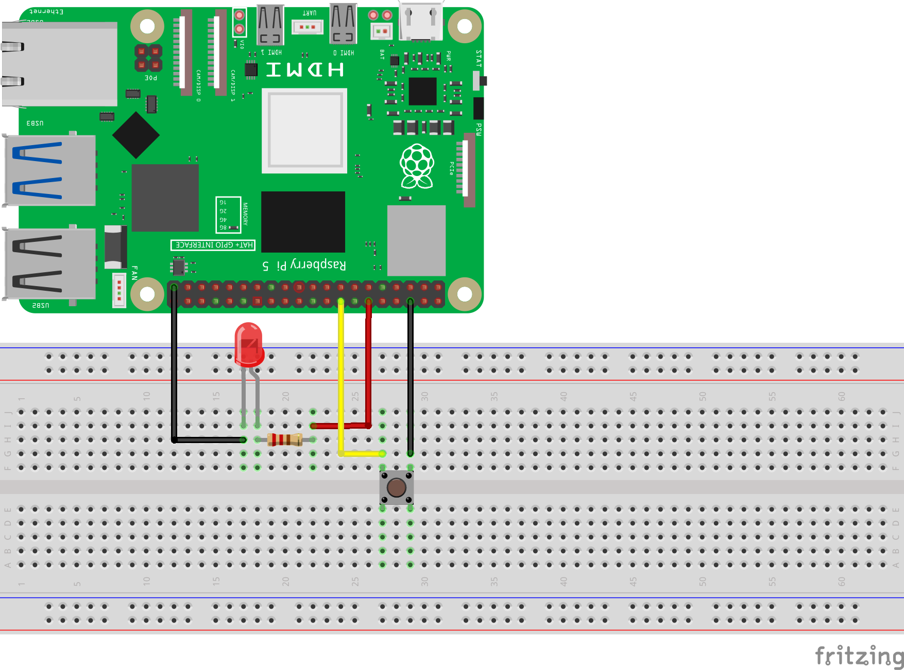

===============================
Урок 2: Подключение кнопки ✨
===============================

Теоретическая часть
-------------------
Кнопка является простым переключателем, который при нажатии замыкает цепь и позволяет передавать сигнал в Raspberry Pi. В этом уроке мы будем использовать кнопку для управления светодиодом с помощью библиотеки **gpiozero**.

Необходимые компоненты
----------------------
- Raspberry Pi
- Светодиод (LED)
- Резистор 330 Ом
- Кнопка
- Резистор 10 кОм (pull-down)
- Макетная плата (breadboard)
- Соединительные провода

Схема подключения
-----------------

   **Рис. 1:** Схема 2-го урока

Запуск кода
-----------
1. Откройте **Thonny** на Raspberry Pi.
2. Создайте файл `button_led.py` в папке `lessons/lesson2/`.
3. Скопируйте в него следующий код.
4. Для запуска через командную строку выполните:
   
   .. code-block:: bash

      python3 lessons/lesson2/button_led.py

Код программы
-------------
Файл: `lessons/lesson2/button_led.py`

.. code-block:: python

   from gpiozero import LED, Button  # Импортируем классы LED и Button
   from signal import pause          # Импортируем pause для ожидания событий

   led = LED(18)    # Определяем светодиод на GPIO18
   button = Button(23)  # Определяем кнопку на GPIO23

   # Функция, которая включит светодиод, когда нажмем кнопку
   def led_on():
       print("Кнопка нажата! Включаем LED.")
       led.on()

   # Функция, которая выключит светодиод, когда отпустим кнопку
   def led_off():
       print("Кнопка отпущена! Выключаем LED.")
       led.off()

   # Назначаем обработчики событий
   button.when_pressed = led_on      # Когда кнопку нажали, включаем LED
   button.when_released = led_off    # Когда кнопку отпустили, выключаем LED

   # Бесконечный цикл ожидания, чтобы программа не завершалась
   print("Нажми кнопку, чтобы включить светодиод!")
   pause()

Разбор кода
-----------
- `from gpiozero import LED, Button` – импорт классов для управления светодиодом и чтения состояния кнопки.
- `led = LED(18)` – светодиод на GPIO 18.
- `button = Button(23)` – кнопка на GPIO 23.
- `button.when_pressed = led_on` – при нажатии кнопки вызывается функция `led_on()`.
- `button.when_released = led_off` – при отпускании кнопки вызывается функция `led_off()`.
- `pause()` – бесконечное ожидание событий, чтобы программа не завершалась.

Ожидаемый результат
-------------------
При нажатии кнопки загорается светодиод, при отпускании – гаснет.

.. figure:: images/result2.gif
   :width: 80%
   :align: center

   **Рис. 2:** Ожидаемый результат работы кода

Завершение работы
-----------------
Для остановки программы нажмите **Ctrl + C** в терминале. Поздравляем! Вы научились управлять светодиодом при помощи кнопки и библиотеки gpiozero.
