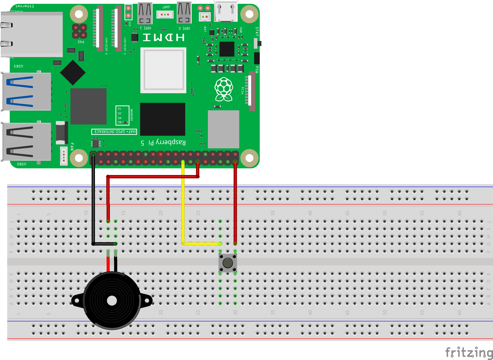

================================================
Урок 4: Работа с активным зуммером 🔊
================================================

Теоретическая часть
-------------------
Активный зуммер (buzzer) издает звук при подаче напряжения и не требует генерации сигнала с частотой, в отличие от пассивного зуммера. В этом уроке мы будем включать активный зуммер по нажатию кнопки.

Необходимые компоненты
----------------------
- Raspberry Pi
- Активный зуммер (Buzzer)
- Кнопка
- Соединительные провода
- Макетная плата (при необходимости)

Схема подключения
-----------------

Запуск кода
-----------
1. Создайте файл `buzzer.py` в папке `lessons/lesson4/`:

   .. code-block:: bash

      nano lessons/lesson4/buzzer.py

2. Скопируйте в него следующий код и сохраните файл.
3. Запустите программу:

   .. code-block:: bash

      python3 lessons/lesson4/buzzer.py

Код программы
-------------
Файл: `lessons/lesson4/buzzer.py`

.. code-block:: python

   from gpiozero import Button, Buzzer
   from signal import pause

   # Определяем номера GPIO в режиме BCM
   BUZZER_PIN = 18
   BUTTON_PIN = 23

   # Инициализация буззера и кнопки
   buzzer = Buzzer(BUZZER_PIN)
   button = Button(BUTTON_PIN, pull_down=True)  # Используем внутреннюю подтяжку к низкому уровню

   # Функции обработки событий
   def button_pressed():
       buzzer.on()
       print("Кнопка нажата! Включаем буззер.")

   def button_released():
       buzzer.off()
       print("Кнопка отпущена! Выключаем буззер.")

   # Привязываем обработчики событий
   button.when_pressed = button_pressed
   button.when_released = button_released

   print("Ожидание нажатия кнопки (нажмите Ctrl+C для выхода)...")

   # Запуск бесконечного цикла ожидания
   pause()

Разбор кода
-----------
- `from gpiozero import Button, Buzzer` – импортируем классы Button и Buzzer из библиотеки gpiozero.
- `button = Button(BUTTON_PIN, pull_down=True)` – настраиваем кнопку на входе GPIO23 с подтяжкой к 0 В (GND).
- `buzzer = Buzzer(BUZZER_PIN)` – настраиваем активный зуммер на GPIO18.
- `button.when_pressed = button_pressed` – при нажатии кнопки вызывается функция `button_pressed()`.
- `button.when_released = button_released` – при отпускании кнопки вызывается функция `button_released()`.
- `pause()` – команда для бесконечного ожидания событий.

Ожидаемый результат
-------------------
При нажатии кнопки активный зуммер будет включаться и издавать звук, при отпускании – выключаться. Вы можете регулировать время звучания, добавляя задержки в функции `button_pressed()`, или расширять логику.

.. .. figure:: images/result4.gif
..    :width: 80%
..    :align: center

   **Рис. 2:** Пример звучания буззера при нажатии кнопки

Завершение работы
-----------------
Для остановки программы нажмите **Ctrl + C** в терминале. Поздравляем! Теперь вы научились управлять активным зуммером с помощью Raspberry Pi и библиотеки gpiozero.
