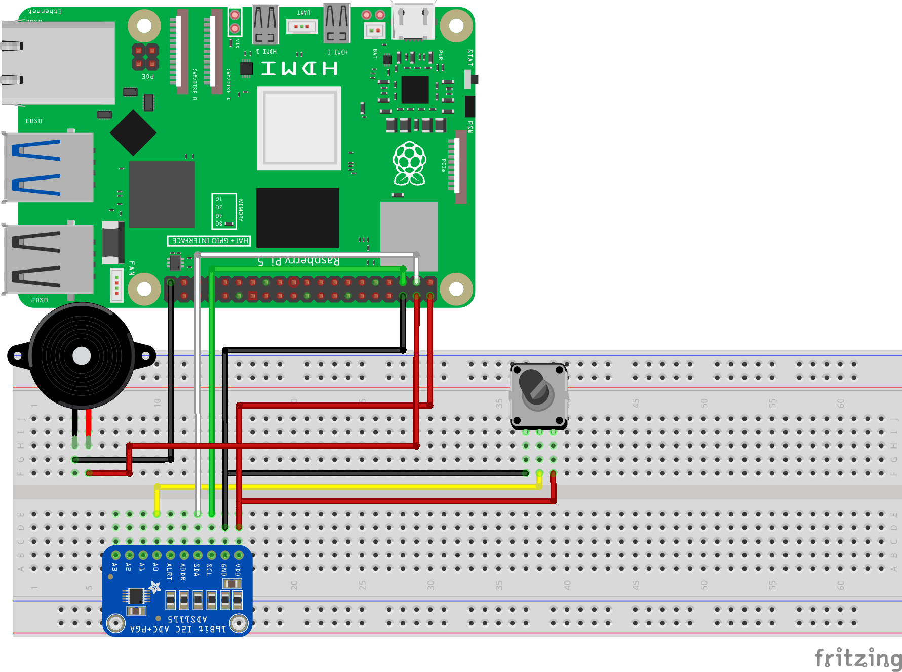

==============================================================
Урок 5: Пассивный зуммер и потенциометр
==============================================================

Теоретическая часть
-------------------
Пассивный зуммер не имеет встроенного генератора звука и требует внешнего сигнала определённой частоты. Мы будем формировать этот сигнал на Raspberry Pi и регулировать частоту с помощью потенциометра. Для чтения аналогового значения потенциометра используем АЦП ADS1115.

Необходимые компоненты
----------------------
- Raspberry Pi
- Пассивный зуммер
- Потенциометр
- АЦП (например, ADS1115)
- Макетная плата (breadboard)
- Соединительные провода

Схема подключения
-----------------

Запуск кода
-----------
1. Создайте файл `passive_buzzer.py` в папке `lessons/lesson5/`:

   .. code-block:: bash

      nano lessons/lesson5/passive_buzzer.py

2. Скопируйте в него следующий код и сохраните.
3. Запустите программу:

   .. code-block:: bash

      python3 lessons/lesson5/passive_buzzer.py

Код программы
-------------
Файл: `lessons/lesson5/passive_buzzer.py`

.. code-block:: python

   from ads1115_lib import ADS1115
   from gpiozero import PWMOutputDevice
   from time import sleep

   # Инициализация ADS1115
   a = ADS1115()

   # Пассивный зуммер подключен к GPIO18
   buzzer = PWMOutputDevice(18)

   # Функция масштабирования значений
   def MAP(x, in_min, in_max, out_min, out_max):
       return (x - in_min) * (out_max - out_min) / (in_max - in_min) + out_min

   while True:
       try:
           # Считывание значения с АЦП
           adc_value = a.read_adc(0)

           # Переводим ADC-значение (0..32767) в частоту (0..5000 Гц)
           frequency = int(MAP(adc_value, 0, 32767, 0, 5000))

           # Устанавливаем частоту зуммера
           buzzer.frequency = frequency

           # Указываем значение duty cycle (громкость) от 0.0 до 1.0
           buzzer.value = 0.5  # Пример: 50% мощности

           # Вывод данных в консоль
           print(f"ADC: {adc_value}\tFreq: {frequency} Hz")

           sleep(0.1)

       except KeyboardInterrupt:
           print("\nПрограмма остановлена пользователем.")
           buzzer.off()  # Выключаем зуммер
           break

Разбор кода
-----------
- `ads1115_lib` – библиотека для работы с АЦП ADS1115.
- `PWMOutputDevice(18)` – настройка вывода сигнала ШИМ (PWM) на GPIO18.
- Функция `MAP(...)` – переводит диапазон значения АЦП (0..32767) в диапазон частоты (0..5000 Гц).
- `buzzer.frequency = frequency` – установка частоты ШИМ.
- `buzzer.value = 0.5` – установка скважности (громкости) ШИМ (от 0.0 до 1.0).
- `try-except KeyboardInterrupt` – обработка прерывания программы клавишами `Ctrl + C`.

Ожидаемый результат
-------------------
При повороте потенциометра будет изменяться выходная частота на зуммере. Таким образом можно регулировать тон звучания пассивного зуммера. Чем выше частота, тем выше тон.

.. figure:: images/pbuzzer_result.gif
   :width: 50%
   :align: center

   **Рис. 2:** Пример изменения частоты звука при вращении потенциометра

Завершение работы
-----------------
Нажмите **Ctrl + C** в терминале, чтобы остановить программу. Поздравляем! Теперь вы можете управлять частотой пассивного зуммера, используя показания потенциометра.
