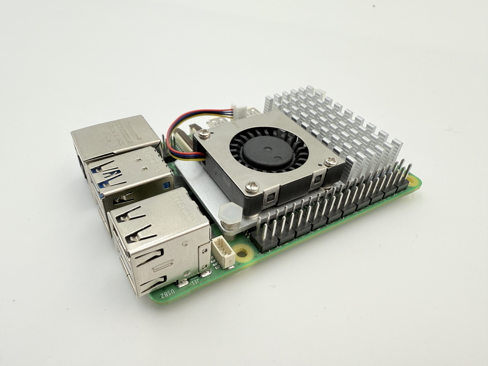

Первые действия для запуска
============================

**Сначала вытаскиваем Raspberry Pi из коробки**

   Рис. 1: Raspberry Pi в комплекте

**Устанавливаем SD карту с уже предустановленным образом в Raspberry**

.. figure:: images/raspberry-install-sd-card.jpeg
   :width: 80%
   :align: center

   Рис. 2: Установка microSD карты

**Берем коробку с кулером**

   Рис. 3: Коробка с кулером

Вытаскиваем кулер
------------------

   Рис. 4: Извлечение кулера

Переворачиваем
--------------

   Рис. 5: Переворачиваем кулер

Убираем плёнку с термопрокладки
-------------------------------

.. figure:: images/cooler-bez-plenky.jpeg
   :width: 80%
   :align: center

   Рис. 6: Снятие защитной плёнки

Ставим на Raspberry
--------------------

   Рис. 7: Установка кулера на Raspberry Pi

Зажимаем до характерного щелчка в указанных местах
---------------------------------------------------

.. figure:: images/cooler-install-raspberry.jpeg
   :width: 80%
   :align: center

   Рис. 8: Фиксация кулера

С обратной стороны убеждаемся, что всё защёлкнуто
--------------------------------------------------

   Рис. 9: Проверка фиксации

Вставляем штекер кулера
------------------------

.. figure:: images/cooler-connector-install.jpeg
   :width: 80%
   :align: center

   Рис. 10: Подключение вентилятора

Штекер должен быть защёлкнут до конца
-------------------------------------

   Рис. 11: Штекер установлен

Берем основу
------------

.. figure:: images/main-body.jpeg
   :width: 80%
   :align: center

   Рис. 12: Основание

Снимаем скотч и вставляем в пазы
---------------------------------

   Рис. 13: Монтаж основания

Вставляем Raspberry на своё место
----------------------------------

.. figure:: images/main-install-raspberry.jpeg
   :width: 80%
   :align: center

   Рис. 14: Установка Raspberry в корпус

Прикручиваем винтами M2.5
--------------------------

   Рис. 15: Места крепления

В итоге должно получиться как на фото
--------------------------------------

.. figure:: images/main-install-raspberry-3-up.jpeg
   :width: 80%
   :align: center

   Рис. 16: Готовая сборка

Вставляем HDMI-MicroHDMI кабель в Raspberry
-------------------------------------------

.. figure:: images/main-raspberry-install-hdmi.jpeg
   :width: 80%
   :align: center

   Рис. 17: Подключение HDMI к Raspberry Pi

Один конец кабеля вставляем в разъём micro-HDMI на Raspberry Pi, другой — в монитор.

Вставляем кабель питания в разъём
----------------------------------

.. figure:: images/main-raspberry-install-typec.jpeg
   :width: 80%
   :align: center

   Рис. 18: Подключение блока питания

Используем блок питания USB-C, и подключаем его к соответствующему разъёму на Raspberry Pi.

Подключаем клавиатуру с тачпадом
---------------------------------

   Рис. 19: Клавиатура в комплекте

Вставляем USB свисток
----------------------

.. figure:: images/main-raspberry-keyboard-usb.jpeg
   :width: 80%
   :align: center

   Рис. 20: USB приёмник клавиатуры

Дальнейшая настройка
------------------------------------------------------------------------------------------------

После загрузки системы можно настроить удаленный доступ к Raspberry Pi:

- **VNC** — графический удаленный доступ к рабочему столу.
- **SSH** — подключение к терминалу Raspberry Pi через сеть.

Эти настройки выполняются после завершения первоначальной конфигурации системы.

.. note::

   Подключение через **SSH** по умолчанию может быть **отключено**. Чтобы его активировать,
   необходимо создать **пустой файл** с названием ``ssh`` (без расширения) в корневой директории
   карты памяти **перед первой загрузкой**.

