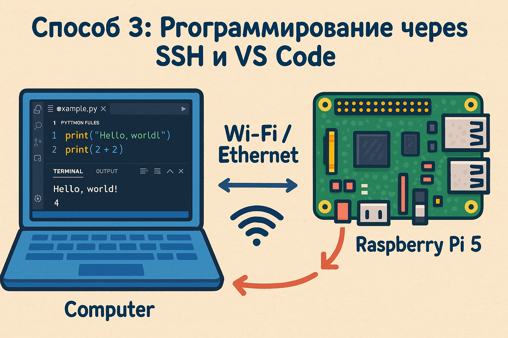
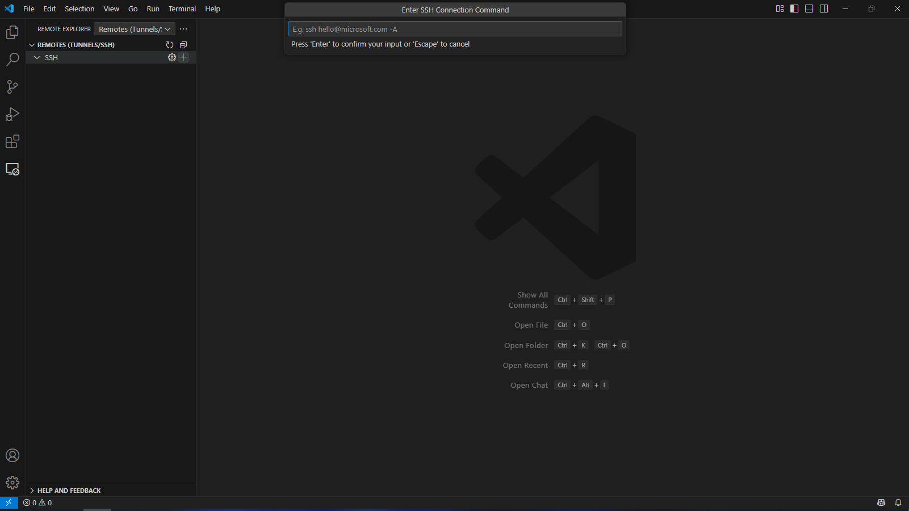
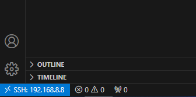
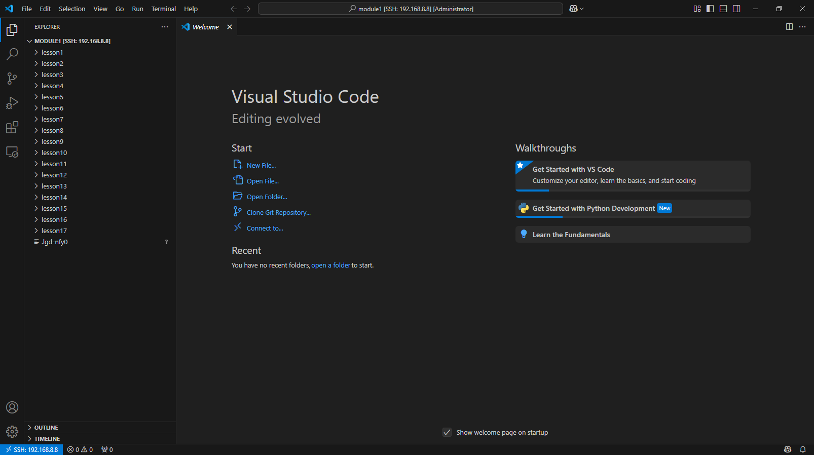
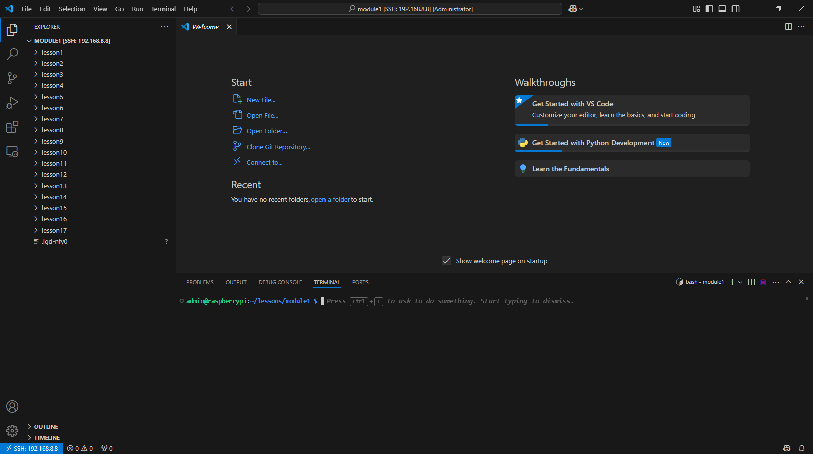

SSH-подключение VS Code для удаленной разработки на Raspberry Pi
=============================================================================================================

В этом уроке вы научитесь настраивать Visual Studio Code для удаленной разработки на Raspberry Pi через SSH. Такой подход позволяет писать, запускать и отлаживать код непосредственно на Raspberry Pi, используя при этом все преимущества VS Code на вашем основном компьютере.

Что такое удаленная разработка в VS Code
-----------------------------------------------

Visual Studio Code предоставляет мощное расширение Remote - SSH, которое позволяет подключаться к удаленным устройствам (таким как Raspberry Pi) и работать с ними так, будто вы используете локальный редактор. При этом:

* Код выполняется непосредственно на удаленном устройстве
* Файловая система Raspberry Pi доступна прямо в VS Code
* Терминал VS Code подключается к консоли Raspberry Pi
* Все расширения и настройки VS Code остаются доступными

Предварительные требования
------------------------------------

Перед настройкой убедитесь, что:

1. На вашем компьютере установлен Visual Studio Code (см. раздел :doc:`/appendix/vscode/vscode`)
2. SSH-доступ к Raspberry Pi настроен и работает (см. раздел :doc:`/appendix/ssh/ssh`)
3. Вы знаете IP-адрес вашего Raspberry Pi (см. раздел :doc:`/appendix/getip/getip`)
4. Имя пользователя и пароль для доступа к Raspberry Pi

Настройка подключения к Raspberry Pi
-----------------------------------------------

1. Нажмите на значок Remote Explorer на боковой панели VS Code (или нажмите F1 и введите "Remote-SSH: Connect to Host...")
2. Нажмите кнопку "+" для добавления нового SSH-хоста
3. В открывшемся поле введите команду подключения:

   .. code-block:: bash

      ssh username@ip-address

   Например: `ssh pi@192.168.1.100`

4. Выберите файл конфигурации для сохранения (обычно это ~/.ssh/config)
5. Новое подключение появится в списке "SSH TARGETS"

Подключение к Raspberry Pi
------------------------------

Теперь вы можете подключиться к Raspberry Pi:

1. В панели Remote Explorer наведите курсор на созданное подключение
2. Нажмите иконку "Connect to Host in New Window"
3. VS Code откроет новое окно и начнет процесс подключения
4. При первом подключении появится запрос о доверии к хосту — выберите "Continue"
5. Введите пароль для вашей учетной записи на Raspberry Pi

После успешного подключения в левом нижнем углу окна VS Code появится индикатор "SSH: название_хоста":

Работа с файлами на Raspberry Pi
-------------------------------------------

Теперь вы можете работать с файлами на Raspberry Pi:

1. Выберите "Open Folder" в меню File (или нажмите Ctrl+O)
2. Перейдите к папке с уроками (например, /home/pi/lessons)
3. Нажмите "OK" для открытия папки

В проводнике VS Code теперь отображаются файлы с Raspberry Pi. Вы можете:

* Просматривать содержимое файлов
* Редактировать код
* Создавать новые файлы и папки
* Все изменения будут сохраняться непосредственно на Raspberry Pi

Использование терминала
-------------------------------

VS Code предоставляет доступ к терминалу Raspberry Pi:

1. Откройте встроенный терминал через меню Terminal -> New Terminal (или нажмите Ctrl+`)
2. Терминал откроется в нижней части окна VS Code
3. Этот терминал работает непосредственно на Raspberry Pi — вы можете выполнять любые команды так же, как если бы подключились через обычный SSH-клиент

Запуск программ через терминал:

.. code-block:: bash

   cd lessons/module1/lesson1
   python3 blink.py

Решение типичных проблем
--------------------------------

**Обрыв соединения**

Если соединение с Raspberry Pi разорвалось:

1. Закройте окно VS Code
2. Откройте VS Code заново и повторите процесс подключения
3. Убедитесь, что Raspberry Pi включен и подключен к сети

**Проблемы с разрешениями файлов**

Если VS Code не может редактировать некоторые файлы из-за отсутствия прав:

1. Проверьте владельца файла в терминале:

   .. code-block:: bash

      ls -la имя_файла

2. Измените разрешения файла, если необходимо:

   .. code-block:: bash

      chmod 644 имя_файла

3. Или измените владельца файла:

   .. code-block:: bash

      sudo chown имя_пользователя имя_файла

Заключение
----------------

Теперь вы можете эффективно разрабатывать и запускать код на Raspberry Pi, используя удобный интерфейс VS Code на вашем основном компьютере. Такой подход значительно повышает комфорт разработки и позволяет использовать все преимущества современной IDE при работе с Raspberry Pi.
